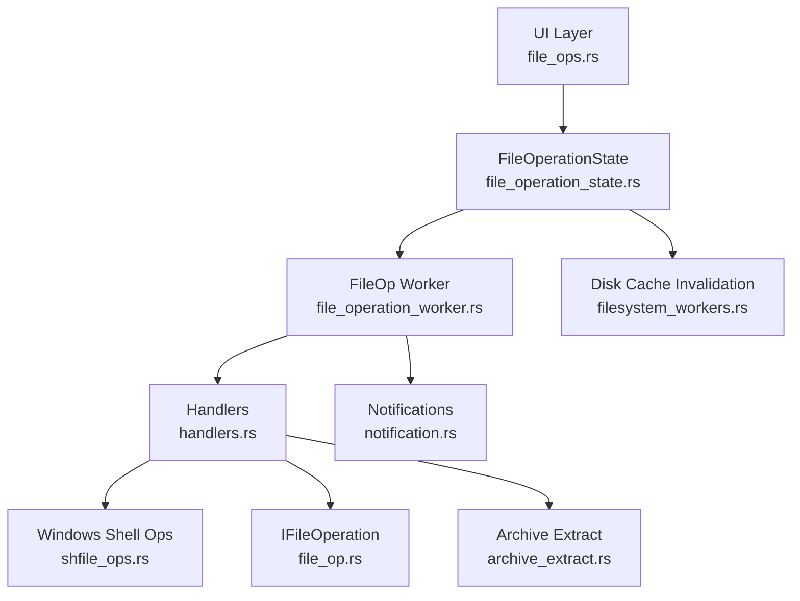
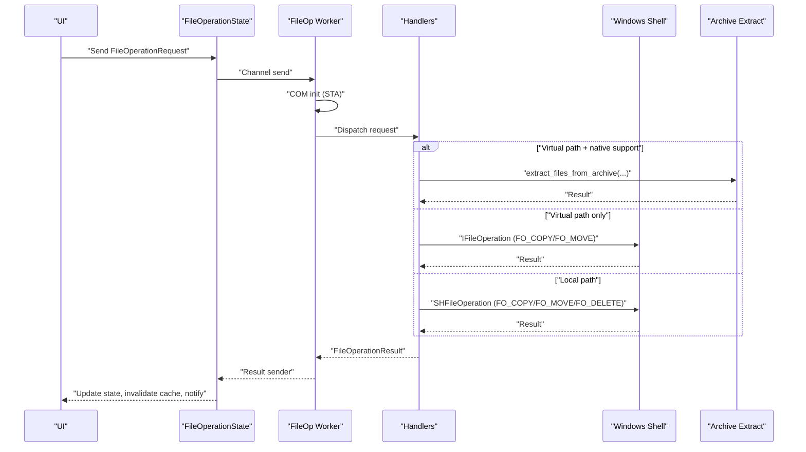
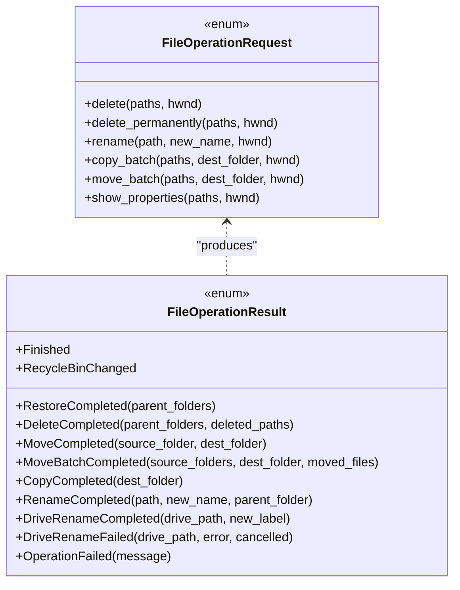
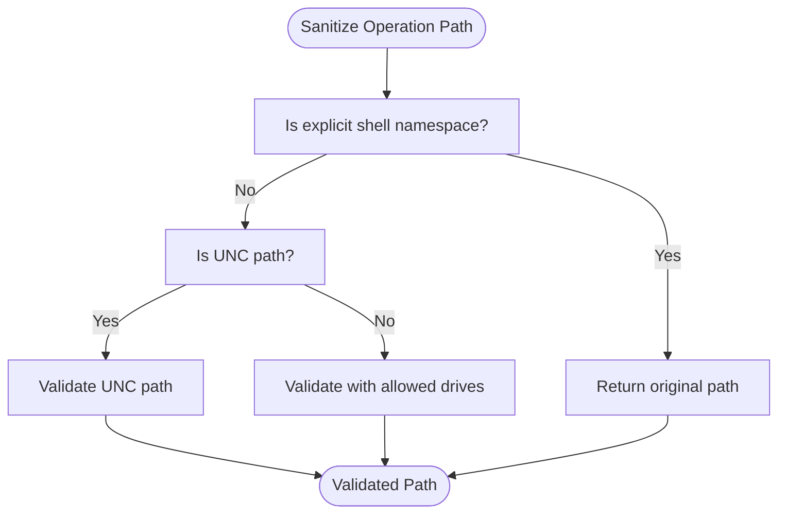
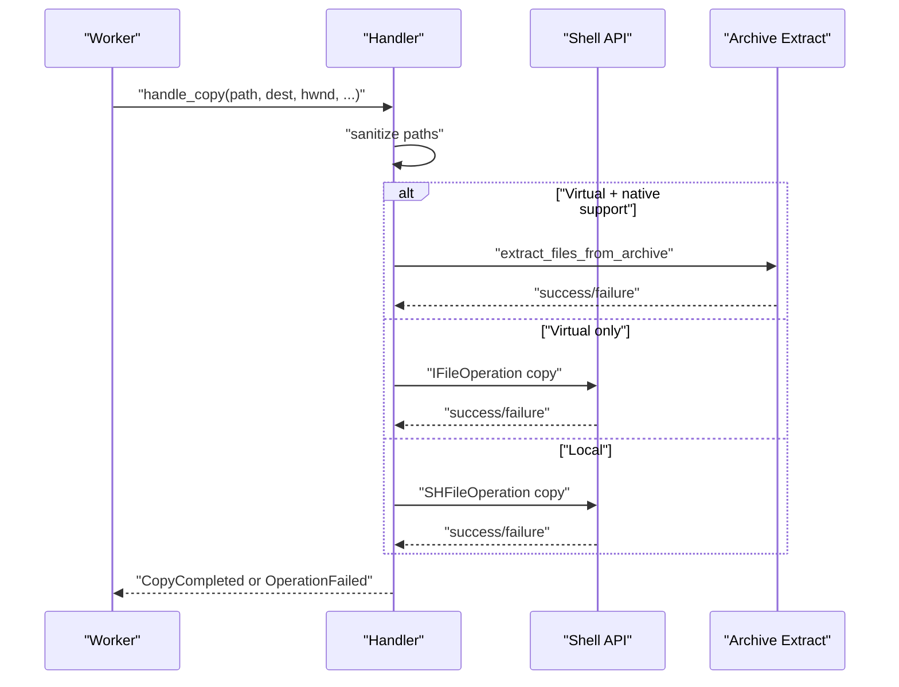
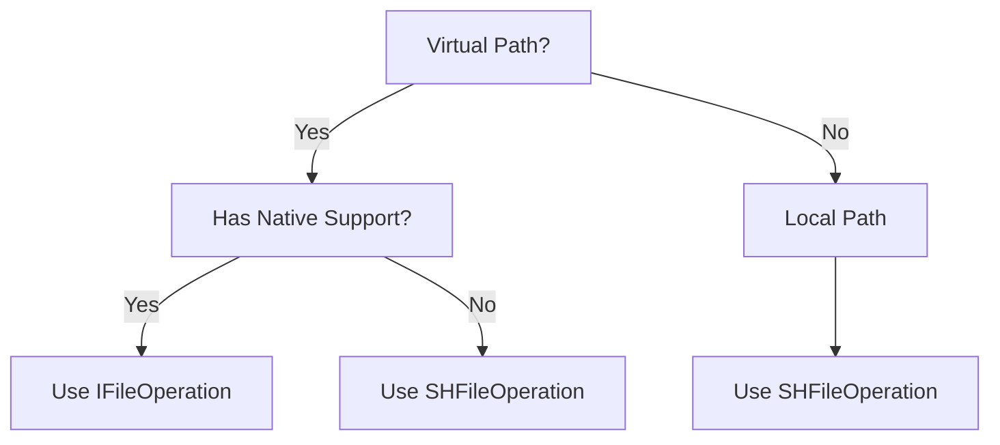
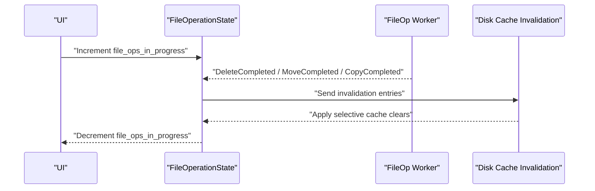
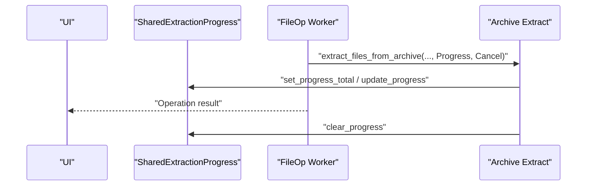
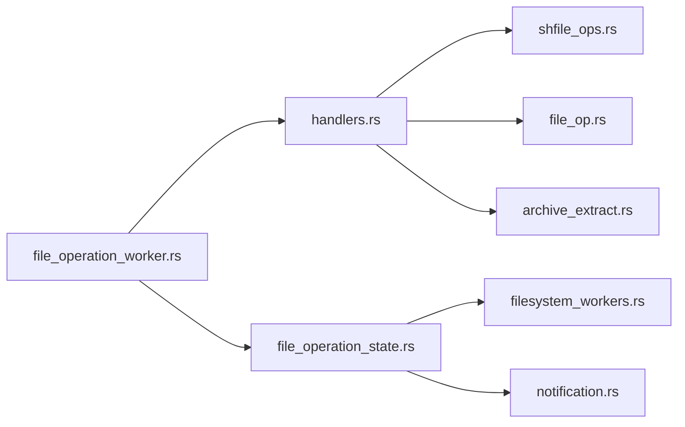

# File Operation Workers

<cite>
**Referenced Files in This Document**
- [file_operation_worker.rs](file://src/workers/file_operation_worker.rs)
- [handlers.rs](file://src/workers/file_operation_worker/handlers.rs)
- [file_ops.rs](file://src/app/operations/file_ops.rs)
- [file_operation_state.rs](file://src/app/file_operation_state.rs)
- [file_op.rs](file://src/infrastructure/windows/shell_operations/file_op.rs)
- [shfile_ops.rs](file://src/infrastructure/windows/shell_operations/shfile_ops.rs)
- [archive_extract.rs](file://src/infrastructure/archive_extract.rs)
- [notification.rs](file://src/application/notification.rs)
- [filesystem_workers.rs](file://src/app/init_workers/filesystem_workers.rs)
</cite>

## Table of Contents
1. [Introduction](#introduction)
2. [Project Structure](#project-structure)
3. [Core Components](#core-components)
4. [Architecture Overview](#architecture-overview)
5. [Detailed Component Analysis](#detailed-component-analysis)
6. [Dependency Analysis](#dependency-analysis)
7. [Performance Considerations](#performance-considerations)
8. [Troubleshooting Guide](#troubleshooting-guide)
9. [Conclusion](#conclusion)

## Introduction
This document explains the asynchronous file operation worker system responsible for performing copy, move, delete, rename, and restore-from-recycle-bin operations on Windows. It covers the command pattern used to encapsulate operations, the Windows Shell integration for native execution, fallback mechanisms for unsupported operations, state management, progress tracking, user notifications, conflict resolution, and error handling strategies.

## Project Structure
The file operation worker is implemented as a dedicated worker thread that receives typed commands, validates paths securely, selects the most appropriate Shell APIs, and reports results back to the UI. Supporting modules provide Windows Shell wrappers, archive extraction fallback, and UI notification facilities.

**Diagram sources**
- [file_operation_worker.rs:226-328](file://src/workers/file_operation_worker.rs#L226-L328)
- [handlers.rs:10-404](file://src/workers/file_operation_worker/handlers.rs#L10-L404)
- [file_ops.rs:96-386](file://src/app/operations/file_ops.rs#L96-L386)
- [file_operation_state.rs:6-19](file://src/app/file_operation_state.rs#L6-L19)
- [shfile_ops.rs:1-242](file://src/infrastructure/windows/shell_operations/shfile_ops.rs#L1-L242)
- [file_op.rs:1-245](file://src/infrastructure/windows/shell_operations/file_op.rs#L1-L245)
- [archive_extract.rs:216-313](file://src/infrastructure/archive_extract.rs#L216-L313)
- [notification.rs:108-161](file://src/application/notification.rs#L108-L161)
- [filesystem_workers.rs:157-222](file://src/app/init_workers/filesystem_workers.rs#L157-L222)

**Section sources**
- [file_operation_worker.rs:1-353](file://src/workers/file_operation_worker.rs#L1-L353)
- [handlers.rs:1-404](file://src/workers/file_operation_worker/handlers.rs#L1-L404)
- [file_ops.rs:1-386](file://src/app/operations/file_ops.rs#L1-L386)
- [file_operation_state.rs:1-20](file://src/app/file_operation_state.rs#L1-L20)
- [shfile_ops.rs:1-242](file://src/infrastructure/windows/shell_operations/shfile_ops.rs#L1-L242)
- [file_op.rs:1-245](file://src/infrastructure/windows/shell_operations/file_op.rs#L1-L245)
- [archive_extract.rs:1-771](file://src/infrastructure/archive_extract.rs#L1-L771)
- [notification.rs:1-161](file://src/application/notification.rs#L1-L161)
- [filesystem_workers.rs:157-222](file://src/app/init_workers/filesystem_workers.rs#L157-L222)

## Core Components
- Command pattern: The worker accepts strongly-typed requests (delete, rename, copy, move, batch variants, restore, empty recycle bin, properties) and dispatches to handlers.
- Security validation: Paths are sanitized and validated against allowed drives and namespace rules before execution.
- Windows Shell integration: Uses SHFileOperation for traditional shell operations and IFileOperation for advanced features (virtual paths, undo support).
- Archive extraction fallback: When IFileOperation cannot handle archive contents, the system extracts natively and writes to the destination.
- Progress tracking: Shared progress state is exposed to the UI for archive extraction; batch operations report a single progress dialog.
- User notifications: Dedicated notification manager surfaces operation outcomes and errors to the user.
- State management: Tracks in-progress operations, pending deletions, and invalidates caches appropriately.

**Section sources**
- [file_operation_worker.rs:67-160](file://src/workers/file_operation_worker.rs#L67-L160)
- [handlers.rs:10-404](file://src/workers/file_operation_worker/handlers.rs#L10-L404)
- [archive_extract.rs:149-178](file://src/infrastructure/archive_extract.rs#L149-L178)
- [notification.rs:108-161](file://src/application/notification.rs#L108-L161)
- [file_operation_state.rs:6-19](file://src/app/file_operation_state.rs#L6-L19)

## Architecture Overview
The system uses a worker thread with a message channel to keep the UI responsive. The worker initializes COM as STA, validates inputs, selects the best Shell API, and posts structured results back to the UI.

**Diagram sources**
- [file_operation_worker.rs:226-328](file://src/workers/file_operation_worker.rs#L226-L328)
- [handlers.rs:132-218](file://src/workers/file_operation_worker/handlers.rs#L132-L218)
- [file_op.rs:31-71](file://src/infrastructure/windows/shell_operations/file_op.rs#L31-L71)
- [shfile_ops.rs:190-241](file://src/infrastructure/windows/shell_operations/shfile_ops.rs#L190-L241)
- [archive_extract.rs:216-313](file://src/infrastructure/archive_extract.rs#L216-L313)

## Detailed Component Analysis

### Command Pattern and Request Types
- Requests are defined as an enum with constructors for convenience, carrying paths, destination folders, and HWND for Shell dialogs.
- The worker receives requests via a channel, resets cancellation flags per operation, and dispatches to handlers.

**Diagram sources**
- [file_operation_worker.rs:67-160](file://src/workers/file_operation_worker.rs#L67-L160)
- [file_operation_worker.rs:16-59](file://src/workers/file_operation_worker.rs#L16-L59)

**Section sources**
- [file_operation_worker.rs:67-160](file://src/workers/file_operation_worker.rs#L67-L160)
- [file_operation_worker.rs:226-328](file://src/workers/file_operation_worker.rs#L226-L328)

### Security Validation and Path Sanitization
- Explicit shell namespace paths bypass sanitization; UNC paths use a lightweight validator; others are validated against allowed local drives.
- Drive detection uses a bitmask of mounted logical drives; fallback to a default drive when none are detected.

**Diagram sources**
- [file_operation_worker.rs:207-221](file://src/workers/file_operation_worker.rs#L207-L221)
- [file_operation_worker.rs:162-179](file://src/workers/file_operation_worker.rs#L162-L179)

**Section sources**
- [file_operation_worker.rs:162-221](file://src/workers/file_operation_worker.rs#L162-L221)

### Handler Implementation Details
- Delete: Validates paths, invokes Shell delete, reports deletion and recycle bin change.
- Rename: Handles drive label rename for root paths; otherwise validates target name and uses Shell rename.
- Copy/Move: Detects virtual paths and native archive support; prefers IFileOperation for virtual paths, falls back to SHFileOperation or Shell APIs; supports batch operations.
- Restore from Recycle Bin: Validates physical/original paths and restores items.
- Empty Recycle Bin: Triggers Shell empty operation and reports change.
- Show Properties: Fire-and-forget; opens a modeless dialog via Shell.

**Diagram sources**
- [handlers.rs:132-170](file://src/workers/file_operation_worker/handlers.rs#L132-L170)
- [file_op.rs:31-71](file://src/infrastructure/windows/shell_operations/file_op.rs#L31-L71)
- [shfile_ops.rs:190-211](file://src/infrastructure/windows/shell_operations/shfile_ops.rs#L190-L211)
- [archive_extract.rs:216-313](file://src/infrastructure/archive_extract.rs#L216-L313)

**Section sources**
- [handlers.rs:10-404](file://src/workers/file_operation_worker/handlers.rs#L10-L404)
- [file_op.rs:1-245](file://src/infrastructure/windows/shell_operations/file_op.rs#L1-L245)
- [shfile_ops.rs:1-242](file://src/infrastructure/windows/shell_operations/shfile_ops.rs#L1-L242)
- [archive_extract.rs:180-313](file://src/infrastructure/archive_extract.rs#L180-L313)

### Windows Shell Integration and Fallback Mechanisms
- IFileOperation: Preferred for virtual paths (e.g., inside archives), supports undo and single progress dialog for batches.
- SHFileOperation: Traditional Shell operations for local paths; supports single or multi-item operations with confirmation dialogs.
- Fallback behavior: If IFileOperation fails or is unavailable, handlers fall back to SHFileOperation or SHFileOperation equivalents.

**Diagram sources**
- [handlers.rs:132-218](file://src/workers/file_operation_worker/handlers.rs#L132-L218)
- [file_op.rs:31-71](file://src/infrastructure/windows/shell_operations/file_op.rs#L31-L71)
- [shfile_ops.rs:136-188](file://src/infrastructure/windows/shell_operations/shfile_ops.rs#L136-L188)
- [archive_extract.rs:180-189](file://src/infrastructure/archive_extract.rs#L180-L189)

**Section sources**
- [file_op.rs:12-28](file://src/infrastructure/windows/shell_operations/file_op.rs#L12-L28)
- [shfile_ops.rs:136-188](file://src/infrastructure/windows/shell_operations/shfile_ops.rs#L136-L188)

### Operation State Management and UI Updates
- The UI tracks in-progress operations and pending deletions to coordinate cache invalidation and thumbnail updates.
- After operations, the worker sends results indicating which folders require refresh or invalidation.
- Disk cache invalidation worker selectively clears caches depending on path type and existence checks.

**Diagram sources**
- [file_ops.rs:96-154](file://src/app/operations/file_ops.rs#L96-L154)
- [file_operation_state.rs:6-19](file://src/app/file_operation_state.rs#L6-L19)
- [filesystem_workers.rs:157-222](file://src/app/init_workers/filesystem_workers.rs#L157-L222)

**Section sources**
- [file_ops.rs:96-154](file://src/app/operations/file_ops.rs#L96-L154)
- [file_operation_state.rs:6-19](file://src/app/file_operation_state.rs#L6-L19)
- [filesystem_workers.rs:157-222](file://src/app/init_workers/filesystem_workers.rs#L157-L222)

### Progress Tracking and User Notifications
- Archive extraction progress: Shared state updated with current file and counts; cleared when done.
- Batch operations: Single progress dialog managed by Shell APIs.
- Notifications: Centralized notification manager displays info/warning/error messages with durations.

**Diagram sources**
- [archive_extract.rs:149-178](file://src/infrastructure/archive_extract.rs#L149-L178)
- [archive_extract.rs:216-313](file://src/infrastructure/archive_extract.rs#L216-L313)
- [notification.rs:108-161](file://src/application/notification.rs#L108-L161)

**Section sources**
- [archive_extract.rs:149-178](file://src/infrastructure/archive_extract.rs#L149-L178)
- [archive_extract.rs:216-313](file://src/infrastructure/archive_extract.rs#L216-L313)
- [notification.rs:108-161](file://src/application/notification.rs#L108-L161)

### Conflict Resolution Strategies
- Duplicate names: Shell APIs manage conflicts via native dialogs and undo support; callers should rely on Shell prompts for user-driven decisions.
- Permission issues: Errors propagate as OperationFailed results; UI can surface localized messages.
- Network drives and locks: Operations may fail or prompt; handlers return OperationFailed with localized messages; callers should retry or inform the user.

**Section sources**
- [handlers.rs:10-49](file://src/workers/file_operation_worker/handlers.rs#L10-L49)
- [handlers.rs:100-129](file://src/workers/file_operation_worker/handlers.rs#L100-L129)
- [file_op.rs:31-71](file://src/infrastructure/windows/shell_operations/file_op.rs#L31-L71)
- [shfile_ops.rs:26-98](file://src/infrastructure/windows/shell_operations/shfile_ops.rs#L26-L98)

### Transaction-like Behavior and Rollback
- Undo support: IFileOperation and SHFileOperation are configured with undo flags, enabling user-initiated rollbacks through the Shell.
- Batch operations: Single progress dialog and atomic operation semantics reduce partial states.
- Application-level rollback: Not implemented; rely on Shell undo capabilities.

**Section sources**
- [file_op.rs:41-42](file://src/infrastructure/windows/shell_operations/file_op.rs#L41-L42)
- [shfile_ops.rs:37-38](file://src/infrastructure/windows/shell_operations/shfile_ops.rs#L37-L38)
- [shfile_ops.rs:88-90](file://src/infrastructure/windows/shell_operations/shfile_ops.rs#L88-L90)

## Dependency Analysis
The worker depends on:
- Windows Shell APIs for native operations.
- Archive extraction for virtual paths.
- Shared progress and cancellation flags for UI feedback.
- Notification manager for user messaging.
- Disk cache invalidation for UI consistency.

**Diagram sources**
- [file_operation_worker.rs:1-353](file://src/workers/file_operation_worker.rs#L1-L353)
- [handlers.rs:1-404](file://src/workers/file_operation_worker/handlers.rs#L1-L404)
- [shfile_ops.rs:1-242](file://src/infrastructure/windows/shell_operations/shfile_ops.rs#L1-L242)
- [file_op.rs:1-245](file://src/infrastructure/windows/shell_operations/file_op.rs#L1-L245)
- [archive_extract.rs:1-771](file://src/infrastructure/archive_extract.rs#L1-L771)
- [file_operation_state.rs:1-20](file://src/app/file_operation_state.rs#L1-L20)
- [filesystem_workers.rs:157-222](file://src/app/init_workers/filesystem_workers.rs#L157-L222)
- [notification.rs:1-161](file://src/application/notification.rs#L1-L161)

**Section sources**
- [file_operation_worker.rs:1-353](file://src/workers/file_operation_worker.rs#L1-L353)
- [handlers.rs:1-404](file://src/workers/file_operation_worker/handlers.rs#L1-L404)
- [archive_extract.rs:1-771](file://src/infrastructure/archive_extract.rs#L1-L771)
- [file_operation_state.rs:1-20](file://src/app/file_operation_state.rs#L1-L20)
- [filesystem_workers.rs:157-222](file://src/app/init_workers/filesystem_workers.rs#L157-L222)
- [notification.rs:1-161](file://src/application/notification.rs#L1-L161)

## Performance Considerations
- COM initialization: Worker initializes COM as STA once per operation cycle to avoid leaks and ensure Shell compatibility.
- Batch operations: Prefer batch variants to minimize dialog overhead and improve throughput.
- Archive extraction: Pre-scans to estimate totals; cancellation is respected to avoid wasted work.
- UI responsiveness: All heavy operations run off the UI thread; progress and results are communicated via channels.

[No sources needed since this section provides general guidance]

## Troubleshooting Guide
Common issues and resolutions:
- Operation cancelled or failed: Handlers send OperationFailed with localized messages; UI should display notifications and allow retry.
- Permission denied: Shell prompts may appear; if suppressed, callers receive OperationFailed; ensure proper elevation or permissions.
- Locked files: Shell may prompt for retry; if cancelled, OperationFailed is returned.
- Network drives: Some operations may require interactive dialogs or fail; prefer Shell dialogs for user intervention.
- Archive extraction errors: Unsupported formats or corrupted archives cause failures; UI can offer alternatives.

**Section sources**
- [handlers.rs:10-49](file://src/workers/file_operation_worker/handlers.rs#L10-L49)
- [handlers.rs:100-129](file://src/workers/file_operation_worker/handlers.rs#L100-L129)
- [file_op.rs:31-71](file://src/infrastructure/windows/shell_operations/file_op.rs#L31-L71)
- [shfile_ops.rs:26-98](file://src/infrastructure/windows/shell_operations/shfile_ops.rs#L26-L98)
- [archive_extract.rs:282-304](file://src/infrastructure/archive_extract.rs#L282-L304)

## Conclusion
The file operation worker system provides a robust, secure, and user-friendly mechanism for asynchronous file operations on Windows. By combining Shell APIs with archive extraction fallback, it supports both traditional and virtual filesystems while maintaining UI responsiveness and providing clear feedback through notifications and progress tracking.