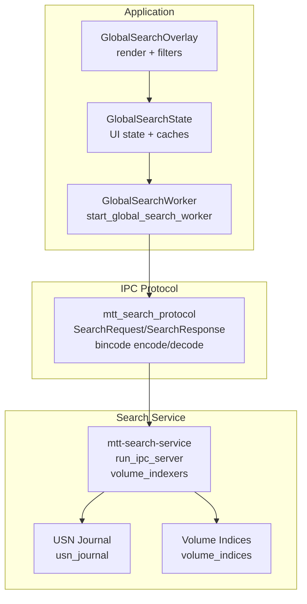
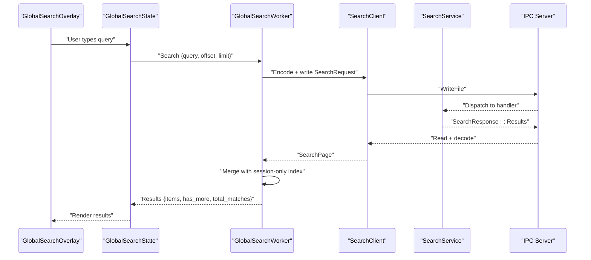
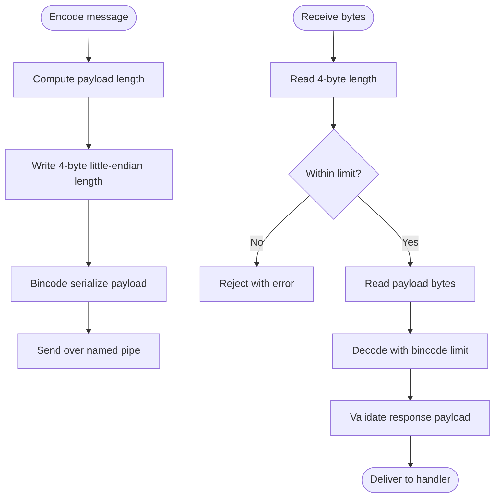
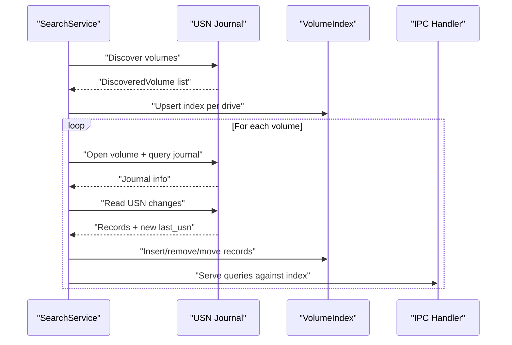
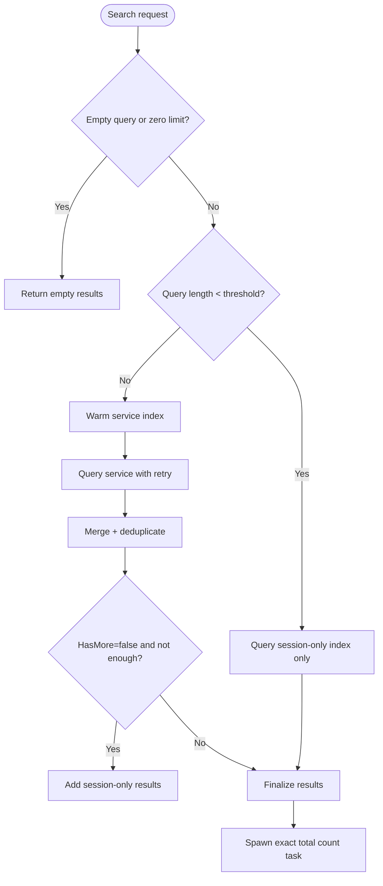
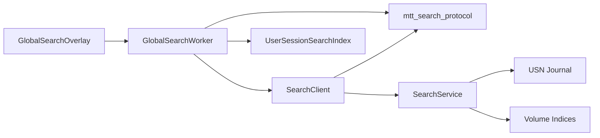

# Global Search Workers

<cite>
**Referenced Files in This Document**
- [lib.rs](file://crates/mtt-search-protocol/src/lib.rs)
- [main.rs](file://crates/mtt-search-service/src/main.rs)
- [mod.rs](file://crates/mtt-search-service/src/ipc_server/mod.rs)
- [mod.rs](file://crates/mtt-search-service/src/volume_indexers/mod.rs)
- [usn_journal.rs](file://crates/mtt-search-service/src/usn_journal.rs)
- [volume_indices.rs](file://crates/mtt-search-service/src/volume_indices.rs)
- [global_search_worker.rs](file://src/workers/global_search_worker.rs)
- [global_search.rs](file://src/infrastructure/global_search.rs)
- [global_search_state.rs](file://src/app/global_search_state.rs)
- [global_search_events.rs](file://src/app/operations/message_handler/global_search_events.rs)
- [global_search_overlay.rs](file://src/ui/global_search_overlay.rs)
- [filters.rs](file://src/ui/global_search_overlay/filters.rs)
- [pipeline_workers.rs](file://src/app/init_workers/pipeline_workers.rs)
- [mod.rs](file://src/app/init_workers/mod.rs)
- [mod.rs](file://src/infrastructure/user_session_search/mod.rs)
</cite>

## Table of Contents
1. [Introduction](#introduction)
2. [Project Structure](#project-structure)
3. [Core Components](#core-components)
4. [Architecture Overview](#architecture-overview)
5. [Detailed Component Analysis](#detailed-component-analysis)
6. [Dependency Analysis](#dependency-analysis)
7. [Performance Considerations](#performance-considerations)
8. [Troubleshooting Guide](#troubleshooting-guide)
9. [Conclusion](#conclusion)

## Introduction
This document explains the global search worker system that powers the Spotlight-style search overlay. It coordinates with the standalone search service over named pipes using bincode serialization, merges service-backed results with a user-session-only index, and delivers paginated results to the UI. The system uses a hybrid indexing strategy: USN journal monitoring for NTFS volumes and periodic full-tree scans for others, with a robust IPC protocol, validation, and safety measures.

## Project Structure
The global search system spans three layers:
- Protocol and IPC: Defines the wire format and client/server communication.
- Search Service: Runs as a separate Windows process, maintains indices, and serves queries.
- Application Worker and UI: Manages search requests, merges results, and renders the overlay.

**Diagram sources**
- [global_search_worker.rs:327-594](file://src/workers/global_search_worker.rs#L327-L594)
- [global_search_state.rs:18-139](file://src/app/global_search_state.rs#L18-L139)
- [global_search_overlay.rs:26-378](file://src/ui/global_search_overlay.rs#L26-L378)
- [lib.rs:1-290](file://crates/mtt-search-protocol/src/lib.rs#L1-L290)
- [main.rs:112-307](file://crates/mtt-search-service/src/main.rs#L112-L307)
- [mod.rs:35-214](file://crates/mtt-search-service/src/ipc_server/mod.rs#L35-L214)
- [usn_journal.rs:80-138](file://crates/mtt-search-service/src/usn_journal.rs#L80-L138)
- [volume_indices.rs:22-76](file://crates/mtt-search-service/src/volume_indices.rs#L22-L76)

**Section sources**
- [lib.rs:1-290](file://crates/mtt-search-protocol/src/lib.rs#L1-L290)
- [main.rs:112-307](file://crates/mtt-search-service/src/main.rs#L112-L307)
- [mod.rs:35-214](file://crates/mtt-search-service/src/ipc_server/mod.rs#L35-L214)
- [usn_journal.rs:80-138](file://crates/mtt-search-service/src/usn_journal.rs#L80-L138)
- [volume_indices.rs:22-76](file://crates/mtt-search-service/src/volume_indices.rs#L22-L76)
- [global_search_worker.rs:327-594](file://src/workers/global_search_worker.rs#L327-L594)
- [global_search_state.rs:18-139](file://src/app/global_search_state.rs#L18-L139)
- [global_search_overlay.rs:26-378](file://src/ui/global_search_overlay.rs#L26-L378)

## Core Components
- IPC Protocol and Serialization
  - Named pipe path and limits for queries, results, and path checks.
  - Bincode encoding with 4-byte little-endian length prefix and payload validation.
  - Request/response enums define supported operations: Query, GetStatus, Ping, WarmIndex, CheckPathsModified, FolderSize.

- Search Service
  - IPC server with rate limiting, watchdog timeouts, and security policy enforcement.
  - Hybrid indexing: USN journal for NTFS/ReFS and fallback scanners for others.
  - Shared per-volume indices with independent locking for concurrency.

- Global Search Worker
  - Orchestrates search requests, merges service results with a user-session-only index, deduplicates, and manages total count computation.
  - Implements retry/backoff for transient IPC errors and status tracking.

- User Session Search Index
  - Scans and persists user-session-only volumes (e.g., virtual mounts) and applies fast updates via watchers.

- UI Integration
  - Overlay modal with debounced input, category/drive filters, and virtualized results panel.
  - Processes worker responses and updates state for rendering.

**Section sources**
- [lib.rs:3-192](file://crates/mtt-search-protocol/src/lib.rs#L3-L192)
- [main.rs:190-307](file://crates/mtt-search-service/src/main.rs#L190-L307)
- [mod.rs:35-214](file://crates/mtt-search-service/src/ipc_server/mod.rs#L35-L214)
- [usn_journal.rs:218-422](file://crates/mtt-search-service/src/usn_journal.rs#L218-L422)
- [volume_indices.rs:22-76](file://crates/mtt-search-service/src/volume_indices.rs#L22-L76)
- [global_search_worker.rs:12-594](file://src/workers/global_search_worker.rs#L12-L594)
- [mod.rs:58-299](file://src/infrastructure/user_session_search/mod.rs#L58-L299)
- [global_search_overlay.rs:26-378](file://src/ui/global_search_overlay.rs#L26-L378)

## Architecture Overview
The system follows a request-response IPC pattern with a dedicated service process. The worker coalesces UI requests, contacts the service, merges with session-only results, and pushes updates to the UI.

**Diagram sources**
- [global_search_worker.rs:428-576](file://src/workers/global_search_worker.rs#L428-L576)
- [global_search.rs:22-55](file://src/infrastructure/global_search.rs#L22-L55)
- [mod.rs:168-194](file://crates/mtt-search-service/src/ipc_server/mod.rs#L168-L194)
- [lib.rs:165-192](file://crates/mtt-search-protocol/src/lib.rs#L165-L192)

**Section sources**
- [global_search_worker.rs:327-594](file://src/workers/global_search_worker.rs#L327-L594)
- [global_search.rs:22-55](file://src/infrastructure/global_search.rs#L22-L55)
- [mod.rs:35-214](file://crates/mtt-search-service/src/ipc_server/mod.rs#L35-L214)

## Detailed Component Analysis

### IPC Protocol and Serialization
- Transport: Named pipe with a fixed path constant.
- Framing: 4-byte little-endian length prefix followed by bincode payload.
- Validation: Limits on query length, result count, and payload size; responses validated before deserialization.
- Requests: Query, GetStatus, Ping, WarmIndex, CheckPathsModified, FolderSize.
- Responses: Results, Status, Pong, WarmStarted, PathsModified, FolderSize, Error.

**Diagram sources**
- [lib.rs:165-192](file://crates/mtt-search-protocol/src/lib.rs#L165-L192)
- [global_search.rs:504-533](file://src/infrastructure/global_search.rs#L504-L533)

**Section sources**
- [lib.rs:3-192](file://crates/mtt-search-protocol/src/lib.rs#L3-L192)
- [global_search.rs:504-533](file://src/infrastructure/global_search.rs#L504-L533)

### Search Service: IPC Server and Indexing
- IPC Server
  - Creates pipe instances with overlapped connect and watchdog to prevent slowloris DoS.
  - Enforces max active clients and per-connection timeouts.
  - Validates requests and responses and redacts sensitive status metrics per security policy.

- Hybrid Indexing Strategy
  - USN Journal: Discovers NTFS/ReFS volumes, opens journal, reads incremental changes, parses records, and tracks directory modification timestamps for fast change detection.
  - Fallback Scanners: For non-USN volumes, spawns periodic full-tree scans.
  - Shared Volume Indices: Independent RwLock per volume for concurrency.

**Diagram sources**
- [main.rs:240-290](file://crates/mtt-search-service/src/main.rs#L240-L290)
- [usn_journal.rs:80-138](file://crates/mtt-search-service/src/usn_journal.rs#L80-L138)
- [usn_journal.rs:218-422](file://crates/mtt-search-service/src/usn_journal.rs#L218-L422)
- [volume_indices.rs:43-58](file://crates/mtt-search-service/src/volume_indices.rs#L43-L58)
- [mod.rs:35-214](file://crates/mtt-search-service/src/ipc_server/mod.rs#L35-L214)

**Section sources**
- [main.rs:190-307](file://crates/mtt-search-service/src/main.rs#L190-L307)
- [mod.rs:35-214](file://crates/mtt-search-service/src/ipc_server/mod.rs#L35-L214)
- [usn_journal.rs:80-138](file://crates/mtt-search-service/src/usn_journal.rs#L80-L138)
- [usn_journal.rs:218-422](file://crates/mtt-search-service/src/usn_journal.rs#L218-L422)
- [volume_indices.rs:22-76](file://crates/mtt-search-service/src/volume_indices.rs#L22-L76)

### Global Search Worker: Request Orchestration and Merging
- Responsibilities
  - Coalesces multiple requests, prioritizing search over status checks.
  - Warms the service index proactively and retries on transient errors.
  - Merges service results with user-session-only index, deduplicating by normalized path.
  - Computes approximate total matches and spawns background tasks for exact counts.

- Result Merging Logic
  - If service query returns fewer items than requested and has_more is false, supplement with session-only results.
  - If offset is beyond service total, probe session-only results to compute has_more accurately.

**Diagram sources**
- [global_search_worker.rs:428-576](file://src/workers/global_search_worker.rs#L428-L576)
- [global_search_worker.rs:103-127](file://src/workers/global_search_worker.rs#L103-L127)

**Section sources**
- [global_search_worker.rs:12-594](file://src/workers/global_search_worker.rs#L12-L594)

### User Session Search Index: Local Fallback
- Purpose: Index and serve results for volumes not visible to the service (e.g., virtual mounts).
- Behavior
  - Periodic discovery and rescans with rescan intervals tailored to filesystem type.
  - Live path tracking via watchers; incremental updates applied without full rescans.
  - Persistence to SQLite to accelerate subsequent sessions.

**Section sources**
- [mod.rs:58-299](file://src/infrastructure/user_session_search/mod.rs#L58-L299)

### UI Integration: Overlay, Filters, and Event Processing
- Overlay
  - Debounces input, renders status/headline, filter controls (category/drive), and a virtualized results panel.
  - Handles loading timeouts and service startup grace period.

- Filters
  - Build filtered indices and available drives cache to avoid O(N) recomputation.
  - Drive letter extraction supports regular and verbatim Windows paths.

- Event Processing
  - Consumes worker responses with a budget to avoid UI stalls.
  - Updates state for availability, indexing progress, and results.

**Section sources**
- [global_search_overlay.rs:26-378](file://src/ui/global_search_overlay.rs#L26-L378)
- [filters.rs:16-133](file://src/ui/global_search_overlay/filters.rs#L16-L133)
- [global_search_events.rs:7-179](file://src/app/operations/message_handler/global_search_events.rs#L7-L179)
- [global_search_state.rs:18-139](file://src/app/global_search_state.rs#L18-L139)

## Dependency Analysis
- Worker depends on:
  - IPC client for service communication.
  - User session index for fallback results.
  - UI state channels for sending results and status.

- IPC client depends on:
  - Protocol definitions and bincode framing.
  - Windows named pipe APIs with security checks.

- Service depends on:
  - USN journal for NTFS/ReFS.
  - Volume indices for concurrent access.
  - IPC server for request handling.

**Diagram sources**
- [global_search_worker.rs:327-594](file://src/workers/global_search_worker.rs#L327-L594)
- [global_search.rs:22-55](file://src/infrastructure/global_search.rs#L22-L55)
- [lib.rs:1-290](file://crates/mtt-search-protocol/src/lib.rs#L1-L290)
- [main.rs:190-307](file://crates/mtt-search-service/src/main.rs#L190-L307)
- [usn_journal.rs:218-422](file://crates/mtt-search-service/src/usn_journal.rs#L218-L422)
- [volume_indices.rs:22-76](file://crates/mtt-search-service/src/volume_indices.rs#L22-L76)
- [global_search_overlay.rs:26-378](file://src/ui/global_search_overlay.rs#L26-L378)

**Section sources**
- [pipeline_workers.rs:54-68](file://src/app/init_workers/pipeline_workers.rs#L54-L68)
- [mod.rs:10-18](file://src/app/init_workers/mod.rs#L10-L18)

## Performance Considerations
- Large Directory Structures
  - Service uses USN journal for near-real-time updates on NTFS/ReFS; fallback scanners are bounded and incremental.
  - Worker merges results efficiently and deduplicates to reduce UI overhead.

- Network Drives and Remote Shares
  - USN journal is unavailable; fallback scanners are used with appropriate rescan intervals.
  - Folder size requests for NTFS rely on the service’s indexed subtree totals; fallback to local scans is used elsewhere.

- IPC and Concurrency
  - Max active clients and per-connection timeouts protect the service from overload.
  - Overlapped I/O and watchdogs mitigate slowloris risks.
  - Worker retries with backoff for transient pipe errors.

- UI Responsiveness
  - Debounced input and budgeted event processing prevent UI stalls.
  - Virtualization and filtered indices minimize redraw costs.

[No sources needed since this section provides general guidance]

## Troubleshooting Guide
- Service Unavailable or Offline
  - Worker marks service offline after repeated failures beyond a threshold.
  - UI shows “service offline” or “starting” depending on startup grace period.

- Transient Pipe Errors
  - Recognized errors include busy pipes, read/write failures, and peek errors.
  - Worker warms the service index and retries before falling back to session-only results.

- Stuck Loading State
  - Overlay watchdog releases loading after a timeout to prevent indefinite spinner.

- Server Verification Failures
  - Client verifies the pipe server process identity and token; failures indicate potential squatting or misconfiguration.

**Section sources**
- [global_search_worker.rs:57-66](file://src/workers/global_search_worker.rs#L57-L66)
- [global_search_worker.rs:554-576](file://src/workers/global_search_worker.rs#L554-L576)
- [global_search_overlay.rs:89-108](file://src/ui/global_search_overlay.rs#L89-L108)
- [global_search.rs:121-130](file://src/infrastructure/global_search.rs#L121-L130)
- [global_search.rs:320-415](file://src/infrastructure/global_search.rs#L320-L415)

## Conclusion
The global search worker system combines a robust IPC protocol, a hybrid indexing strategy leveraging USN journals and periodic scans, and a resilient worker that merges service-backed and session-only results. It integrates tightly with the UI to deliver a responsive, accurate, and secure search experience across diverse storage types.