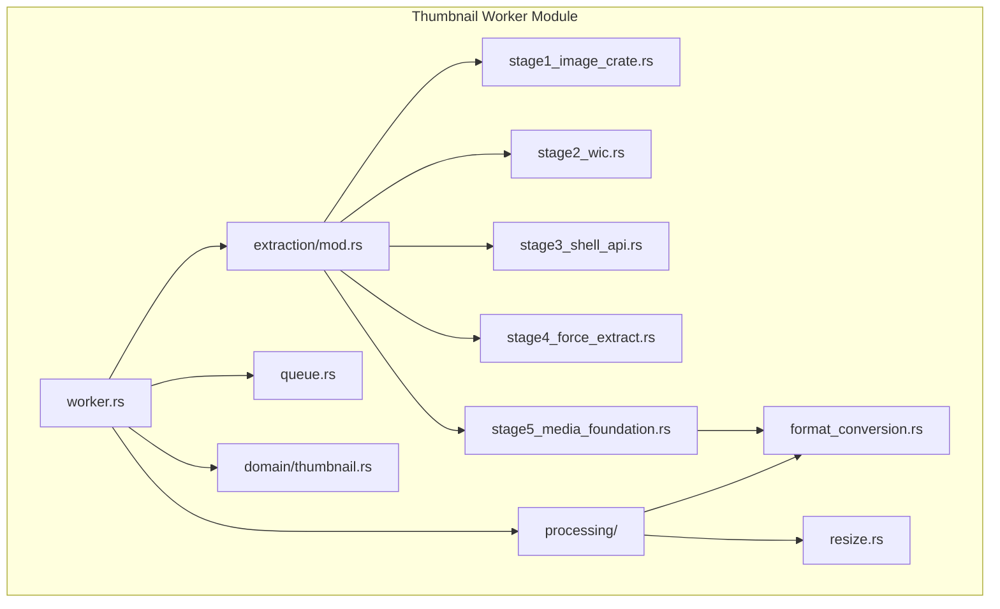
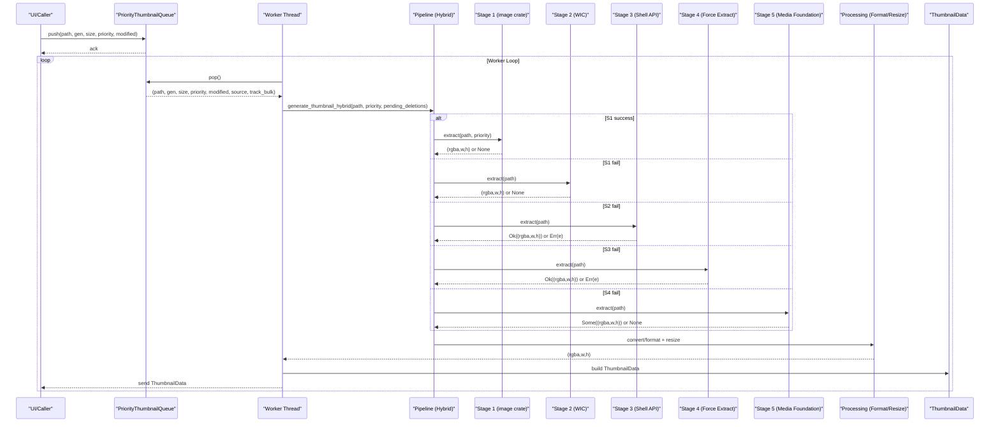
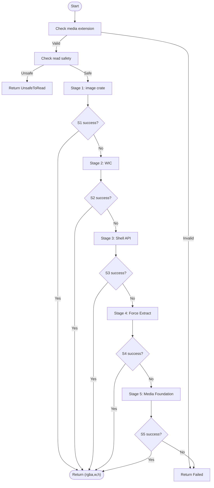
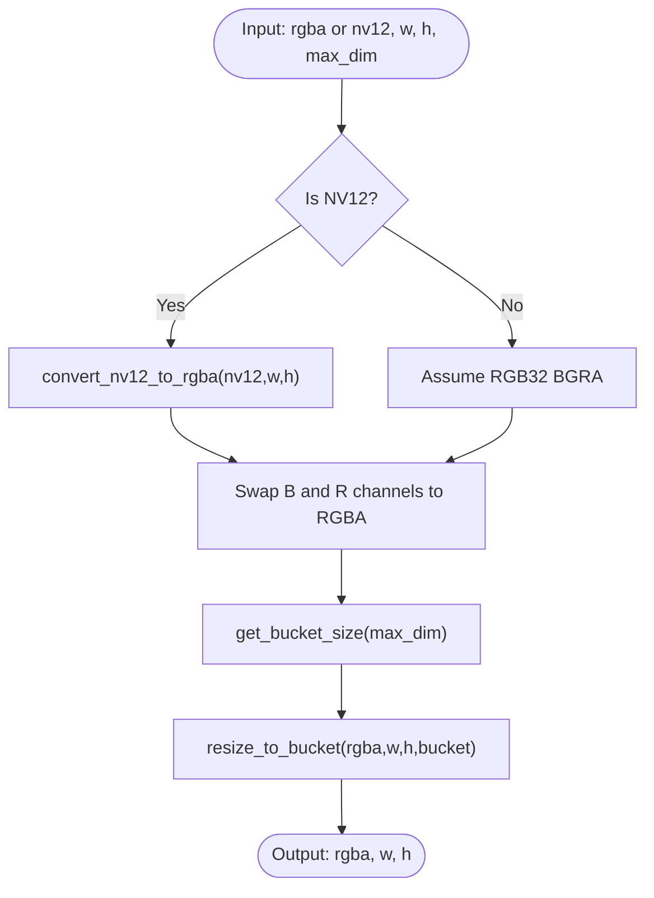
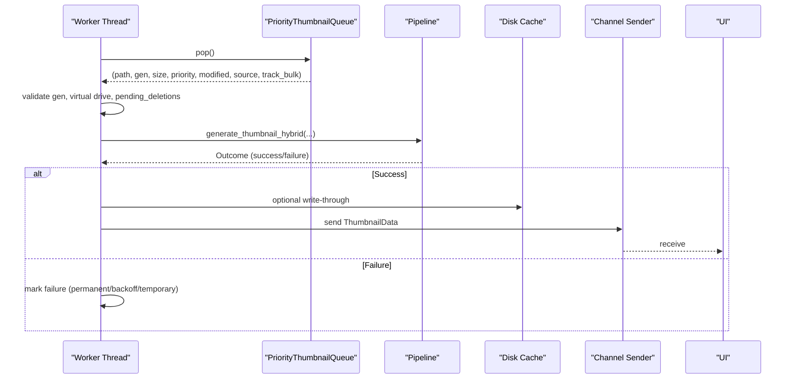
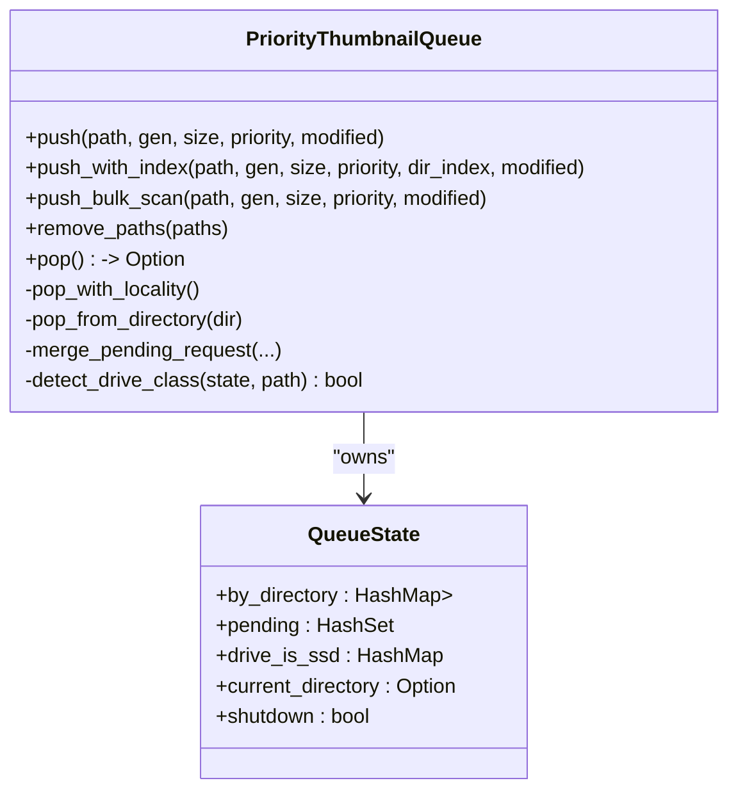
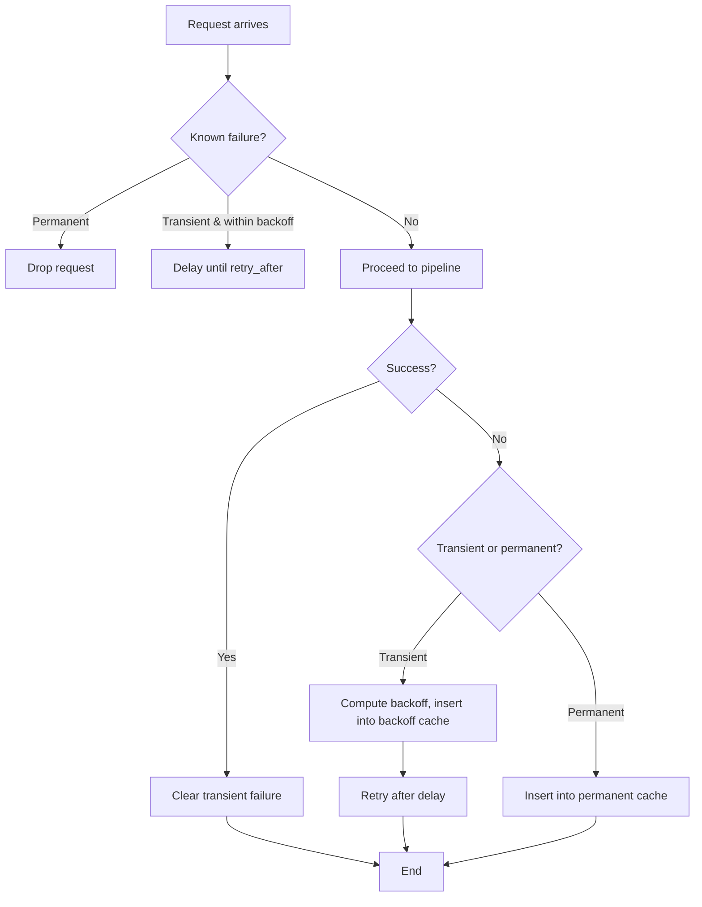
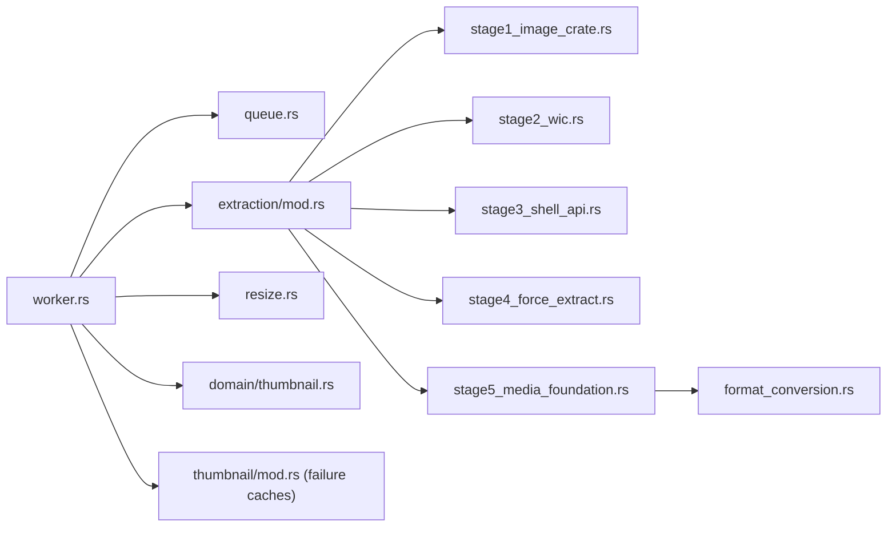

# Thumbnail Pipeline Workers

<cite>
**Referenced Files in This Document**
- [mod.rs](file://src/workers/thumbnail/mod.rs)
- [extraction/mod.rs](file://src/workers/thumbnail/extraction/mod.rs)
- [stage1_image_crate.rs](file://src/workers/thumbnail/extraction/stage1_image_crate.rs)
- [stage2_wic.rs](file://src/workers/thumbnail/extraction/stage2_wic.rs)
- [stage3_shell_api.rs](file://src/workers/thumbnail/extraction/stage3_shell_api.rs)
- [stage4_force_extract.rs](file://src/workers/thumbnail/extraction/stage4_force_extract.rs)
- [stage5_media_foundation.rs](file://src/workers/thumbnail/extraction/stage5_media_foundation.rs)
- [format_conversion.rs](file://src/workers/thumbnail/processing/format_conversion.rs)
- [resize.rs](file://src/workers/thumbnail/processing/resize.rs)
- [queue.rs](file://src/workers/thumbnail/queue.rs)
- [worker.rs](file://src/workers/thumbnail/worker.rs)
- [thumbnail.rs](file://src/domain/thumbnail.rs)
</cite>

## Table of Contents
1. [Introduction](#introduction)
2. [Project Structure](#project-structure)
3. [Core Components](#core-components)
4. [Architecture Overview](#architecture-overview)
5. [Detailed Component Analysis](#detailed-component-analysis)
6. [Dependency Analysis](#dependency-analysis)
7. [Performance Considerations](#performance-considerations)
8. [Troubleshooting Guide](#troubleshooting-guide)
9. [Conclusion](#conclusion)

## Introduction
This document explains the thumbnail extraction and processing pipeline workers. It details the five-stage extraction process, the progressive enhancement approach, format conversion and resizing algorithms, worker request processing, priority queuing, concurrent execution patterns, memory management, caching strategies, and error handling for corrupted files, unsupported formats, and resource exhaustion.

## Project Structure
The thumbnail worker system resides under the thumbnail worker module and is composed of:
- A hybrid extraction pipeline with five stages
- A processing stage for format conversion and resizing
- A priority queue with SSD/HDD awareness and deduplication
- Worker threads with concurrency limits and RAII initialization for COM/Media Foundation
- Domain data structures for thumbnail payloads

**Diagram sources**
- [extraction/mod.rs:1-168](file://src/workers/thumbnail/extraction/mod.rs#L1-L168)
- [stage1_image_crate.rs:1-42](file://src/workers/thumbnail/extraction/stage1_image_crate.rs#L1-L42)
- [stage2_wic.rs:1-71](file://src/workers/thumbnail/extraction/stage2_wic.rs#L1-L71)
- [stage3_shell_api.rs:1-117](file://src/workers/thumbnail/extraction/stage3_shell_api.rs#L1-L117)
- [stage4_force_extract.rs:1-15](file://src/workers/thumbnail/extraction/stage4_force_extract.rs#L1-L15)
- [stage5_media_foundation.rs:1-227](file://src/workers/thumbnail/extraction/stage5_media_foundation.rs#L1-L227)
- [format_conversion.rs:1-132](file://src/workers/thumbnail/processing/format_conversion.rs#L1-L132)
- [resize.rs:1-96](file://src/workers/thumbnail/processing/resize.rs#L1-L96)
- [queue.rs:1-559](file://src/workers/thumbnail/queue.rs#L1-L559)
- [worker.rs:1-338](file://src/workers/thumbnail/worker.rs#L1-L338)
- [thumbnail.rs:1-12](file://src/domain/thumbnail.rs#L1-L12)

**Section sources**
- [mod.rs:1-148](file://src/workers/thumbnail/mod.rs#L1-L148)
- [extraction/mod.rs:1-168](file://src/workers/thumbnail/extraction/mod.rs#L1-L168)
- [queue.rs:1-559](file://src/workers/thumbnail/queue.rs#L1-L559)
- [worker.rs:1-338](file://src/workers/thumbnail/worker.rs#L1-L338)
- [thumbnail.rs:1-12](file://src/domain/thumbnail.rs#L1-L12)

## Core Components
- Hybrid extraction pipeline: Five stages progressing from fast to robust and finally to direct decoding.
- Processing pipeline: Format conversion (NV12 to RGBA) and resizing with bucket sizing.
- Priority queue: Directory-grouped batching with SSD/HDD awareness, deduplication, and merging.
- Worker threads: Concurrency-limited decoders, per-thread COM/Media Foundation initialization, and panic isolation.
- Failure caches: Permanent and backoff failure tracking to avoid repeated attempts.

**Section sources**
- [extraction/mod.rs:21-168](file://src/workers/thumbnail/extraction/mod.rs#L21-L168)
- [format_conversion.rs:1-132](file://src/workers/thumbnail/processing/format_conversion.rs#L1-L132)
- [resize.rs:1-96](file://src/workers/thumbnail/processing/resize.rs#L1-L96)
- [queue.rs:11-559](file://src/workers/thumbnail/queue.rs#L11-L559)
- [worker.rs:25-169](file://src/workers/thumbnail/worker.rs#L25-L169)
- [mod.rs:32-148](file://src/workers/thumbnail/mod.rs#L32-L148)

## Architecture Overview
The pipeline orchestrates a five-stage extraction process, each progressively more robust and resource-intensive. The worker threads pull requests from a priority queue, enforce concurrency caps, and feed the pipeline. Results are returned as RGBA buffers with width/height and included in a domain payload.

**Diagram sources**
- [queue.rs:67-340](file://src/workers/thumbnail/queue.rs#L67-L340)
- [worker.rs:192-289](file://src/workers/thumbnail/worker.rs#L192-L289)
- [extraction/mod.rs:38-167](file://src/workers/thumbnail/extraction/mod.rs#L38-L167)
- [stage1_image_crate.rs:14-41](file://src/workers/thumbnail/extraction/stage1_image_crate.rs#L14-L41)
- [stage2_wic.rs:12-70](file://src/workers/thumbnail/extraction/stage2_wic.rs#L12-L70)
- [stage3_shell_api.rs:18-63](file://src/workers/thumbnail/extraction/stage3_shell_api.rs#L18-L63)
- [stage4_force_extract.rs:8-14](file://src/workers/thumbnail/extraction/stage4_force_extract.rs#L8-L14)
- [stage5_media_foundation.rs:13-226](file://src/workers/thumbnail/extraction/stage5_media_foundation.rs#L13-L226)
- [format_conversion.rs:5-58](file://src/workers/thumbnail/processing/format_conversion.rs#L5-L58)
- [resize.rs:7-61](file://src/workers/thumbnail/processing/resize.rs#L7-L61)
- [thumbnail.rs:3-12](file://src/domain/thumbnail.rs#L3-L12)

## Detailed Component Analysis

### Five-Stage Hybrid Extraction Pipeline
The pipeline proceeds through ordered stages, each designed for increasing complexity and reliability:
- Stage 1 (image crate): Fast path for common raster formats using buffered sequential I/O and format detection.
- Stage 2 (WIC): Robust fallback for problematic formats (e.g., CMYK JPEGs) via Windows Imaging Component.
- Stage 3 (Shell API): Universal fallback using IShellItemImageFactory; for videos, prefers thumbnail-only to trigger force extraction when needed.
- Stage 4 (Force Extraction): Bypasses Windows cache using IThumbnailCache with force flag.
- Stage 5 (Media Foundation): Direct video frame extraction via IMFSourceReader, supporting RGB32 or NV12.

**Diagram sources**
- [extraction/mod.rs:38-167](file://src/workers/thumbnail/extraction/mod.rs#L38-L167)

**Section sources**
- [extraction/mod.rs:21-168](file://src/workers/thumbnail/extraction/mod.rs#L21-L168)
- [stage1_image_crate.rs:14-41](file://src/workers/thumbnail/extraction/stage1_image_crate.rs#L14-L41)
- [stage2_wic.rs:12-70](file://src/workers/thumbnail/extraction/stage2_wic.rs#L12-L70)
- [stage3_shell_api.rs:18-63](file://src/workers/thumbnail/extraction/stage3_shell_api.rs#L18-L63)
- [stage4_force_extract.rs:8-14](file://src/workers/thumbnail/extraction/stage4_force_extract.rs#L8-L14)
- [stage5_media_foundation.rs:13-226](file://src/workers/thumbnail/extraction/stage5_media_foundation.rs#L13-L226)

### Processing Stage: Format Conversion and Resizing
- NV12 to RGBA conversion: Converts hardware-friendly NV12 frames to RGBA using integer arithmetic with BT.601 coefficients and clamping.
- Resizing: Buckets sizes into 128/256/512/1024; preserves aspect ratio and uses CatmullRom filter for quality.

**Diagram sources**
- [stage5_media_foundation.rs:172-214](file://src/workers/thumbnail/extraction/stage5_media_foundation.rs#L172-L214)
- [format_conversion.rs:5-58](file://src/workers/thumbnail/processing/format_conversion.rs#L5-L58)
- [resize.rs:7-61](file://src/workers/thumbnail/processing/resize.rs#L7-L61)

**Section sources**
- [format_conversion.rs:1-132](file://src/workers/thumbnail/processing/format_conversion.rs#L1-L132)
- [resize.rs:1-96](file://src/workers/thumbnail/processing/resize.rs#L1-L96)
- [stage5_media_foundation.rs:171-224](file://src/workers/thumbnail/extraction/stage5_media_foundation.rs#L171-L224)

### Worker Request Processing Workflow
- Worker threads initialize COM and Media Foundation once per thread and run a loop pulling requests from the priority queue.
- Each request is validated against generation, pending deletions, and optional virtual drive constraints.
- The hybrid pipeline is executed, and results are sent to the UI via a channel as ThumbnailData.

**Diagram sources**
- [worker.rs:192-289](file://src/workers/thumbnail/worker.rs#L192-L289)
- [queue.rs:310-340](file://src/workers/thumbnail/queue.rs#L310-L340)
- [extraction/mod.rs:38-167](file://src/workers/thumbnail/extraction/mod.rs#L38-L167)
- [thumbnail.rs:3-12](file://src/domain/thumbnail.rs#L3-L12)

**Section sources**
- [worker.rs:102-169](file://src/workers/thumbnail/worker.rs#L102-L169)
- [worker.rs:192-289](file://src/workers/thumbnail/worker.rs#L192-L289)
- [queue.rs:310-340](file://src/workers/thumbnail/queue.rs#L310-L340)
- [thumbnail.rs:1-12](file://src/domain/thumbnail.rs#L1-L12)

### Priority Queuing and Concurrent Execution
- Directory grouping minimizes HDD seeks by prioritizing items within the current directory when the drive is detected as HDD.
- Deduplication and merging: Pending paths are tracked; incoming requests can upgrade priority, increase size, update generation, and adjust indices.
- Drive classification: SSD vs HDD is cached per drive prefix to decide ordering and locality.
- Concurrency control: A semaphore limits concurrent decode operations; a separate semaphore limits virtual drive bulk scans to one at a time.

**Diagram sources**
- [queue.rs:29-482](file://src/workers/thumbnail/queue.rs#L29-L482)

**Section sources**
- [queue.rs:11-559](file://src/workers/thumbnail/queue.rs#L11-L559)
- [worker.rs:117-122](file://src/workers/thumbnail/worker.rs#L117-L122)

### Memory Management, Caching, and Failure Tracking
- Decode concurrency cap: Hard cap on concurrent decodes to bound RAM usage even on high-core systems.
- Failure caches:
  - Permanent failures: LRU cache of paths that failed irrecoverably.
  - Transient failures: LRU cache with exponential backoff and retry timers.
  - Active write blocks: Short-term block for files actively being written.
- Disk cache integration: Optional write-through to a disk-backed cache for thumbnails.

**Diagram sources**
- [mod.rs:70-148](file://src/workers/thumbnail/mod.rs#L70-L148)

**Section sources**
- [worker.rs:25-27](file://src/workers/thumbnail/worker.rs#L25-L27)
- [mod.rs:32-148](file://src/workers/thumbnail/mod.rs#L32-L148)

## Dependency Analysis
Key dependencies and relationships:
- Pipeline depends on Windows APIs (COM/WIC/Shell/Media Foundation) and the image crate for fast paths.
- Worker threads depend on the priority queue, failure caches, and disk cache.
- Processing depends on image crate for resizing and a dedicated NV12 conversion routine.

**Diagram sources**
- [worker.rs:102-169](file://src/workers/thumbnail/worker.rs#L102-L169)
- [extraction/mod.rs:11-15](file://src/workers/thumbnail/extraction/mod.rs#L11-L15)
- [stage5_media_foundation.rs:8-8](file://src/workers/thumbnail/extraction/stage5_media_foundation.rs#L8-L8)
- [format_conversion.rs:1-132](file://src/workers/thumbnail/processing/format_conversion.rs#L1-L132)
- [resize.rs:1-96](file://src/workers/thumbnail/processing/resize.rs#L1-L96)
- [thumbnail.rs:1-12](file://src/domain/thumbnail.rs#L1-L12)
- [mod.rs:37-148](file://src/workers/thumbnail/mod.rs#L37-L148)

**Section sources**
- [worker.rs:102-169](file://src/workers/thumbnail/worker.rs#L102-L169)
- [extraction/mod.rs:11-15](file://src/workers/thumbnail/extraction/mod.rs#L11-L15)
- [stage5_media_foundation.rs:8-8](file://src/workers/thumbnail/extraction/stage5_media_foundation.rs#L8-L8)
- [format_conversion.rs:1-132](file://src/workers/thumbnail/processing/format_conversion.rs#L1-L132)
- [resize.rs:1-96](file://src/workers/thumbnail/processing/resize.rs#L1-L96)
- [thumbnail.rs:1-12](file://src/domain/thumbnail.rs#L1-L12)
- [mod.rs:37-148](file://src/workers/thumbnail/mod.rs#L37-L148)

## Performance Considerations
- HDD locality: Directory grouping reduces seek times on rotational drives; SSDs disable locality to maximize throughput.
- Concurrency caps: Decode semaphore prevents memory spikes; virtual drive semaphore throttles bulk scans on FUSE-based virtual drives.
- I/O priority: Thread priority set to background to minimize interference with video playback.
- Buffer safety: Pre-checks ensure buffer capacity before conversions; fallback returns original data if checks fail.
- Bucket sizing: Aligns output sizes to power-of-two buckets to optimize GPU uploads.

[No sources needed since this section provides general guidance]

## Troubleshooting Guide
Common issues and handling:
- Non-media files: Early exit if extension is not recognized as media.
- Unsafe reads: Classification of files as unsafe to read (e.g., sharing violations) aborts extraction.
- Deleted/pending files: Checks for pending deletions and existence before and between stages.
- Stage-specific errors:
  - Stage 3/4: Expected “file not found” errors are filtered from logs to avoid noise.
  - Stage 5: RGB32 unsupported falls back to NV12; buffer size mismatches are logged and retried.
- Failure tracking:
  - Transient failures: Automatic exponential backoff with retry timers.
  - Permanent failures: LRU cache marks paths to avoid repeated attempts.
  - Active write blocks: Short cooldown for files actively being written.

**Section sources**
- [extraction/mod.rs:54-167](file://src/workers/thumbnail/extraction/mod.rs#L54-L167)
- [stage3_shell_api.rs:122-133](file://src/workers/thumbnail/extraction/stage3_shell_api.rs#L122-L133)
- [stage5_media_foundation.rs:96-114](file://src/workers/thumbnail/extraction/stage5_media_foundation.rs#L96-L114)
- [stage5_media_foundation.rs:171-204](file://src/workers/thumbnail/extraction/stage5_media_foundation.rs#L171-L204)
- [mod.rs:70-148](file://src/workers/thumbnail/mod.rs#L70-L148)

## Conclusion
The thumbnail pipeline combines a fast, layered extraction strategy with robust fallbacks, strict concurrency control, and intelligent caching to deliver reliable, high-quality thumbnails across diverse file types and workloads. The design balances performance (fast paths, SSD locality) with resilience (WIC, Shell API, Media Foundation) and operational safety (failures, timeouts, and memory caps).