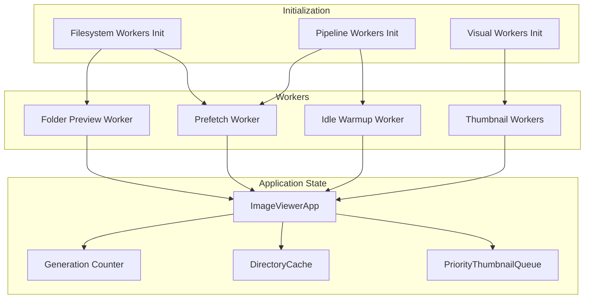
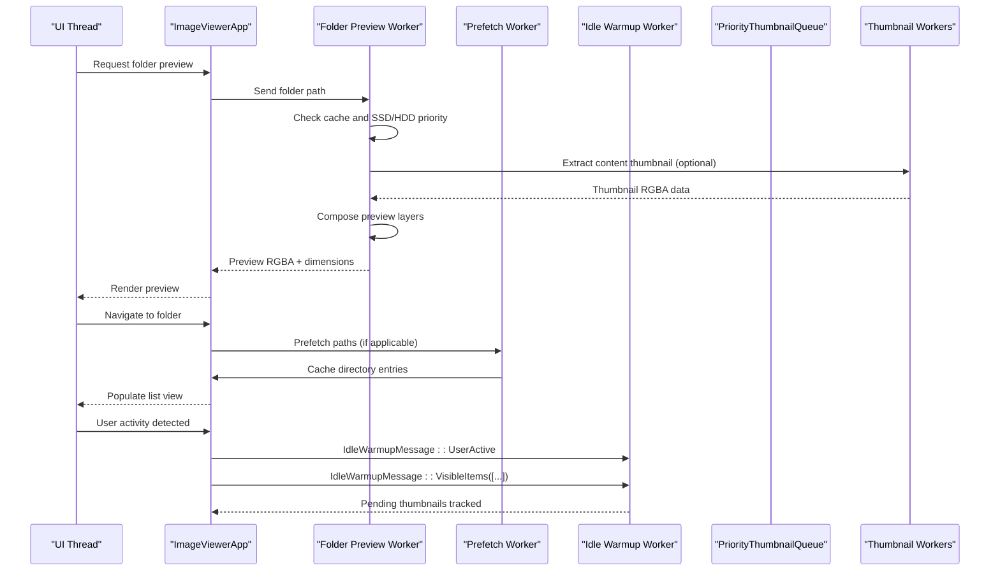
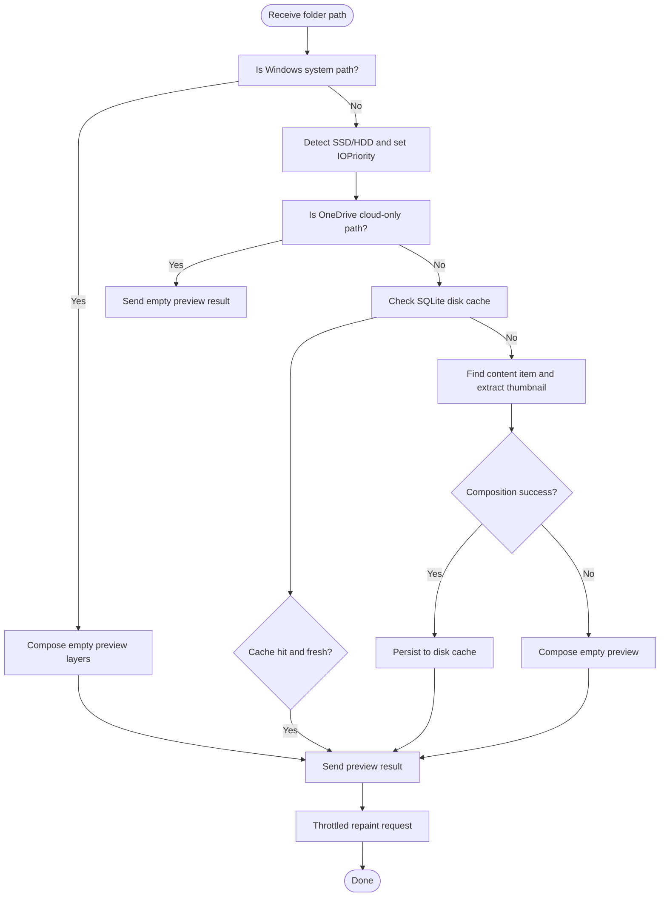
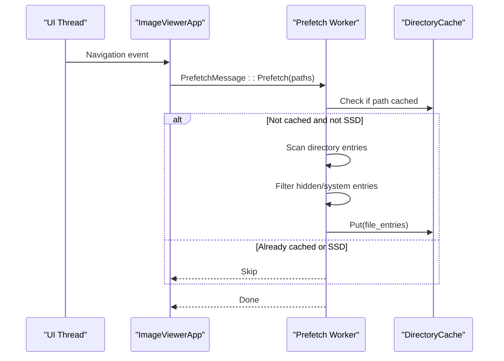
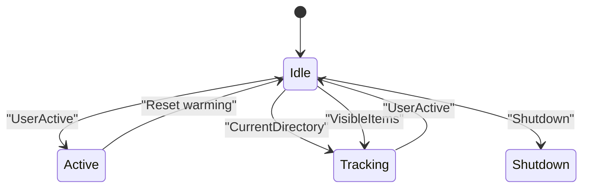
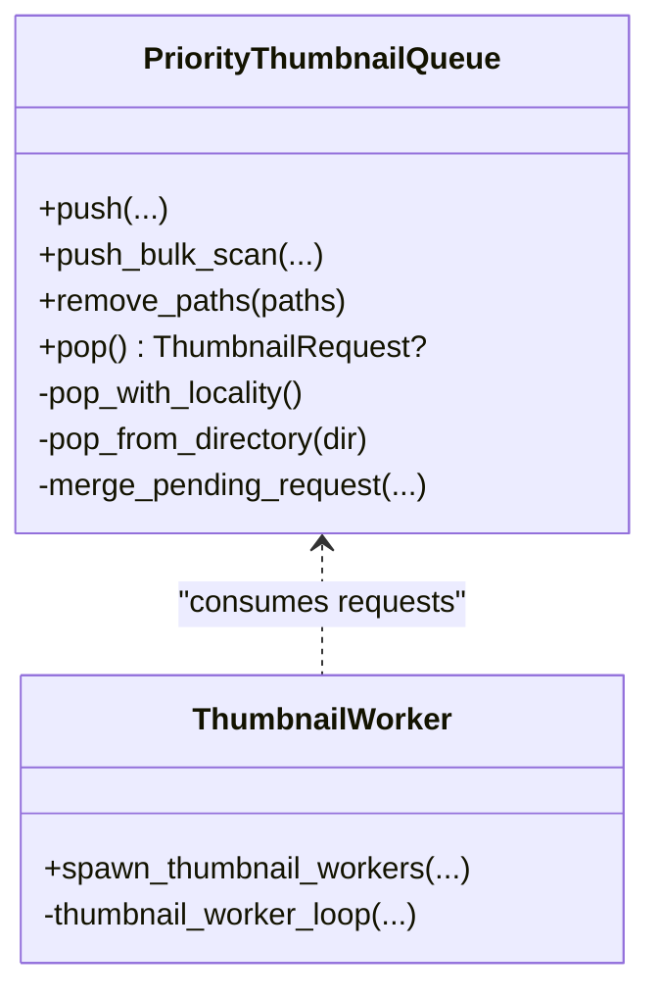
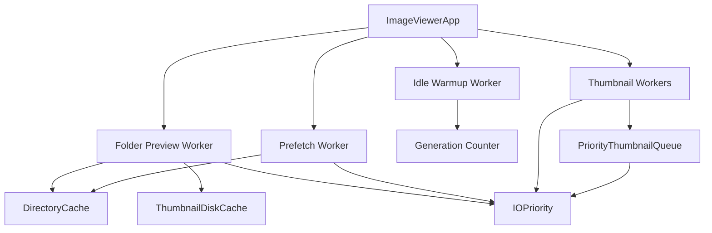

# Utility Workers

<cite>
**Referenced Files in This Document**
- [folder_preview_worker.rs](file://src/workers/folder_preview_worker.rs)
- [prefetch_worker.rs](file://src/workers/prefetch_worker.rs)
- [idle_warmup.rs](file://src/workers/idle_warmup.rs)
- [mod.rs](file://src/workers/mod.rs)
- [filesystem_workers.rs](file://src/app/init_workers/filesystem_workers.rs)
- [pipeline_workers.rs](file://src/app/init_workers/pipeline_workers.rs)
- [visual_workers.rs](file://src/app/init_workers/visual_workers.rs)
- [state.rs](file://src/app/state/mod.rs)
- [shutdown.rs](file://src/app/operations/shutdown.rs)
- [worker.rs](file://src/workers/thumbnail/worker.rs)
- [queue.rs](file://src/workers/thumbnail/queue.rs)
- [io_priority.rs](file://src/infrastructure/io_priority.rs)
- [threading.rs](file://src/infrastructure/io_priority/threading.rs)
- [adaptive_batch.rs](file://src/infrastructure/adaptive_batch.rs)
- [status_bar.rs](file://src/ui/status_bar.rs)
</cite>

## Table of Contents
1. [Introduction](#introduction)
2. [Project Structure](#project-structure)
3. [Core Components](#core-components)
4. [Architecture Overview](#architecture-overview)
5. [Detailed Component Analysis](#detailed-component-analysis)
6. [Dependency Analysis](#dependency-analysis)
7. [Performance Considerations](#performance-considerations)
8. [Troubleshooting Guide](#troubleshooting-guide)
9. [Conclusion](#conclusion)

## Introduction
This document explains the utility workers that support the main application: the folder preview worker, the prefetch worker, and the idle warmup worker. It details how these workers generate directory previews and metadata, proactively load data for anticipated user actions, and maintain worker pools and caches during low activity. It also covers the coordination mechanisms with the main application state, adaptive behavior based on user activity and disk characteristics, and performance monitoring and optimization strategies.

## Project Structure
Utility workers are organized under the workers module and integrated with initialization routines and application state:
- Worker definitions: folder preview, prefetch, idle warmup, and thumbnail pipeline
- Initialization: spawning and wiring workers into the app state
- Coordination: channels and shared state for communication
- Infrastructure: I/O priority, adaptive batching, and resource monitoring

**Diagram sources**
- [filesystem_workers.rs:224-257](file://src/app/init_workers/filesystem_workers.rs#L224-L257)
- [pipeline_workers.rs:13-33](file://src/app/init_workers/pipeline_workers.rs#L13-L33)
- [visual_workers.rs:125-302](file://src/app/init_workers/visual_workers.rs#L125-L302)
- [state.rs:65-435](file://src/app/state/mod.rs#L65-L435)

**Section sources**
- [mod.rs:1-9](file://src/workers/mod.rs#L1-L9)
- [filesystem_workers.rs:224-257](file://src/app/init_workers/filesystem_workers.rs#L224-L257)
- [pipeline_workers.rs:13-33](file://src/app/init_workers/pipeline_workers.rs#L13-L33)
- [visual_workers.rs:125-302](file://src/app/init_workers/visual_workers.rs#L125-L302)
- [state.rs:65-435](file://src/app/state/mod.rs#L65-L435)

## Core Components
- Folder Preview Worker: Generates folder cover previews by composing a content thumbnail with layered assets, with a fallback to Windows Shell APIs when needed. It respects SSD vs HDD I/O priorities and caches results to disk.
- Prefetch Worker: Proactively caches directory listings for upcoming navigation, skipping SSDs and limiting concurrent prefetch targets.
- Idle Warmup Worker: Maintains readiness by tracking user activity and pending thumbnail requests; it does not directly perform I/O but coordinates warm-up signals.
- Thumbnail Pipeline: Provides a priority queue and worker pool that adapts to SSD/HDD characteristics, merges duplicate requests, and throttles concurrency to protect system resources.

**Section sources**
- [folder_preview_worker.rs:1-286](file://src/workers/folder_preview_worker.rs#L1-L286)
- [prefetch_worker.rs:1-72](file://src/workers/prefetch_worker.rs#L1-L72)
- [idle_warmup.rs:1-82](file://src/workers/idle_warmup.rs#L1-L82)
- [worker.rs:103-169](file://src/workers/thumbnail/worker.rs#L103-L169)
- [queue.rs:29-559](file://src/workers/thumbnail/queue.rs#L29-L559)

## Architecture Overview
The utility workers operate asynchronously, communicating with the main application state via channels and shared structures. They adapt to user activity and storage characteristics to optimize responsiveness and throughput.

**Diagram sources**
- [folder_preview_worker.rs:50-196](file://src/workers/folder_preview_worker.rs#L50-L196)
- [prefetch_worker.rs:17-72](file://src/workers/prefetch_worker.rs#L17-L72)
- [idle_warmup.rs:46-82](file://src/workers/idle_warmup.rs#L46-L82)
- [worker.rs:192-289](file://src/workers/thumbnail/worker.rs#L192-L289)
- [queue.rs:310-340](file://src/workers/thumbnail/queue.rs#L310-L340)
- [state.rs:109-111](file://src/app/state/mod.rs#L109-L111)

## Detailed Component Analysis

### Folder Preview Worker
Responsibilities:
- Generate folder previews by extracting a representative content thumbnail and compositing it with layered assets.
- Fallback to Windows Shell APIs for system paths or when composition is not possible.
- Respect SSD vs HDD I/O priorities and cache results to disk for quick retrieval.
- Throttle repaint requests to keep the UI responsive.

Key behaviors:
- Detects SSD vs HDD and sets thread priority accordingly.
- Skips cloud-only OneDrive paths to avoid network blocking.
- Uses a disk cache with freshness checks; avoids caching placeholders for “unsafe to read” media.
- Emits preview data on completion and requests UI repaints at a controlled cadence.

**Diagram sources**
- [folder_preview_worker.rs:107-187](file://src/workers/folder_preview_worker.rs#L107-L187)
- [folder_preview_worker.rs:213-276](file://src/workers/folder_preview_worker.rs#L213-L276)

**Section sources**
- [folder_preview_worker.rs:1-286](file://src/workers/folder_preview_worker.rs#L1-L286)
- [filesystem_workers.rs:224-257](file://src/app/init_workers/filesystem_workers.rs#L224-L257)

### Prefetch Worker
Responsibilities:
- Proactively cache directory listings for upcoming navigation to reduce latency.
- Skip SSDs (raw disk speed is sufficient) and limit the number of directories prefetched.
- Filter out hidden/system entries and construct lightweight FileEntry objects for caching.

Coordination:
- Receives a bounded list of paths and caches only those not already present.
- Uses NTFS fast path directory scanning when available.

**Diagram sources**
- [prefetch_worker.rs:26-64](file://src/workers/prefetch_worker.rs#L26-L64)
- [pipeline_workers.rs:13-33](file://src/app/init_workers/pipeline_workers.rs#L13-L33)

**Section sources**
- [prefetch_worker.rs:1-72](file://src/workers/prefetch_worker.rs#L1-L72)
- [pipeline_workers.rs:13-33](file://src/app/init_workers/pipeline_workers.rs#L13-L33)

### Idle Warmup Worker
Responsibilities:
- Track user activity and maintain readiness by observing current directory and visible items.
- Coordinate warm-up signals to the thumbnail pipeline indirectly via shared state and messages.
- Does not perform I/O itself; acts as a coordinator for background preparation.

Behavior:
- Resets warming state on user activity.
- Updates current directory and pending thumbnail list from UI-visible items.
- Handles shutdown gracefully.

**Diagram sources**
- [idle_warmup.rs:17-38](file://src/workers/idle_warmup.rs#L17-L38)
- [idle_warmup.rs:46-82](file://src/workers/idle_warmup.rs#L46-L82)

**Section sources**
- [idle_warmup.rs:1-82](file://src/workers/idle_warmup.rs#L1-L82)
- [pipeline_workers.rs:13-33](file://src/app/init_workers/pipeline_workers.rs#L13-L33)

### Thumbnail Pipeline (Adaptive Behavior)
Responsibilities:
- Manage a priority queue that groups requests by directory on HDDs to reduce seeks.
- Dynamically adjust worker counts and decode concurrency based on CPU availability.
- Merge duplicate requests, promote priorities, and track bulk progress.

Adaptive mechanisms:
- SSD vs HDD detection influences request ordering and locality behavior.
- DirectoryGroupedQueue sorts by priority and directory index on HDDs.
- Worker count and decode limits scale with CPU cores while bounding memory usage.
- Bulk scans are tracked separately to update progress and throttle virtual drive loads.

**Diagram sources**
- [queue.rs:29-559](file://src/workers/thumbnail/queue.rs#L29-L559)
- [worker.rs:103-169](file://src/workers/thumbnail/worker.rs#L103-L169)

**Section sources**
- [queue.rs:1-559](file://src/workers/thumbnail/queue.rs#L1-L559)
- [worker.rs:1-338](file://src/workers/thumbnail/worker.rs#L1-L338)
- [io_priority.rs:1-183](file://src/infrastructure/io_priority.rs#L1-L183)
- [threading.rs:1-40](file://src/infrastructure/io_priority/threading.rs#L1-L40)

## Dependency Analysis
The utility workers depend on shared infrastructure and are coordinated by the application state:
- I/O priority system: thread priority management and SSD detection
- Directory cache: persistent and in-memory caches for directory listings and previews
- Thumbnail queue: centralized request management with merging and locality
- Application state: channels, shared counters, and UI context for repaints

**Diagram sources**
- [folder_preview_worker.rs:13-19](file://src/workers/folder_preview_worker.rs#L13-L19)
- [prefetch_worker.rs:6-8](file://src/workers/prefetch_worker.rs#L6-L8)
- [idle_warmup.rs:6-8](file://src/workers/idle_warmup.rs#L6-L8)
- [worker.rs:10-21](file://src/workers/thumbnail/worker.rs#L10-L21)
- [queue.rs:5-9](file://src/workers/thumbnail/queue.rs#L5-L9)
- [state.rs:78-83](file://src/app/state/mod.rs#L78-L83)

**Section sources**
- [io_priority.rs:1-183](file://src/infrastructure/io_priority.rs#L1-L183)
- [threading.rs:1-40](file://src/infrastructure/io_priority/threading.rs#L1-L40)
- [state.rs:65-435](file://src/app/state/mod.rs#L65-L435)

## Performance Considerations
- SSD-aware scheduling: workers set thread priority based on SSD detection to balance responsiveness and background impact.
- Request deduplication and promotion: the thumbnail queue merges duplicate requests and promotes priorities to avoid redundant work.
- Concurrency limits: decode semaphore caps peak memory usage; virtual drive bulk scans are serialized to prevent driver overload.
- Adaptive batching: batch sizes are tuned dynamically to maintain target latency per item, with different strategies for SSD vs HDD.
- Backpressure and throttling: folder preview worker throttles repaint requests to ~30 Hz to avoid UI jitter.
- Resource monitoring: kernel metrics polling tracks GDI/User objects and thread counts to detect resource pressure.

Optimization recommendations:
- Keep SSD prefetch disabled to avoid unnecessary I/O.
- Tune batch sizes for HDD workloads using the adaptive tracker.
- Monitor kernel resource metrics during extended operations to detect leaks or spikes.
- Use generation counters to invalidate stale requests promptly.

**Section sources**
- [folder_preview_worker.rs:82-91](file://src/workers/folder_preview_worker.rs#L82-L91)
- [worker.rs:29-77](file://src/workers/thumbnail/worker.rs#L29-L77)
- [queue.rs:213-289](file://src/workers/thumbnail/queue.rs#L213-L289)
- [adaptive_batch.rs:1-88](file://src/infrastructure/adaptive_batch.rs#L1-L88)
- [status_bar.rs:117-147](file://src/ui/status_bar.rs#L117-L147)

## Troubleshooting Guide
Common issues and remedies:
- Worker not exiting cleanly on shutdown: ensure all sender ends are dropped to signal workers to exit.
- Thumbnails not appearing: verify SSD detection and I/O priority settings; confirm decode semaphore permits are released.
- Excessive memory usage: check decode limit and worker count; confirm virtual drive serialization is active for bulk scans.
- Stale previews: clear disk cache entries for affected folders; ensure freshness checks compare cached timestamps with directory modification times.
- Idle warmup not triggering: verify IdleWarmupMessage delivery and that user activity resets warming state.

**Section sources**
- [shutdown.rs:1-97](file://src/app/operations/shutdown.rs#L1-L97)
- [worker.rs:171-189](file://src/workers/thumbnail/worker.rs#L171-L189)
- [folder_preview_worker.rs:114-119](file://src/workers/folder_preview_worker.rs#L114-L119)

## Conclusion
The utility workers provide responsive, adaptive background processing for folder previews, prefetching, and thumbnail generation. Through SSD-aware scheduling, request deduplication, concurrency limits, and adaptive batching, they maintain system responsiveness while minimizing redundant work. Coordination via channels and shared state ensures seamless integration with the main application, and robust shutdown and monitoring practices help sustain long-running stability.