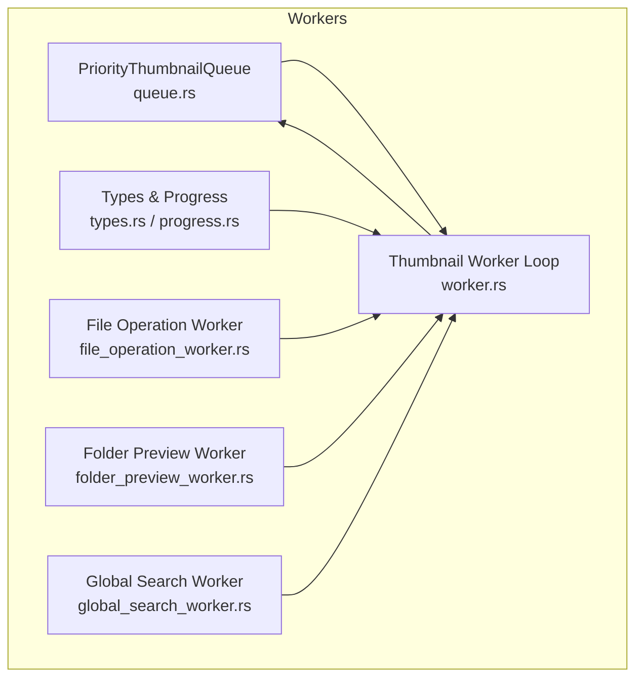
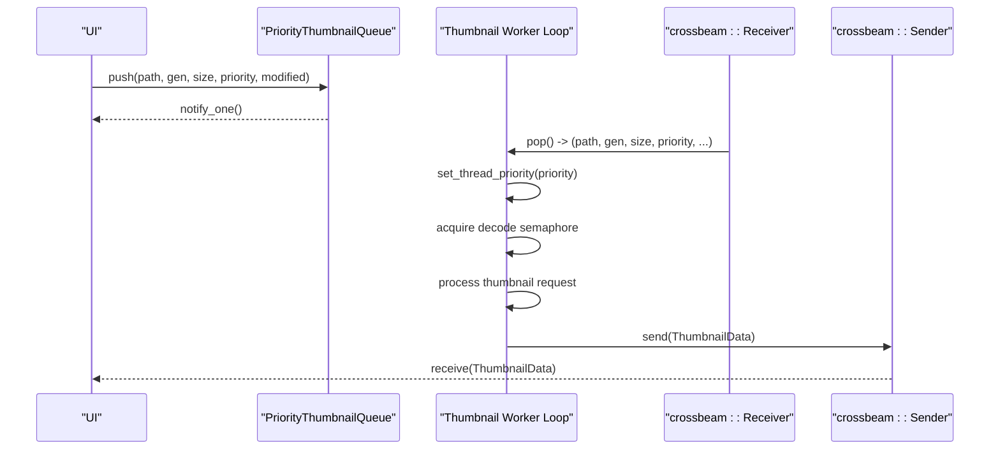
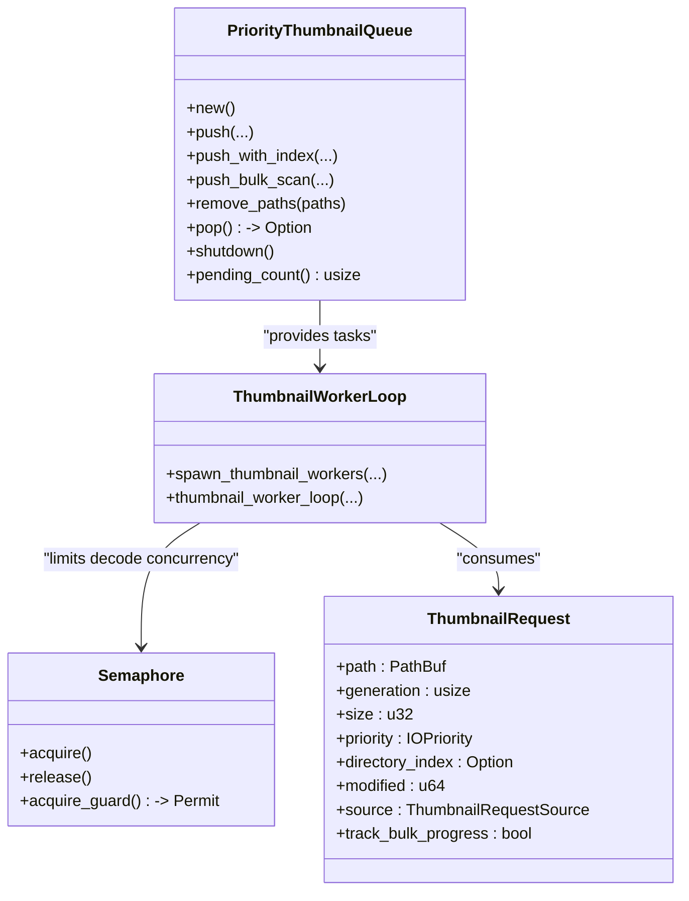
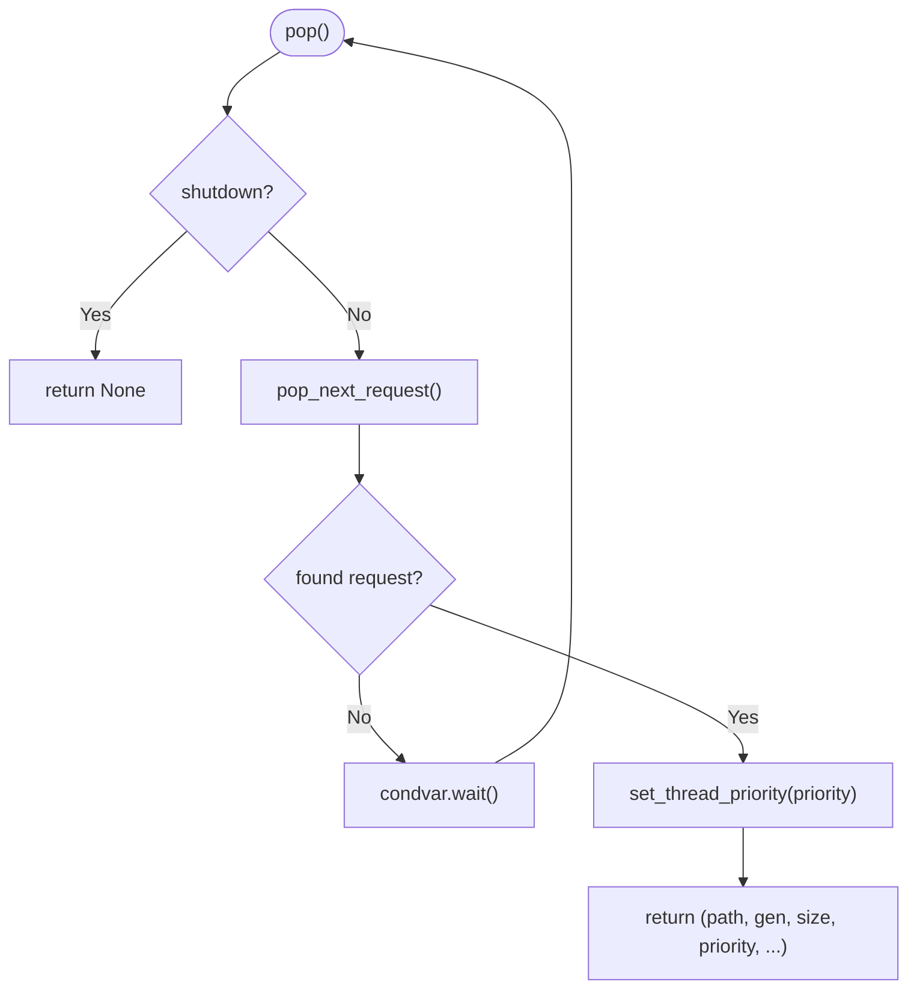
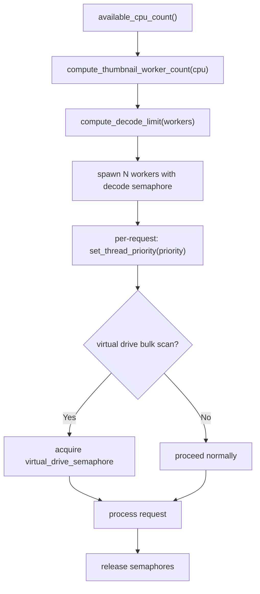
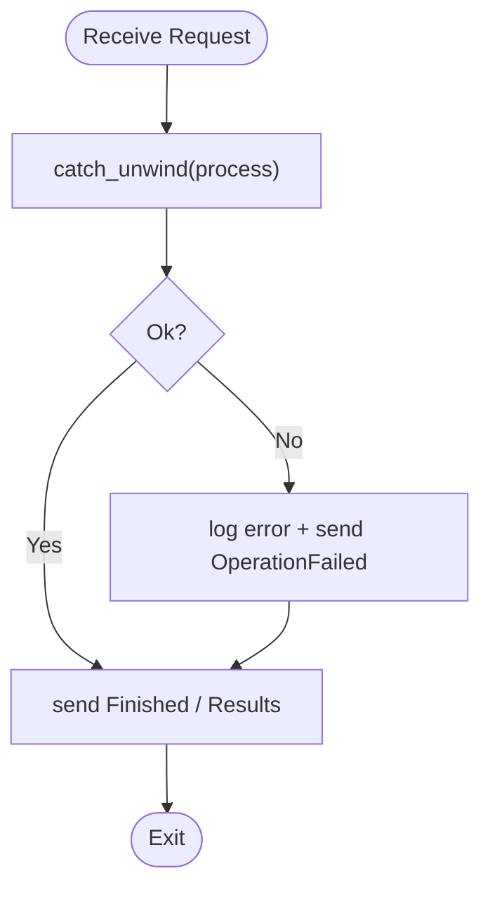
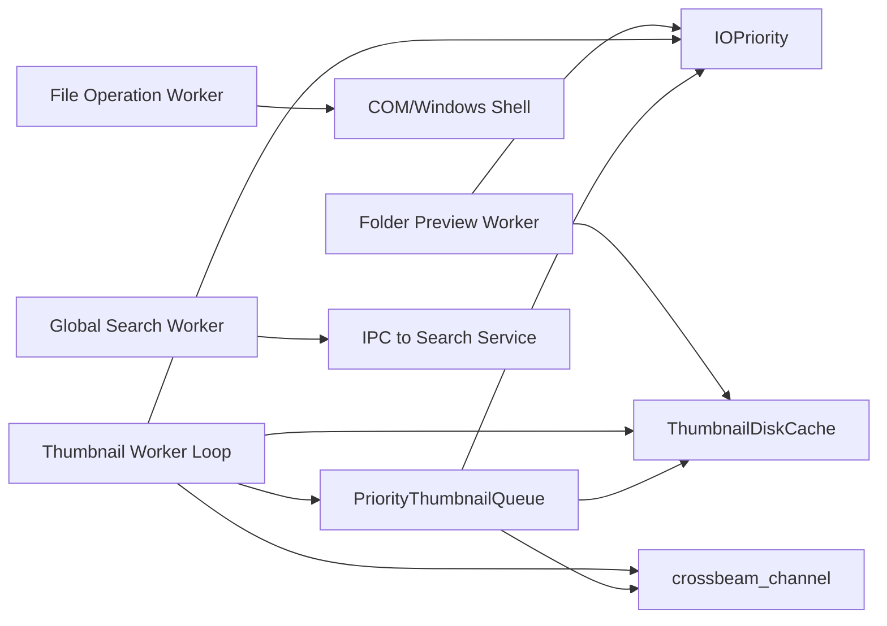

# Worker Architecture Overview

<cite>
**Referenced Files in This Document**
- [worker.rs](file://src/workers/thumbnail/worker.rs)
- [queue.rs](file://src/workers/thumbnail/queue.rs)
- [types.rs](file://src/workers/thumbnail/types.rs)
- [progress.rs](file://src/workers/thumbnail/progress.rs)
- [file_operation_worker.rs](file://src/workers/file_operation_worker.rs)
- [folder_preview_worker.rs](file://src/workers/folder_preview_worker.rs)
- [global_search_worker.rs](file://src/workers/global_search_worker.rs)
</cite>

## Table of Contents
1. [Introduction](#introduction)
2. [Project Structure](#project-structure)
3. [Core Components](#core-components)
4. [Architecture Overview](#architecture-overview)
5. [Detailed Component Analysis](#detailed-component-analysis)
6. [Dependency Analysis](#dependency-analysis)
7. [Performance Considerations](#performance-considerations)
8. [Troubleshooting Guide](#troubleshooting-guide)
9. [Conclusion](#conclusion)

## Introduction
This document explains the MTT File Manager worker architecture with a focus on the worker pool design pattern, crossbeam channel-based communication, task queuing, priority-based scheduling, lifecycle management, adaptive batch processing, error handling, supervision, and performance monitoring. It covers the thumbnail pipeline, file operation worker, folder preview worker, and global search worker to provide a complete picture of concurrent task processing across the application.

## Project Structure
Workers are organized under the src/workers module and include specialized subsystems:
- Thumbnail worker pipeline: queue, types, progress tracking, and the worker thread manager
- File operation worker: Windows Shell operations with COM STA semantics
- Folder preview worker: composed previews with disk caching and IO prioritization
- Global search worker: IPC-backed search with retry, coalescing, and status tracking



**Diagram sources**
- [queue.rs:1-559](file://src/workers/thumbnail/queue.rs#L1-L559)
- [worker.rs:1-338](file://src/workers/thumbnail/worker.rs#L1-L338)
- [types.rs:1-33](file://src/workers/thumbnail/types.rs#L1-L33)
- [progress.rs:1-44](file://src/workers/thumbnail/progress.rs#L1-L44)
- [file_operation_worker.rs:1-353](file://src/workers/file_operation_worker.rs#L1-L353)
- [folder_preview_worker.rs:1-286](file://src/workers/folder_preview_worker.rs#L1-L286)
- [global_search_worker.rs:1-594](file://src/workers/global_search_worker.rs#L1-L594)

**Section sources**
- [worker.rs:1-338](file://src/workers/thumbnail/worker.rs#L1-L338)
- [queue.rs:1-559](file://src/workers/thumbnail/queue.rs#L1-L559)
- [types.rs:1-33](file://src/workers/thumbnail/types.rs#L1-L33)
- [progress.rs:1-44](file://src/workers/thumbnail/progress.rs#L1-L44)
- [file_operation_worker.rs:1-353](file://src/workers/file_operation_worker.rs#L1-L353)
- [folder_preview_worker.rs:1-286](file://src/workers/folder_preview_worker.rs#L1-L286)
- [global_search_worker.rs:1-594](file://src/workers/global_search_worker.rs#L1-L594)

## Core Components
- PriorityThumbnailQueue: Directory-grouped, drive-aware priority queue with deduplication and HDD locality optimization
- Thumbnail Worker Pool: Adaptive worker count, decode limiting, and per-worker semaphores
- Request Types: Structured request model with priority, source, and metadata
- Progress Tracking: Shared state for bulk thumbnail scanning updates
- File Operation Worker: COM STA worker for Windows Shell operations with robust error handling
- Folder Preview Worker: Disk-cache-first composition with SSD/HDD IO prioritization
- Global Search Worker: IPC-driven search with retry, coalescing, and status polling

**Section sources**
- [queue.rs:29-482](file://src/workers/thumbnail/queue.rs#L29-L482)
- [worker.rs:103-289](file://src/workers/thumbnail/worker.rs#L103-L289)
- [types.rs:12-32](file://src/workers/thumbnail/types.rs#L12-L32)
- [progress.rs:4-44](file://src/workers/thumbnail/progress.rs#L4-L44)
- [file_operation_worker.rs:17-160](file://src/workers/file_operation_worker.rs#L17-L160)
- [folder_preview_worker.rs:22-196](file://src/workers/folder_preview_worker.rs#L22-L196)
- [global_search_worker.rs:11-47](file://src/workers/global_search_worker.rs#L11-L47)

## Architecture Overview
The system uses a worker pool pattern with crossbeam channels for task submission and completion callbacks. Each worker pulls tasks from a centralized priority queue, applies IO priority and concurrency limits, and reports results back to the UI or downstream systems.



**Diagram sources**
- [queue.rs:311-340](file://src/workers/thumbnail/queue.rs#L311-L340)
- [worker.rs:192-289](file://src/workers/thumbnail/worker.rs#L192-L289)
- [worker.rs:103-169](file://src/workers/thumbnail/worker.rs#L103-L169)

## Detailed Component Analysis

### Thumbnail Worker Pipeline
The thumbnail pipeline implements a worker pool with:
- Adaptive worker count based on CPU cores
- Decode limiting via a semaphore to cap RAM usage
- Dedicated semaphore for virtual drive bulk scans
- Priority-based IO scheduling and per-request thread priority adjustments
- Bulk progress tracking and UI repaint coordination



**Diagram sources**
- [queue.rs:29-482](file://src/workers/thumbnail/queue.rs#L29-L482)
- [worker.rs:103-289](file://src/workers/thumbnail/worker.rs#L103-L289)
- [types.rs:18-32](file://src/workers/thumbnail/types.rs#L18-L32)

Key behaviors:
- Directory grouping and HDD locality: requests are grouped by parent directory and sorted by priority and directory index for HDDs
- Deduplication and merging: pending requests are merged to promote priority, size, generation, and visibility
- Drive classification: SSD vs HDD detection influences sorting and current-directory locality
- Concurrency control: decode semaphore caps concurrent decodes; virtual drive semaphore restricts bulk scans on FUSE drivers
- Priority scheduling: thread priority adjusted per request; IO priority enum governs scheduling order

**Section sources**
- [queue.rs:67-178](file://src/workers/thumbnail/queue.rs#L67-L178)
- [queue.rs:180-211](file://src/workers/thumbnail/queue.rs#L180-L211)
- [queue.rs:213-289](file://src/workers/thumbnail/queue.rs#L213-L289)
- [queue.rs:310-481](file://src/workers/thumbnail/queue.rs#L310-L481)
- [worker.rs:25-77](file://src/workers/thumbnail/worker.rs#L25-L77)
- [worker.rs:85-100](file://src/workers/thumbnail/worker.rs#L85-L100)
- [worker.rs:103-169](file://src/workers/thumbnail/worker.rs#L103-L169)
- [worker.rs:192-289](file://src/workers/thumbnail/worker.rs#L192-L289)

### Task Queuing and Priority Scheduling
The queue organizes requests by directory and drive type, with priority-based selection:
- For SSDs: random order within directory
- For HDDs: maintains current directory to reduce seek times; switches only for Interactive priority elsewhere
- Merges duplicate paths and upgrades fields when higher priority arrives



**Diagram sources**
- [queue.rs:311-340](file://src/workers/thumbnail/queue.rs#L311-L340)
- [queue.rs:343-431](file://src/workers/thumbnail/queue.rs#L343-L431)
- [queue.rs:434-481](file://src/workers/thumbnail/queue.rs#L434-L481)

**Section sources**
- [queue.rs:310-481](file://src/workers/thumbnail/queue.rs#L310-L481)

### Worker Lifecycle Management
Lifecycle includes initialization, task assignment, completion handling, and graceful shutdown:
- Initialization: worker threads are spawned with names; COM/Media Foundation initialized per thread; IO priority set to background
- Task assignment: workers call pop() and adjust thread priority before processing
- Completion: successful results sent via crossbeam Sender; bulk scans trigger UI repaints
- Graceful shutdown: queue.shutdown() sets flag and notifies all; loop exits when shutdown is observed

```mermaid
sequenceDiagram
participant Init as "init_workers"
participant Spawn as "spawn_thumbnail_workers"
participant Loop as "thumbnail_worker_loop"
participant Queue as "PriorityThumbnailQueue"
participant Done as "shutdown()"
Init->>Spawn : create queue + semaphores
Spawn->>Loop : thread : : Builder : : new().name(...).spawn(...)
Loop->>Queue : pop()
alt not shutdown
Loop->>Loop : process request
Loop->>Loop : send result
else shutdown
Loop->>Done : return
end
```

**Diagram sources**
- [worker.rs:103-169](file://src/workers/thumbnail/worker.rs#L103-L169)
- [worker.rs:192-289](file://src/workers/thumbnail/worker.rs#L192-L289)
- [queue.rs:54-60](file://src/workers/thumbnail/queue.rs#L54-L60)

**Section sources**
- [worker.rs:103-169](file://src/workers/thumbnail/worker.rs#L103-L169)
- [worker.rs:192-289](file://src/workers/thumbnail/worker.rs#L192-L289)
- [queue.rs:54-60](file://src/workers/thumbnail/queue.rs#L54-L60)

### Adaptive Batch Processing and Workload Distribution
Adaptive batching balances throughput and responsiveness:
- Worker count clamped to a practical range based on CPU parallelism
- Decode limit tuned per worker count to cap peak memory usage
- Virtual drive bulk scans restricted to one concurrent extraction to avoid FUSE instability
- SSD/HDD detection influences sorting and locality to optimize disk I/O



**Diagram sources**
- [worker.rs:79-100](file://src/workers/thumbnail/worker.rs#L79-L100)
- [worker.rs:103-169](file://src/workers/thumbnail/worker.rs#L103-L169)
- [worker.rs:244-270](file://src/workers/thumbnail/worker.rs#L244-L270)

**Section sources**
- [worker.rs:79-100](file://src/workers/thumbnail/worker.rs#L79-L100)
- [worker.rs:103-169](file://src/workers/thumbnail/worker.rs#L103-L169)
- [worker.rs:244-270](file://src/workers/thumbnail/worker.rs#L244-L270)

### Error Handling, Supervision, and Fault Tolerance
Robust error handling is implemented across workers:
- Panic isolation: catch_unwind around request processing; errors logged and reported as failures
- File operation worker: COM STA initialization with RAII guard; panics reported as OperationFailed; continues after sending Finished
- Folder preview worker: per-request COM initialization with RAII guard; skips cloud-only OneDrive folders; fallback to empty preview; throttles repaints
- Global search worker: transient IPC error detection; retry with warm-up; coalesces requests; tracks availability and volume states; fallback to local index when service offline



**Diagram sources**
- [file_operation_worker.rs:237-327](file://src/workers/file_operation_worker.rs#L237-L327)
- [folder_preview_worker.rs:69-195](file://src/workers/folder_preview_worker.rs#L69-L195)
- [global_search_worker.rs:361-591](file://src/workers/global_search_worker.rs#L361-L591)

**Section sources**
- [file_operation_worker.rs:237-327](file://src/workers/file_operation_worker.rs#L237-L327)
- [folder_preview_worker.rs:69-195](file://src/workers/folder_preview_worker.rs#L69-L195)
- [global_search_worker.rs:57-101](file://src/workers/global_search_worker.rs#L57-L101)
- [global_search_worker.rs:250-325](file://src/workers/global_search_worker.rs#L250-L325)

### Performance Monitoring and Health Checks
Workers expose metrics and health signals:
- Thumbnail queue exposes pending_count for queue depth monitoring
- Global search worker periodically refreshes service status, tracks volumes, and adjusts polling intervals based on activity
- Folder preview worker logs cache hits/misses/stale entries and timing for performance insights
- Thumbnail worker logs drive classification and worker counts for tuning

**Section sources**
- [queue.rs:62-65](file://src/workers/thumbnail/queue.rs#L62-L65)
- [global_search_worker.rs:87-101](file://src/workers/global_search_worker.rs#L87-L101)
- [global_search_worker.rs:250-325](file://src/workers/global_search_worker.rs#L250-L325)
- [folder_preview_worker.rs:107-148](file://src/workers/folder_preview_worker.rs#L107-L148)
- [worker.rs:124-129](file://src/workers/thumbnail/worker.rs#L124-L129)

### Supporting Workers

#### File Operation Worker
- COM STA initialization per worker thread
- Handles delete, rename, copy, move, batch operations, restore, empty recycle bin, and properties dialogs
- Robust panic handling and result reporting

**Section sources**
- [file_operation_worker.rs:17-160](file://src/workers/file_operation_worker.rs#L17-L160)
- [file_operation_worker.rs:226-328](file://src/workers/file_operation_worker.rs#L226-L328)

#### Folder Preview Worker
- Disk-cache-first strategy with NVMe fast path
- Custom composition fallback; respects SSD/HDD IO priorities
- Throttled repaints to maintain UI responsiveness

**Section sources**
- [folder_preview_worker.rs:22-196](file://src/workers/folder_preview_worker.rs#L22-L196)

#### Global Search Worker
- IPC-based search with retry and transient error handling
- Request coalescing to keep the worker responsive
- Status tracking with dynamic polling intervals

**Section sources**
- [global_search_worker.rs:11-47](file://src/workers/global_search_worker.rs#L11-L47)
- [global_search_worker.rs:328-593](file://src/workers/global_search_worker.rs#L328-L593)

## Dependency Analysis
The worker subsystems depend on shared infrastructure:
- IO priority utilities for drive classification and thread priority management
- Crossbeam channels for asynchronous task submission and result delivery
- Disk cache for thumbnail and folder preview persistence
- Windows COM/Media Foundation for media decoding and shell operations



**Diagram sources**
- [queue.rs:5-10](file://src/workers/thumbnail/queue.rs#L5-L10)
- [worker.rs:8-21](file://src/workers/thumbnail/worker.rs#L8-L21)
- [file_operation_worker.rs:10-15](file://src/workers/file_operation_worker.rs#L10-L15)
- [folder_preview_worker.rs:13-20](file://src/workers/folder_preview_worker.rs#L13-L20)
- [global_search_worker.rs:9](file://src/workers/global_search_worker.rs#L9)

**Section sources**
- [queue.rs:5-10](file://src/workers/thumbnail/queue.rs#L5-L10)
- [worker.rs:8-21](file://src/workers/thumbnail/worker.rs#L8-L21)
- [file_operation_worker.rs:10-15](file://src/workers/file_operation_worker.rs#L10-L15)
- [folder_preview_worker.rs:13-20](file://src/workers/folder_preview_worker.rs#L13-L20)
- [global_search_worker.rs:9](file://src/workers/global_search_worker.rs#L9)

## Performance Considerations
- Concurrency bounds: decode semaphore prevents memory spikes; virtual drive semaphore protects FUSE stability
- IO locality: HDD directory grouping minimizes seeks; SSD paths avoid locality overhead
- Priority scheduling: Interactive requests preempt others; background tasks reduce disk contention
- Disk caching: SQLite cache for folder previews reduces repeated work; staleness checks ensure freshness
- Adaptive worker sizing: worker count tuned to CPU cores; decode limit scales with worker count

[No sources needed since this section provides general guidance]

## Troubleshooting Guide
Common issues and mitigations:
- Stalled thumbnail extraction: verify queue pending_count; check drive classification and semaphore limits
- Cloud-only files blocking UI: ensure virtual drive bulk scan semaphore is engaged; consider skipping non-local OneDrive items
- Frequent panics: inspect catch_unwind logs; validate request sources and generations; confirm COM/Media Foundation initialization
- Global search timeouts: watch for transient IPC errors; rely on retry logic and fallback to local index
- Excessive disk contention: review IO priority settings and worker counts; consider raising background priority threshold

**Section sources**
- [queue.rs:62-65](file://src/workers/thumbnail/queue.rs#L62-L65)
- [worker.rs:244-281](file://src/workers/thumbnail/worker.rs#L244-L281)
- [global_search_worker.rs:57-101](file://src/workers/global_search_worker.rs#L57-L101)
- [folder_preview_worker.rs:93-105](file://src/workers/folder_preview_worker.rs#L93-L105)

## Conclusion
The MTT File Manager employs a robust worker architecture centered on a priority queue and worker pools with adaptive concurrency and IO-aware scheduling. Crossbeam channels enable efficient task distribution and result propagation. Comprehensive error handling, health monitoring, and performance optimizations ensure reliable operation across diverse workloads including thumbnail extraction, file operations, folder previews, and global search.