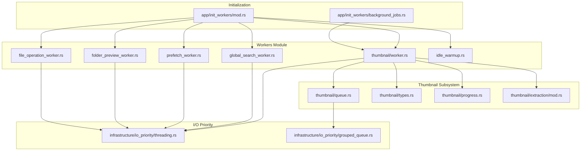
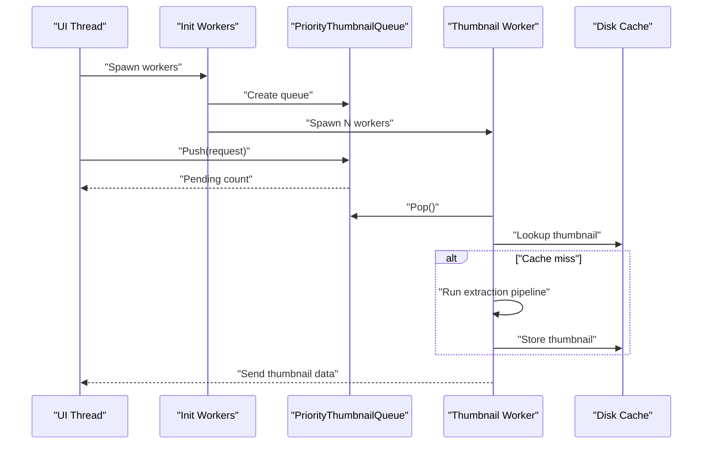
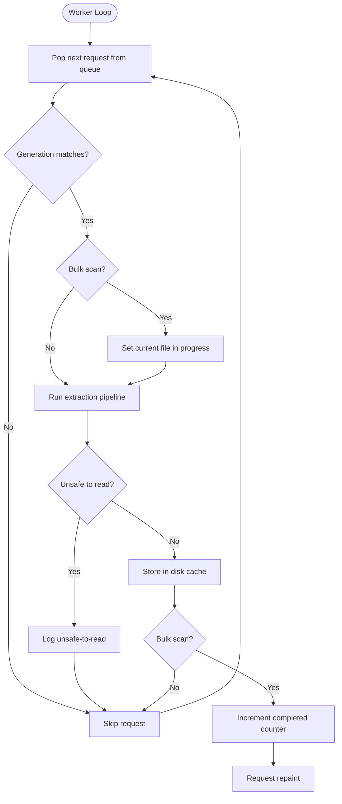
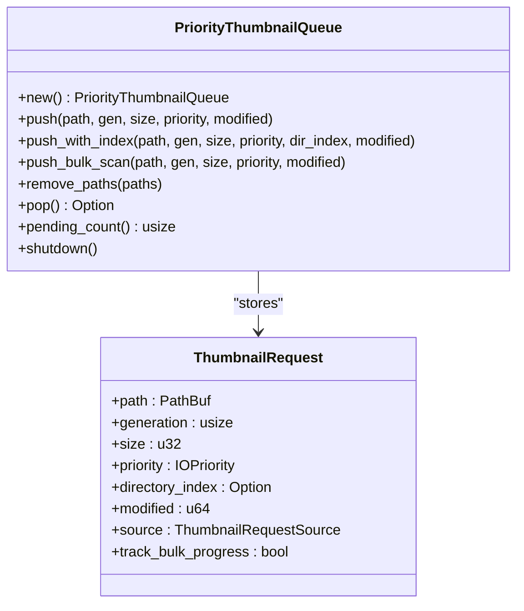
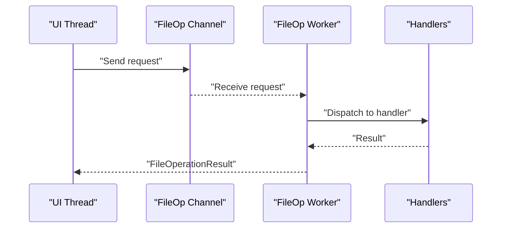
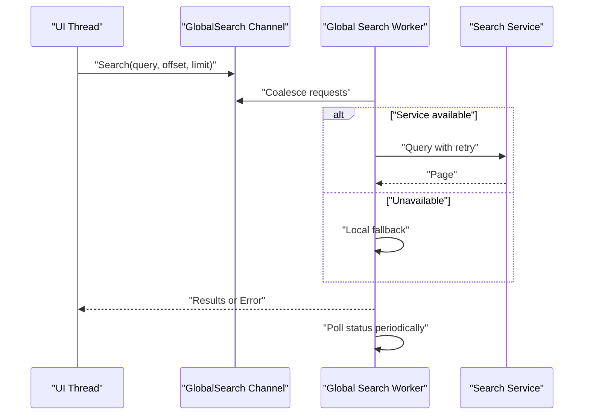
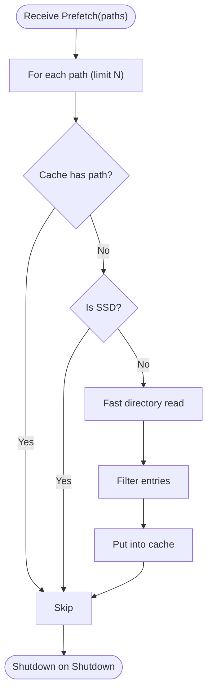
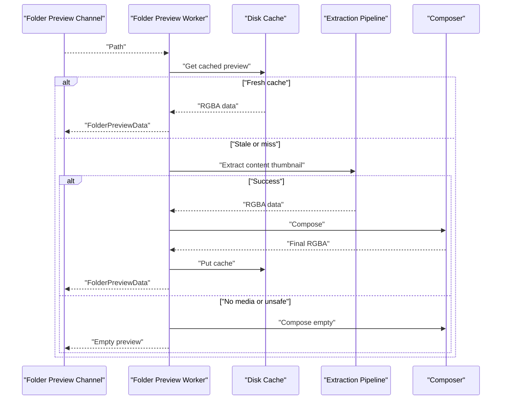
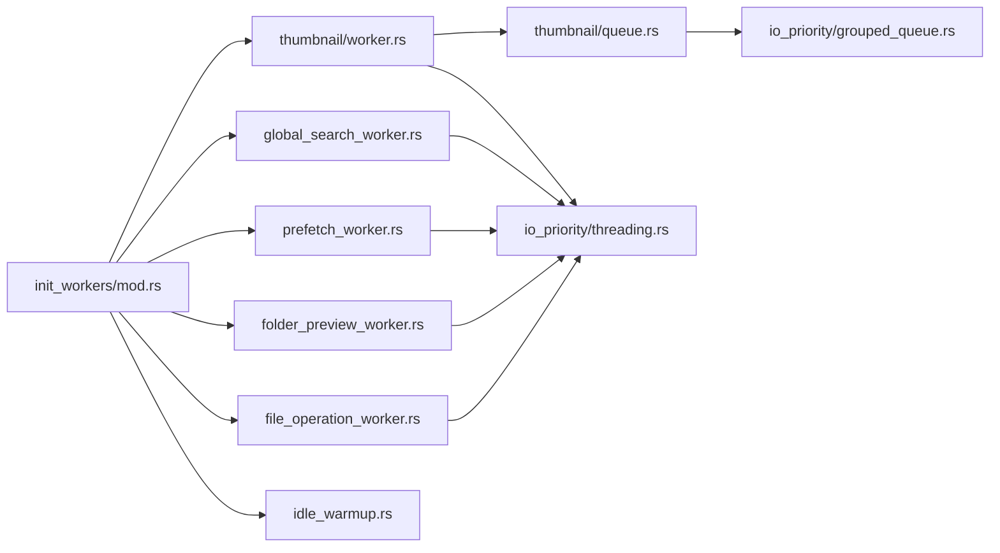

# Worker System

<cite>
**Referenced Files in This Document**
- [workers/mod.rs](file://src/workers/mod.rs)
- [file_operation_worker.rs](file://src/workers/file_operation_worker.rs)
- [handlers.rs](file://src/workers/file_operation_worker/handlers.rs)
- [thumbnail/worker.rs](file://src/workers/thumbnail/worker.rs)
- [thumbnail/queue.rs](file://src/workers/thumbnail/queue.rs)
- [thumbnail/types.rs](file://src/workers/thumbnail/types.rs)
- [thumbnail/progress.rs](file://src/workers/thumbnail/progress.rs)
- [thumbnail/extraction/mod.rs](file://src/workers/thumbnail/extraction/mod.rs)
- [global_search_worker.rs](file://src/workers/global_search_worker.rs)
- [prefetch_worker.rs](file://src/workers/prefetch_worker.rs)
- [folder_preview_worker.rs](file://src/workers/folder_preview_worker.rs)
- [idle_warmup.rs](file://src/workers/idle_warmup.rs)
- [init_workers/mod.rs](file://src/app/init_workers/mod.rs)
- [background_jobs.rs](file://src/app/init_workers/background_jobs.rs)
- [threading.rs](file://src/infrastructure/io_priority/threading.rs)
- [grouped_queue.rs](file://src/infrastructure/io_priority/grouped_queue.rs)
</cite>

## Table of Contents
1. [Introduction](#introduction)
2. [Project Structure](#project-structure)
3. [Core Components](#core-components)
4. [Architecture Overview](#architecture-overview)
5. [Detailed Component Analysis](#detailed-component-analysis)
6. [Dependency Analysis](#dependency-analysis)
7. [Performance Considerations](#performance-considerations)
8. [Troubleshooting Guide](#troubleshooting-guide)
9. [Conclusion](#conclusion)

## Introduction
This document explains the background worker system that powers MTT File Manager’s asynchronous operations. It covers the worker pool architecture enabling parallel processing for thumbnails, file operations, global search, prefetching, and folder previews. It documents task scheduling, priority queuing, inter-thread communication using crossbeam channels, specialized workers, lifecycle management, error handling, graceful shutdown, adaptive batch processing, I/O priority management, and monitoring capabilities.

## Project Structure
Workers are organized under a dedicated module with specialized subsystems:
- Thumbnail pipeline: queue, extraction stages, processing utilities, and worker threads
- File operation worker: Windows Shell integration with robust security and cancellation support
- Global search worker: IPC-driven search with retry/backoff and status tracking
- Prefetch worker: background directory caching for HDDs
- Folder preview worker: composed folder thumbnails with disk cache
- Idle warmup worker: low-priority activity tracking for future warming
- Initialization: spawning and wiring workers into the application runtime

**Diagram sources**
- [workers/mod.rs:1-9](file://src/workers/mod.rs#L1-L9)
- [thumbnail/worker.rs:103-169](file://src/workers/thumbnail/worker.rs#L103-L169)
- [thumbnail/queue.rs:29-52](file://src/workers/thumbnail/queue.rs#L29-L52)
- [global_search_worker.rs:328-360](file://src/workers/global_search_worker.rs#L328-L360)
- [prefetch_worker.rs:17-21](file://src/workers/prefetch_worker.rs#L17-L21)
- [folder_preview_worker.rs:50-56](file://src/workers/folder_preview_worker.rs#L50-L56)
- [idle_warmup.rs:46-51](file://src/workers/idle_warmup.rs#L46-L51)
- [init_workers/mod.rs:7-22](file://src/app/init_workers/mod.rs#L7-L22)
- [background_jobs.rs:40-103](file://src/app/init_workers/background_jobs.rs#L40-L103)
- [threading.rs:9-55](file://src/infrastructure/io_priority/threading.rs#L9-L55)
- [grouped_queue.rs:7-15](file://src/infrastructure/io_priority/grouped_queue.rs#L7-L15)

**Section sources**
- [workers/mod.rs:1-9](file://src/workers/mod.rs#L1-L9)
- [init_workers/mod.rs:7-22](file://src/app/init_workers/mod.rs#L7-L22)

## Core Components
- Worker pools and lifecycle
  - Thumbnail workers: adaptive worker count, decode semaphore, background priority, and Media Foundation/COM initialization
  - File operation worker: COM STA thread with panic-safe dispatch and result reporting
  - Global search worker: request coalescing, retry/backoff, status polling, and hybrid search
  - Prefetch worker: background I/O priority and SSD-aware skipping
  - Folder preview worker: composed previews with disk cache and per-request I/O priority
  - Idle warmup worker: passive tracking of user activity and visible items
- Task queues and scheduling
  - Priority thumbnail queue with directory grouping for HDD locality and deduplication
  - Crossbeam channels for inter-thread messaging
- I/O priority and adaptive batching
  - Per-thread priority adjustment and background mode toggling
  - Directory-grouped queues to reduce seek overhead on HDDs
- Monitoring and progress
  - Bulk thumbnail progress tracking and UI repaint signaling
  - Incremental garbage collection worker for caches

**Section sources**
- [thumbnail/worker.rs:103-169](file://src/workers/thumbnail/worker.rs#L103-L169)
- [file_operation_worker.rs:226-328](file://src/workers/file_operation_worker.rs#L226-L328)
- [global_search_worker.rs:328-593](file://src/workers/global_search_worker.rs#L328-L593)
- [prefetch_worker.rs:17-71](file://src/workers/prefetch_worker.rs#L17-L71)
- [folder_preview_worker.rs:50-196](file://src/workers/folder_preview_worker.rs#L50-L196)
- [idle_warmup.rs:46-81](file://src/workers/idle_warmup.rs#L46-L81)
- [thumbnail/queue.rs:40-52](file://src/workers/thumbnail/queue.rs#L40-L52)
- [threading.rs:9-55](file://src/infrastructure/io_priority/threading.rs#L9-L55)
- [grouped_queue.rs:7-15](file://src/infrastructure/io_priority/grouped_queue.rs#L7-L15)
- [thumbnail/progress.rs:12-37](file://src/workers/thumbnail/progress.rs#L12-L37)
- [background_jobs.rs:40-103](file://src/app/init_workers/background_jobs.rs#L40-L103)

## Architecture Overview
The worker system uses a hybrid of std::sync channels for synchronous coordination and crossbeam channels for high-throughput messaging. Workers are spawned with RAII guards to ensure proper cleanup of OS resources (COM, Media Foundation, thread priority). Priority queues and directory grouping optimize I/O locality on HDDs, while per-thread priority adjustments balance responsiveness and throughput.

**Diagram sources**
- [thumbnail/worker.rs:192-289](file://src/workers/thumbnail/worker.rs#L192-L289)
- [thumbnail/queue.rs:311-340](file://src/workers/thumbnail/queue.rs#L311-L340)
- [thumbnail/progress.rs:16-31](file://src/workers/thumbnail/progress.rs#L16-L31)

## Detailed Component Analysis

### Thumbnail Worker Pool
- Worker spawning and concurrency
  - Adaptive worker count based on CPU parallelism with a bounded hard cap for decode concurrency
  - Decode semaphore limits simultaneous decode operations to cap memory usage
  - Dedicated semaphore for virtual drive bulk scans to protect unstable FUSE stacks
  - Background thread priority for thumbnail workers to reduce HDD contention
- Lifecycle and cleanup
  - COM and Media Foundation initialization with RAII guards ensuring cleanup on panic
  - Graceful shutdown via queue shutdown flag and condition variable notification
- Request processing
  - Generation-based staleness checks to skip stale requests
  - Bulk scan progress tracking with UI repaint signaling
  - Virtual drive throttling during bulk scans

**Diagram sources**
- [thumbnail/worker.rs:232-287](file://src/workers/thumbnail/worker.rs#L232-L287)
- [thumbnail/extraction/mod.rs:49-167](file://src/workers/thumbnail/extraction/mod.rs#L49-L167)
- [thumbnail/progress.rs:25-31](file://src/workers/thumbnail/progress.rs#L25-L31)

**Section sources**
- [thumbnail/worker.rs:103-169](file://src/workers/thumbnail/worker.rs#L103-L169)
- [thumbnail/worker.rs:192-289](file://src/workers/thumbnail/worker.rs#L192-L289)
- [thumbnail/queue.rs:311-340](file://src/workers/thumbnail/queue.rs#L311-L340)
- [thumbnail/progress.rs:16-31](file://src/workers/thumbnail/progress.rs#L16-L31)

### Priority Thumbnail Queue
- Deduplication and merging
  - Prevents duplicate requests and merges fields (priority, size, generation, indices, timestamps)
- Directory grouping and locality
  - Groups requests by parent directory; sorts by IOPriority and directory index on HDDs
  - Maintains current directory to favor locality and switches only for Interactive tasks
- Drive classification
  - Detects SSD vs HDD per drive prefix and adapts sorting behavior accordingly
- Shutdown and removal
  - Supports removing specific paths and notifying waiters

**Diagram sources**
- [thumbnail/queue.rs:29-52](file://src/workers/thumbnail/queue.rs#L29-L52)
- [thumbnail/types.rs:18-32](file://src/workers/thumbnail/types.rs#L18-L32)

**Section sources**
- [thumbnail/queue.rs:40-52](file://src/workers/thumbnail/queue.rs#L40-L52)
- [thumbnail/queue.rs:118-178](file://src/workers/thumbnail/queue.rs#L118-L178)
- [thumbnail/queue.rs:310-482](file://src/workers/thumbnail/queue.rs#L310-L482)
- [thumbnail/types.rs:18-32](file://src/workers/thumbnail/types.rs#L18-L32)

### File Operation Worker
- Purpose
  - Performs Windows Shell file operations on a dedicated COM STA thread
  - Handles delete, rename, copy, move, batch operations, restore, empty recycle bin, and properties dialogs
- Security and validation
  - Sanitizes paths and validates shell namespace bypasses; supports UNC and drive-based validation
- Cancellation and progress
  - Integrates with extraction progress/cancel flags for archive operations
- Error handling
  - Panic-safe dispatch with structured result reporting and failure notifications

**Diagram sources**
- [file_operation_worker.rs:226-328](file://src/workers/file_operation_worker.rs#L226-L328)
- [handlers.rs:10-404](file://src/workers/file_operation_worker/handlers.rs#L10-L404)

**Section sources**
- [file_operation_worker.rs:16-117](file://src/workers/file_operation_worker.rs#L16-L117)
- [file_operation_worker.rs:226-328](file://src/workers/file_operation_worker.rs#L226-L328)
- [handlers.rs:10-404](file://src/workers/file_operation_worker/handlers.rs#L10-L404)

### Global Search Worker
- Responsibilities
  - IPC-backed global search via the MTT Search Service
  - Coalesces rapid queries, merges results, and tracks service status
- Retry and fallback
  - Retries transient IPC errors and falls back to local session index
- Status tracking
  - Periodic polling with dynamic intervals based on service availability and scanning volumes
- Concurrency and isolation
  - Dedicated thread with in-flight total count guard to prevent unbounded tasks

**Diagram sources**
- [global_search_worker.rs:328-593](file://src/workers/global_search_worker.rs#L328-L593)

**Section sources**
- [global_search_worker.rs:11-47](file://src/workers/global_search_worker.rs#L11-L47)
- [global_search_worker.rs:328-593](file://src/workers/global_search_worker.rs#L328-L593)

### Prefetch Worker
- Purpose
  - Preloads directory listings into the directory cache to improve perceived performance
- Behavior
  - Respects SSD detection to skip prefetching on fast devices
  - Limits number of directories prefetched per batch
  - Filters out hidden/system entries and constructs FileEntry records

**Diagram sources**
- [prefetch_worker.rs:24-68](file://src/workers/prefetch_worker.rs#L24-L68)

**Section sources**
- [prefetch_worker.rs:17-71](file://src/workers/prefetch_worker.rs#L17-L71)

### Folder Preview Worker
- Purpose
  - Generates folder previews by extracting a representative media thumbnail and composing it with folder assets
- Strategy
  - SQLite disk cache fast-path for NVMe; otherwise runs custom composition
  - Falls back to empty composition when no media is found
  - Skips cloud-only OneDrive folders to avoid blocking network I/O
- I/O priority
  - Sets thread priority per SSD detection for responsiveness

**Diagram sources**
- [folder_preview_worker.rs:69-195](file://src/workers/folder_preview_worker.rs#L69-L195)
- [thumbnail/extraction/mod.rs:49-167](file://src/workers/thumbnail/extraction/mod.rs#L49-L167)

**Section sources**
- [folder_preview_worker.rs:50-196](file://src/workers/folder_preview_worker.rs#L50-L196)

### Idle Warmup Worker
- Purpose
  - Passive tracking of user activity and visible items to inform future warming strategies
- Behavior
  - Low-priority thread with blocking receive loop
  - Resets warming state on user activity

**Section sources**
- [idle_warmup.rs:46-81](file://src/workers/idle_warmup.rs#L46-L81)

## Dependency Analysis
- Inter-thread communication
  - Thumbnail worker uses crossbeam Sender for delivering results to UI
  - Other workers use std::sync mpsc channels for request/result exchange
- I/O priority integration
  - Per-thread priority is adjusted using Windows APIs via a thread-local guard
  - DirectoryGroupedQueue and PriorityThumbnailQueue both leverage IOPriority to sort and group requests
- Initialization and wiring
  - Initialization module spawns and wires all workers, passing shared caches and channels

**Diagram sources**
- [init_workers/mod.rs:7-22](file://src/app/init_workers/mod.rs#L7-L22)
- [file_operation_worker.rs:226-328](file://src/workers/file_operation_worker.rs#L226-L328)
- [thumbnail/worker.rs:103-169](file://src/workers/thumbnail/worker.rs#L103-L169)
- [global_search_worker.rs:328-360](file://src/workers/global_search_worker.rs#L328-L360)
- [prefetch_worker.rs:17-21](file://src/workers/prefetch_worker.rs#L17-L21)
- [folder_preview_worker.rs:50-56](file://src/workers/folder_preview_worker.rs#L50-L56)
- [idle_warmup.rs:46-51](file://src/workers/idle_warmup.rs#L46-L51)
- [thumbnail/queue.rs:29-52](file://src/workers/thumbnail/queue.rs#L29-L52)
- [threading.rs:9-55](file://src/infrastructure/io_priority/threading.rs#L9-L55)
- [grouped_queue.rs:7-15](file://src/infrastructure/io_priority/grouped_queue.rs#L7-L15)

**Section sources**
- [init_workers/mod.rs:7-22](file://src/app/init_workers/mod.rs#L7-L22)
- [threading.rs:9-55](file://src/infrastructure/io_priority/threading.rs#L9-L55)
- [grouped_queue.rs:7-15](file://src/infrastructure/io_priority/grouped_queue.rs#L7-L15)

## Performance Considerations
- Adaptive worker sizing
  - Thumbnail worker count clamped to a practical range based on CPU cores
  - Decode semaphore caps peak memory usage during heavy decode loads
- I/O locality and priority
  - Directory grouping minimizes HDD seeks; SSD mode disables grouping
  - Per-request thread priority toggles background mode to reduce contention
- Background priority enforcement
  - All thumbnail workers run at background priority to keep UI responsive
- Disk cache utilization
  - Folder preview worker leverages SQLite cache for NVMe-speed hits
  - Thumbnail disk cache reduces repeated extraction work
- Incremental garbage collection
  - Separate worker performs incremental cleanup and periodic vacuuming to maintain cache health

**Section sources**
- [thumbnail/worker.rs:85-100](file://src/workers/thumbnail/worker.rs#L85-L100)
- [thumbnail/queue.rs:191-211](file://src/workers/thumbnail/queue.rs#L191-L211)
- [threading.rs:9-55](file://src/infrastructure/io_priority/threading.rs#L9-L55)
- [folder_preview_worker.rs:107-148](file://src/workers/folder_preview_worker.rs#L107-L148)
- [background_jobs.rs:40-103](file://src/app/init_workers/background_jobs.rs#L40-L103)

## Troubleshooting Guide
- Thumbnail worker panics
  - Panics are caught and reported as operation failures; worker continues processing
  - Check logs for “panic processing” messages and offending paths
- Thumbnail extraction outcomes
  - Non-media files or unsafe-to-read states are handled gracefully; verify file safety classification
- File operation failures
  - Security validation failures are logged; review sanitized paths and shell namespace bypass rules
  - COM initialization failures require COM reinitialization; ensure STA thread model
- Global search service unavailability
  - Transient IPC errors trigger retries and fallback to local index
  - Monitor status polling intervals and consecutive failure thresholds
- Prefetch inefficiency
  - Verify SSD detection and ensure prefetch batches are not oversized
- Priority conflicts
  - Ensure per-thread priority is reset on worker exit to avoid lingering background mode

**Section sources**
- [thumbnail/worker.rs:272-281](file://src/workers/thumbnail/worker.rs#L272-L281)
- [thumbnail/extraction/mod.rs:54-87](file://src/workers/thumbnail/extraction/mod.rs#L54-L87)
- [file_operation_worker.rs:300-320](file://src/workers/file_operation_worker.rs#L300-L320)
- [global_search_worker.rs:57-66](file://src/workers/global_search_worker.rs#L57-L66)
- [global_search_worker.rs:293-307](file://src/workers/global_search_worker.rs#L293-L307)
- [prefetch_worker.rs:32-35](file://src/workers/prefetch_worker.rs#L32-L35)
- [threading.rs:40-55](file://src/infrastructure/io_priority/threading.rs#L40-L55)

## Conclusion
The worker system in MTT File Manager is designed for robustness, responsiveness, and efficient resource utilization. Through adaptive worker pools, priority-aware queues, crossbeam channels, and I/O priority management, it delivers smooth UI performance while handling intensive tasks like thumbnail extraction, file operations, global search, and folder previews. Monitoring hooks and incremental maintenance further ensure long-term stability and performance.