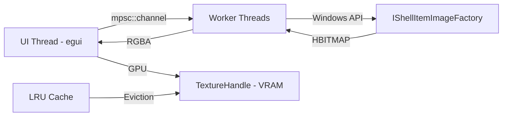

# MTT File Manager

Gerenciador de arquivos nativo para Windows com **ultra-performance** para visualização de thumbnails de imagens e vídeos, desenvolvido em Rust usando **APIs nativas do Windows**.

🎯 **4-6 MB** executável | ⚡ **Zero dependências externas** | 🚀 **Performance nativa do Windows** | 🔒 **Segurança aprimorada**

---

## 🎯 Funcionalidades

### Visualização de Mídia
- ✅ **Thumbnails de Imagens**: PNG, JPG, JPEG, BMP, GIF, WEBP, TIFF, ICO, HEIC, AVIF
- ✅ **Thumbnails de Vídeos**: MP4, MKV, AVI, MOV, WMV, FLV, WEBM, M4V, MPG, MPEG, 3GP, TS
- ✅ **API Nativa do Windows**: Usa `IShellItemImageFactory` (mesma do Windows Explorer)
- ✅ **Cache Inteligente**: LRU Cache de 500 itens (~125 MB VRAM máximo)

### Performance
- ✅ **Carregamento Assíncrono**: Interface nunca trava (60+ FPS)
- ✅ **Lazy Loading**: Thumbnails carregados sob demanda (visíveis no viewport)
- ✅ **Virtualização**: Renderiza apenas linhas visíveis no grid
- ✅ **Processamento Paralelo**: Controle de concorrência (máx 50 threads)
- ✅ **GPU Acceleration**: Texturas em VRAM via OpenGL

### Interface
- ✅ **Grid Responsivo**: Ajusta automaticamente ao tamanho da janela
- ✅ **Zoom Dinâmico**: 64px - 256px (slider)
- ✅ **Sidebar**: Acesso rápido a drives e pastas especiais (Imagens, Vídeos, Downloads, Documentos)
- ✅ **Navegação**: Voltar, caminho atual, contador de itens
- ✅ **Double-click**: Abre arquivos com app padrão, navega para pastas

### Segurança
- ✅ **Filtragem de Arquivos Hidden/System**: Via `GetFileAttributesW`
- ✅ **Whitelist de Extensões**: Previne execução de arquivos maliciosos
- ✅ **Depth Limit**: Previne recursão infinita
- ✅ **Execução como Usuário**: Não requer privilégios de administrador

---

## 📦 Pré-requisitos

### Sistema Operacional
- **Windows 10** (build 1809+) ou **Windows 11**
- ⚠️ Windows 7/8: Não testado (APIs podem diferir)
- ❌ Linux/macOS: Não suportado (usa Win32 APIs exclusivas)

### Ferramentas de Desenvolvimento
1. **Rust** (stable 1.75+): Instale via [rustup.rs](https://rustup.rs/)
   ```powershell
   # Verificar instalação
   rustc --version
   cargo --version
   ```

2. **Visual Studio Build Tools** (opcional, mas recomendado):
   - Link-time optimization (LTO) requer MSVC linker
   - Download: [Visual Studio Build Tools](https://visualstudio.microsoft.com/downloads/)

---

## 🚀 Instalação e Execução

### Modo Desenvolvimento (Debug)

```powershell
# 1. Clone o repositório
git clone https://github.com/seu-usuario/mtt-file-manager.git
cd mtt-file-manager

# 2. Compile e execute (build debug, ~30 MB, sem otimizações)
cargo run

# 3. Ou compile separadamente
cargo build
.\target\debug\mtt-file-manager.exe
```

**Características do Debug Build:**
- Executável maior (~30 MB)
- Startup mais lento
- Inclui símbolos de debug
- Ideal para desenvolvimento e profiling

---

### Modo Produção (Release)

```powershell
# 1. Build otimizado (4-6 MB, LTO ativado)
cargo build --release

# 2. Executável gerado em:
.\target\release\mtt-file-manager.exe

# 3. (Opcional) Reduzir mais 20-30% com strip
strip .\target\release\mtt-file-manager.exe
```

**Otimizações Ativadas** (ver `Cargo.toml`):
```toml
[profile.release]
opt-level = 3        # Máxima otimização
lto = true           # Link-Time Optimization
codegen-units = 1    # Melhor otimização cross-crate
```

---

## 📝 Como Usar

### Interface Principal

```
┌────────────────────────────────────────────────────┐
│ ⬅ | 📂 C:\Users\Public\Pictures                   │ ← Barra de Navegação
├──────────┬─────────────────────────────────────────┤
│ 💾 Discos│ Zoom: [====] | Itens: 127 | VRAM: 45MB │ ← Toolbar
│ C:\      │                                         │
│ D:\      │  ┌───┐ ┌───┐ ┌───┐ ┌───┐              │
│          │  │📁 │ │📁 │ │🖼️│ │🖼️│              │
│ ⭐ Atalhos│  │Dir│ │Dir│ │Img│ │Img│              │ ← Grid de Itens
│ 📷 Imagens│  └───┘ └───┘ └───┘ └───┘              │
│ 🎬 Vídeos │                                         │
│ 📥 Downl. │  [... scrollável ...]                  │
│ 🗂️ Docs   │                                         │
└──────────┴─────────────────────────────────────────┘
```

### Ações Disponíveis

| Ação | Como Fazer |
|------|-----------|
| **Navegar para pasta** | Double-click na pasta |
| **Abrir arquivo** | Double-click no arquivo |
| **Voltar nível** | Clique no botão ⬅ |
| **Mudar zoom** | Arraste o slider "Zoom" |
| **Selecionar item** | Single-click |
| **Ir para drive** | Clique em C:\, D:\, etc. (sidebar) |
| **Ir para pasta especial** | Clique em "📷 Imagens", "🎬 Vídeos", etc. |

### Atalhos de Teclado (Futuro)

⚠️ Ainda não implementado. Ver [docs/ROADMAP_TECNICO.md](docs/ROADMAP_TECNICO.md)

---

## 🏗️ Arquitetura

Para detalhes completos, consulte a **documentação técnica**:

- 📚 [**ARQUITETURA.md**](docs/ARQUITETURA.md): Fluxo de dados, diagramas Mermaid, estrutura de pastas
- 📚 [**STACK.md**](docs/STACK.md): Tecnologias, bibliotecas e comparação com alternativas
- 🔒 [**SEGURANCA_WINDOWS.md**](docs/SEGURANCA_WINDOWS.md): Vetores de ataque, mitigações e auditoria de código unsafe
- 🗺️ [**ROADMAP_TECNICO.md**](docs/ROADMAP_TECNICO.md): Débitos técnicos e próximas features

### Resumo Arquitetural



**Componentes Principais:**
- **UI Layer**: `eframe` (egui) - Immediate mode GUI
- **Concurrency**: `std::sync::mpsc` + `std::thread`
- **Filesystem**: `walkdir` (iterator otimizado)
- **Native APIs**: `windows` crate (bindings oficiais Microsoft)
- **Cache**: `lru` (Least Recently Used)

---

## 🔧 Desenvolvimento

### Estrutura do Projeto

```
MTT File Manager/
├── src/
│   └── main.rs              # 675 linhas (monolítico - candidato a refatoração)
├── target/                  # Build artifacts (não commitar!)
├── docs/                    # 📚 Documentação técnica
│   ├── ARQUITETURA.md
│   ├── STACK.md
│   ├── SEGURANCA_WINDOWS.md
│   └── ROADMAP_TECNICO.md
├── Cargo.toml              # Manifesto Rust
├── .gitignore              # Arquivos ignorados
├── .cursorrules            # ⚖️ LEI DO PROJETO (leia antes de contribuir!)
└── README.md               # Este arquivo
```

### Comandos Úteis

```powershell
# Compilar sem executar (mais rápido para verificar erros)
cargo check

# Lint (detecta code smells)
cargo clippy -- -D warnings

# Formatar código (obrigatório antes de commit)
cargo fmt --all

# Testes (quando implementados)
cargo test

# Análise de tamanho do executável
cargo bloat --release --crates

# Limpar build artifacts (libera espaço)
cargo clean
```

---

## 🤝 Como Contribuir

### **ANTES DE FAZER QUALQUER ALTERAÇÃO:**

1. **Leia obrigatoriamente**: [`.cursorrules`](.cursorrules) (Lei do Projeto)
2. **Consulte**: [docs/ROADMAP_TECNICO.md](docs/ROADMAP_TECNICO.md) (o que precisa ser feito)
3. **Entenda**: [docs/ARQUITETURA.md](docs/ARQUITETURA.md) (como o código funciona)

### Fluxo de Contribuição

```
1. Fork o repositório
2. Crie branch: git checkout -b feature/minha-feature
3. Faça alterações NO CÓDIGO E NA DOCUMENTAÇÃO (regra obrigatória!)
4. Teste: cargo test && cargo clippy
5. Commit: git commit -m "feat: X | docs: atualiza Y"
6. Push: git push origin feature/minha-feature
7. Abra Pull Request
```

### Checklist de PR

- [ ] Código compila sem warnings
- [ ] Passou em `cargo clippy`
- [ ] Passou em `cargo fmt --check`
- [ ] Documentação atualizada em `docs/`
- [ ] Commit messages seguem formato
- [ ] Sem TODOs/FIXMEs não documentados

---

## 🐛 Problemas Conhecidos

### Build Errors

**Erro**: `error: failed to write ... (os error 32)`
```
error: failed to write target\release\deps\libbytemuck-*.rmeta:
The process cannot access the file because it is being used by another process.
```

**Solução**:
1. Feche todas as instâncias do app
2. Execute: `cargo clean`
3. Recompile: `cargo build --release`

### Performance

- **Pastas com 10k+ arquivos**: Carregamento pode levar 2-3 segundos
  - ✅ **Mitigação**: Lazy loading + virtualização
  - 🎯 **Futuro**: Batch loading com `rayon`

- **Vídeos 4K+**: Thumbnail pode demorar 1-2 segundos
  - ✅ **Mitigação**: Carregamento assíncrono (UI não trava)
  - ℹ️ **Normal**: Windows também demora (mesma API)

---

## 📊 Comparação com Alternativas

| Métrica | MTT (Rust) | Windows Explorer | Electron App |
|---------|-----------|------------------|--------------|
| **Executável** | 4-6 MB | Built-in | 60-150 MB |
| **RAM idle** | ~50 MB | ~80 MB | ~200-400 MB |
| **Startup** | <500ms | <1s | 1-3s |
| **FPS** | 60+ | 60+ | 30-60 |
| **Native APIs** | ✅ Direto | ✅ Direto | ❌ Via Node.js |
| **Thumbnails/sec** | ~20 | ~30 | ~10 |

---

## 📄 Licença

**MIT License**

Copyright (c) 2025 MTT File Manager Contributors

Permission is hereby granted, free of charge, to any person obtaining a copy
of this software and associated documentation files (the "Software"), to deal
in the Software without restriction, including without limitation the rights
to use, copy, modify, merge, publish, distribute, sublicense, and/or sell
copies of the Software, and to permit persons to whom the Software is
furnished to do so, subject to the following conditions:

The above copyright notice and this permission notice shall be included in all
copies or substantial portions of the Software.

THE SOFTWARE IS PROVIDED "AS IS", WITHOUT WARRANTY OF ANY KIND, EXPRESS OR
IMPLIED, INCLUDING BUT NOT LIMITED TO THE WARRANTIES OF MERCHANTABILITY,
FITNESS FOR A PARTICULAR PURPOSE AND NONINFRINGEMENT. IN NO EVENT SHALL THE
AUTHORS OR COPYRIGHT HOLDERS BE LIABLE FOR ANY CLAIM, DAMAGES OR OTHER
LIABILITY, WHETHER IN AN ACTION OF CONTRACT, TORT OR OTHERWISE, ARISING FROM,
OUT OF OR IN CONNECTION WITH THE SOFTWARE OR THE USE OR OTHER DEALINGS IN THE
SOFTWARE.

---

## 🙏 Agradecimentos

- **[egui](https://github.com/emilk/egui)**: Excelente framework de UI imediata
- **[windows-rs](https://github.com/microsoft/windows-rs)**: Bindings oficiais Rust para Win32
- **Microsoft**: APIs bem documentadas (`IShellItemImageFactory`)
- **Comunidade Rust**: Tooling excepcional e ecossistema maduro

---

## 📞 Suporte

- **Bugs**: Abra uma [Issue no GitHub](https://github.com/seu-usuario/mtt-file-manager/issues)
- **Features**: Consulte [ROADMAP_TECNICO.md](docs/ROADMAP_TECNICO.md) e vote/comente
- **Discussões**: [GitHub Discussions](https://github.com/seu-usuario/mtt-file-manager/discussions)
- **Segurança**: Reporte vulnerabilidades diretamente aos maintainers (NÃO abra issue pública)

---

**Última Atualização**: 2025-12-27  
**Versão**: 0.1.0  
**Status**: ⚠️ Alpha (uso em produção não recomendado ainda)
