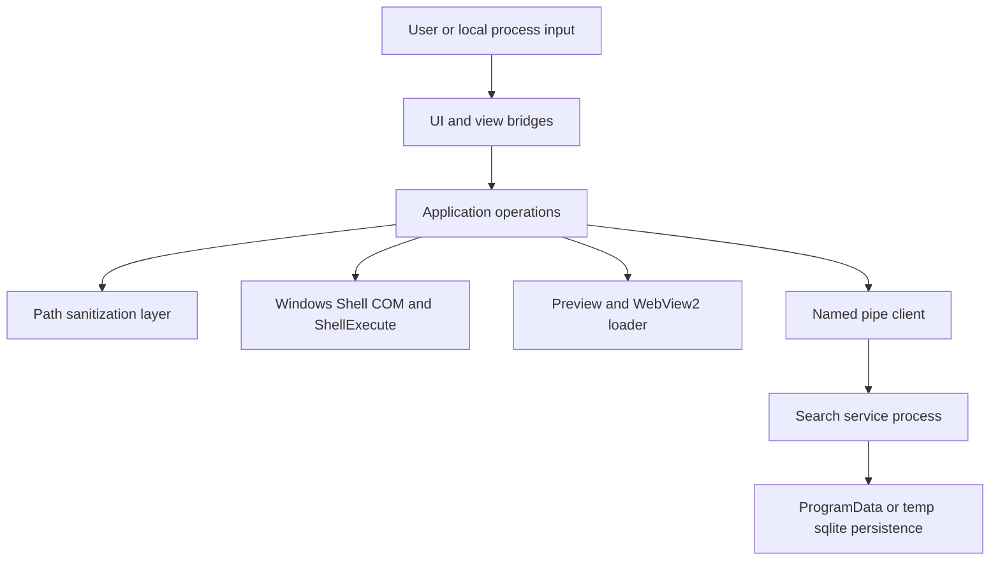

# SECURITY_AUDIT_REPORT

## 1) Executive Summary

This assessment was performed as a static, evidence-only audit of the current repository state, with direct code anchors and no speculative claims.

High-level result:

- The codebase already contains meaningful hardening in critical areas (for example, named-pipe remote rejection and request-size limits in [create_pipe()](crates/mtt-search-service/src/ipc_server.rs:209) and [read_message()](crates/mtt-search-service/src/ipc_server.rs:502)).
- The highest-risk residual exposures are trust-boundary issues: LocalSystem service data exposure to regular users, shell/path policy bypass conditions, dynamic loader fallback behavior, and ACL fail-open/fallback cache paths.

Risk posture (current snapshot):

- **High:** 2
- **Medium:** 3
- **Critical:** 0 (based on evidence available in this repository snapshot)

---

## 2) Main Modules and Entry Points Found

Primary runtime entry points:

- Desktop app entry: [main()](src/main.rs:27)
- Search service entry: [main()](crates/mtt-search-service/src/main.rs:34)
- Service installer/control: [install_service()](crates/mtt-search-service/src/service_control.rs:18)

Security-relevant module entry points:

- File operation sanitization and shell open:
  - [sanitize_operation_path()](src/application/file_operations.rs:87)
  - [open_with_shell()](src/application/file_operations.rs:116)
- Worker-path sanitization and shell/file-op dispatch:
  - [sanitize_operation_path()](src/workers/file_operation_worker.rs:171)
  - [handle_copy()](src/workers/file_operation_worker/handlers.rs:94)
  - [handle_move()](src/workers/file_operation_worker/handlers.rs:117)
- Shell namespace/archive navigation:
  - [is_shell_navigation_path()](src/infrastructure/windows/shell_folder.rs:37)
  - [list_shell_folder()](src/infrastructure/windows/shell_folder.rs:59)
- Shell execution path:
  - [open_with_shell()](src/infrastructure/windows/shell_operations/context_menu.rs:11)
- PDF/WebView loader boundary:
  - [init()](src/pdf_viewer/webview.rs:134)
  - [warmup_env()](src/pdf_viewer/webview.rs:508)
- Local IPC trust boundary:
  - [search()](src/infrastructure/global_search.rs:21)
  - [run_ipc_server()](crates/mtt-search-service/src/ipc_server.rs:43)
  - [create_pipe()](crates/mtt-search-service/src/ipc_server.rs:209)
- Persistence/ACL boundaries:
  - [new()](src/infrastructure/disk_cache.rs:62)
  - [get_db_path()](crates/mtt-search-service/src/index_db.rs:24)

---

## 3) Top 5 Highest-Risk Flows

1. **Local user -> Named Pipe -> LocalSystem search service -> full path disclosure**
   - Anchors: [install_service()](crates/mtt-search-service/src/service_control.rs:18), [create_pipe()](crates/mtt-search-service/src/ipc_server.rs:209), [SearchResultItem](crates/mtt-search-protocol/src/lib.rs:43), [handle_client()](crates/mtt-search-service/src/ipc_server.rs:349)

2. **UI-selected path -> shell open execution boundary**
   - Anchors: [open_with_shell()](src/application/file_operations.rs:116), [open_with_shell()](src/infrastructure/windows/shell_operations/context_menu.rs:11), [render_list_view()](src/app/operations/ui_rendering/list_bridge.rs:99)

3. **Path string -> sanitization bypass for shell namespace/archive heuristics -> shell/file operations**
   - Anchors: [should_bypass_sanitization()](src/application/file_operations.rs:64), [sanitize_operation_path()](src/application/file_operations.rs:87), [is_shell_navigation_path()](src/infrastructure/windows/shell_folder.rs:37), [path_contains_archive_segment()](src/domain/file_entry.rs:129)

4. **PDF preview initialization -> dynamic loader fallback**
   - Anchors: [init()](src/pdf_viewer/webview.rs:134), [warmup_env()](src/pdf_viewer/webview.rs:508)

5. **Cache/index DB open -> ACL hardening best effort -> fallback locations**
   - Anchors: [new()](src/infrastructure/disk_cache.rs:62), [get_db_path()](crates/mtt-search-service/src/index_db.rs:24)

---

## 4) Attack Surface Map

### 4.1 Key Externally Influenced Inputs

- UI-selected filesystem/shell paths reaching shell APIs via [open_with_shell()](src/application/file_operations.rs:116)
- Search queries and IPC payloads entering service via [read_message()](crates/mtt-search-service/src/ipc_server.rs:502)
- Archive-like paths interpreted as shell namespace by [is_shell_navigation_path()](src/infrastructure/windows/shell_folder.rs:37)
- Loader resolution path for WebView2 in [init()](src/pdf_viewer/webview.rs:134)

### 4.2 Mermaid Diagram

---

## 5) Prioritized Findings Table

| ID | Severity | Category | Evidence (anchor) | Impact | Exploitability | Confidence |
|---|---|---|---|---|---|---|
| F-01 | High | Privilege boundary / information disclosure | [install_service()](crates/mtt-search-service/src/service_control.rs:18), [create_pipe()](crates/mtt-search-service/src/ipc_server.rs:209), [SearchResultItem](crates/mtt-search-protocol/src/lib.rs:43), [handle_client()](crates/mtt-search-service/src/ipc_server.rs:349) | Cross-user/system-level metadata exposure risk (file paths) via LocalSystem-backed index queried by regular users | Local authenticated user | High |
| F-02 | High | DLL loading boundary | [init()](src/pdf_viewer/webview.rs:134), [warmup_env()](src/pdf_viewer/webview.rs:508) | Potential local DLL search-order hijack when fallback loader path is used | Local attacker with path-control preconditions | High |
| F-03 | Medium | Path policy bypass surface | [should_bypass_sanitization()](src/application/file_operations.rs:64), [sanitize_operation_path()](src/application/file_operations.rs:87), [is_shell_navigation_path()](src/infrastructure/windows/shell_folder.rs:37) | Drive/component policy checks can be skipped for shell/heuristic paths | User-controlled path strings reaching operation layer | Medium |
| F-04 | Medium | Execution trust boundary | [open_with_shell()](src/application/file_operations.rs:116), [open_with_shell()](src/infrastructure/windows/shell_operations/context_menu.rs:11) | Explorer-like launch behavior on selected items without additional provenance/risk interstitials | User interaction/phishing path | High |
| F-05 | Medium | Local integrity / ACL hardening gap | [new()](src/infrastructure/disk_cache.rs:62), [get_db_path()](crates/mtt-search-service/src/index_db.rs:24) | Cache/index tampering risk if ACL hardening fails or temp fallback is used | Local same-host attacker | High |

---

## 6) Detailed Findings

### F-01 — LocalSystem search-service trust boundary allows broad local-user query access

**Severity:** High  
**Type:** Information disclosure / trust-boundary weakness

#### Evidence

- Service installation uses LocalSystem account (`account_name: None`) in [install_service()](crates/mtt-search-service/src/service_control.rs:18).
- Pipe ACL in [create_pipe()](crates/mtt-search-service/src/ipc_server.rs:209) explicitly grants access to BUILTIN\Users and SYSTEM.
- Search response type includes full path field in [SearchResultItem](crates/mtt-search-protocol/src/lib.rs:43).
- Query handler maps results to returned full paths in [handle_client()](crates/mtt-search-service/src/ipc_server.rs:349).

#### Why this matters

The process trust level is **LocalSystem**, while client access includes regular local users. Even with remote clients blocked via `PIPE_REJECT_REMOTE_CLIENTS` in [create_pipe()](crates/mtt-search-service/src/ipc_server.rs:209), local users can still query metadata generated under a higher privilege context.

#### Security-focused remediation

- Enforce caller-aware authorization at the IPC boundary before returning result paths.
- Filter results by effective caller access (ACL check) prior to response serialization.
- Re-evaluate service account scope for least privilege if LocalSystem is not strictly required.

---

### F-02 — WebView2 loader fallback re-enters default DLL search behavior

**Severity:** High  
**Type:** DLL search-order hardening gap

#### Evidence

- [init()](src/pdf_viewer/webview.rs:134) first loads `WebView2Loader.dll` from executable directory, but falls back to `LoadLibraryW("WebView2Loader.dll")` if not found.
- Same fallback exists in [warmup_env()](src/pdf_viewer/webview.rs:508).

#### Why this matters

If the trusted absolute-path load fails, fallback behavior can depend on process DLL search rules. In environments where search path is influenced, this increases preloading/hijack risk.

#### Security-focused remediation

- Load only from trusted absolute directories (fail closed if absent in production profile).
- Use hardened loader flags/directories policy for DLL resolution.
- Add startup assertion/log when fallback path is used.

---

### F-03 — Shell namespace/archive heuristic can bypass normal path sanitization policy

**Severity:** Medium  
**Type:** Path policy bypass surface

#### Evidence

- [should_bypass_sanitization()](src/application/file_operations.rs:64) returns true for `shell:` and shell-navigation detection.
- [sanitize_operation_path()](src/application/file_operations.rs:87) returns original path immediately when bypass condition is true.
- Archive/shell classification in [is_shell_navigation_path()](src/infrastructure/windows/shell_folder.rs:37) uses extension/segment heuristics backed by [path_contains_archive_segment()](src/domain/file_entry.rs:129).
- Worker path does equivalent bypass in [sanitize_operation_path()](src/workers/file_operation_worker.rs:171).

#### Why this matters

The normal checks (drive enforcement, canonicalization flow, component checks) are intentionally skipped for certain path classes. This is functionally useful for shell namespace support, but broadens parser attack surface unless tightly typed and provenance-bound.

#### Security-focused remediation

- Replace raw-string bypass with typed, internally-issued shell-namespace tokens/PIDL-backed flow.
- Restrict bypass trigger conditions to validated shell identifiers only.
- Keep archive navigation support, but decouple archive UX detection from security bypass decisions.

---

### F-04 — Shell execution boundary is direct and permissive by design

**Severity:** Medium  
**Type:** Execution boundary / user-safety hardening

#### Evidence

- Open action calls [open_with_shell()](src/application/file_operations.rs:116), which delegates to shell execution in [open_with_shell()](src/infrastructure/windows/shell_operations/context_menu.rs:11).
- Shell call uses `ShellExecuteW` in [open_with_shell()](src/infrastructure/windows/shell_operations/context_menu.rs:11) with default verb and no result handling.

#### Why this matters

This preserves Explorer-like behavior (explicit project requirement), but it means any selected item path can trigger associated handler execution. Security posture then depends on path provenance and user decision quality.

#### Security-focused remediation

- Keep execution capability intact (do not disable executable opening).
- Add targeted high-risk source warnings (for example, UNC/shell-namespace/internet-marked files).
- Record shell-open failures/return codes for security-relevant telemetry/logging.

---

### F-05 — ACL hardening is best-effort and fallback DB path may weaken local integrity guarantees

**Severity:** Medium  
**Type:** Local integrity / cache tampering

#### Evidence

- Thumbnail DB can fall back to `%TEMP%\MTT-File-Manager\thumbnails_fallback.db` in [new()](src/infrastructure/disk_cache.rs:62).
- `icacls` hardening failures are warning-only in [new()](src/infrastructure/disk_cache.rs:62).
- ProgramData ACL hardening in [get_db_path()](crates/mtt-search-service/src/index_db.rs:24) executes commands without enforced success gate.

#### Why this matters

If ACL hardening does not apply successfully, cache/index files may become more susceptible to same-host tampering or poisoning attempts.

#### Security-focused remediation

- Enforce ACL application success for privileged persistence locations.
- Apply explicit ACL hardening for any fallback path before opening DB.
- Validate ownership/ACL on existing DB files prior to use.

---

## 7) Hardening Checklist

- [x] Enforce caller-aware authorization on IPC search results before returning full paths.
- [x] Harden DLL resolution path for WebView2 loader (trusted absolute path + fail-safe policy).
- [x] Replace heuristic shell-path sanitization bypass with validated typed shell namespace flow.
- [x] Add high-risk-source confirmation UX for shell open while preserving Explorer-compatible execution.
- [x] Make ACL hardening fail-closed for privileged DB/cache paths and harden fallback storage.
- [ ] Add regression tests for bypass boundaries and IPC authorization rules.

---

## 8) Remediation Roadmap

### Quick Wins (0–7 days)

- Add explicit runtime warning/log when WebView2 fallback loader path is used in [init()](src/pdf_viewer/webview.rs:134).
- Add result-code checks/logging around `ShellExecuteW` in [open_with_shell()](src/infrastructure/windows/shell_operations/context_menu.rs:11).
- Add startup integrity checks for DB/cache ACL state in [new()](src/infrastructure/disk_cache.rs:62) and [get_db_path()](crates/mtt-search-service/src/index_db.rs:24).

### Medium Term (2–6 weeks)

- Implement IPC caller-aware access filtering before serializing [SearchResponse::Results](crates/mtt-search-protocol/src/lib.rs:25).
- Refactor path-security boundary to avoid raw-string shell bypass in [sanitize_operation_path()](src/application/file_operations.rs:87).
- Enforce strict trusted loader search policy for WebView2 runtime loading in [warmup_env()](src/pdf_viewer/webview.rs:508).

### Long Term (6+ weeks)

- Rework global search architecture to minimize privilege asymmetry and cross-user metadata exposure.
- Establish a repeatable security verification suite (path, IPC, loader, ACL, and shell boundary tests).

---

## 9) Dependency and Supply-Chain Review (Strict Evidence Only)

Reviewed manifests:

- Workspace/app dependencies in [Cargo.toml](Cargo.toml:1)
- Search-service dependencies in [Cargo.toml](crates/mtt-search-service/Cargo.toml:1)

Observed from repository contents:

- `.github` workflows/artifacts were not present in this repository snapshot at audit time (directory listing returned no files): [.github/](.github)

Scope constraint applied:

- Per requested strict-evidence mode, no inferred external pipeline/signing posture was asserted beyond in-repo artifacts.

---

## 10) Explicit “Not Found in Codebase” Notes (Within Reviewed Scope)

- No in-repo CI workflow files or release-signing workflow definitions found under [.github/](.github).
- No dedicated in-repo auto-update implementation endpoint/configuration was identified in reviewed Rust modules/manifests ([Cargo.toml](Cargo.toml:1), [Cargo.toml](crates/mtt-search-service/Cargo.toml:1)).
- No explicit telemetry/analytics SDK dependencies were identified in reviewed manifests ([Cargo.toml](Cargo.toml:1), [Cargo.toml](crates/mtt-search-service/Cargo.toml:1)).

---

## 11) Notes on Method and Limits

- This report is based on repository static review and code-path reasoning only.
- No runtime fuzzing, dynamic exploit validation, or external infrastructure validation was performed in this pass.
- Findings are intentionally bounded to evidence present in source and in-repo artifacts.

