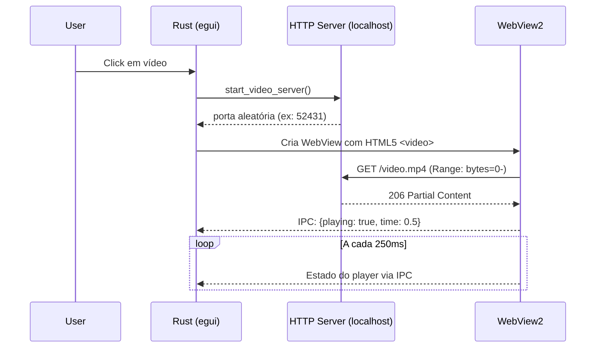

# 🏛️ Arquitetura do MTT File Manager

**Última Atualização**: Janeiro 2026

---

## Visão Geral

O MTT File Manager é um gerenciador de arquivos nativo para Windows, construído com uma arquitetura híbrida que combina:

- **Rust + egui** para a interface principal
- **WebView2 (via wry)** para reprodução de vídeo com aceleração de hardware
- **Windows APIs** para integração nativa com Shell, COM e Media Foundation

---

## Diagrama de Camadas

```
┌─────────────────────────────────────────────────────────────────┐
│                           UI Layer                               │
│  ┌─────────────┐  ┌─────────────┐  ┌─────────────────────────┐  │
│  │   egui      │  │   views/    │  │   components/           │  │
│  │   Panels    │  │  grid_view  │  │  webview_preview.rs     │  │
│  │   Sidebar   │  │  list_view  │  │  (WebView2 Video)       │  │
│  └─────────────┘  └─────────────┘  └─────────────────────────┘  │
├─────────────────────────────────────────────────────────────────┤
│                      Application Layer                           │
│  ┌─────────────────────────────────────────────────────────┐    │
│  │   app/operations/   (19 módulos)                        │    │
│  │   clipboard_ops, navigation, tabs, thumbnails, ...      │    │
│  └─────────────────────────────────────────────────────────┘    │
├─────────────────────────────────────────────────────────────────┤
│                     Infrastructure Layer                         │
│  ┌─────────────┐  ┌─────────────┐  ┌─────────────────────────┐  │
│  │   cache     │  │   windows/  │  │   workers/              │  │
│  │   SQLite    │  │  icons.rs   │  │  thumbnail_loader.rs    │  │
│  │   LRU       │  │  metadata/  │  │  folder_scanner.rs      │  │
│  └─────────────┘  └─────────────┘  └─────────────────────────┘  │
├─────────────────────────────────────────────────────────────────┤
│                       Domain Layer                               │
│  ┌─────────────────────────────────────────────────────────┐    │
│  │   FileEntry, ThumbnailData, MediaMetadata, errors       │    │
│  └─────────────────────────────────────────────────────────┘    │
└─────────────────────────────────────────────────────────────────┘
```

---

## Arquitetura Híbrida: egui + WebView2

### O Problema

O `egui` é um framework de UI imediata (immediate mode GUI) excelente para interfaces responsivas, mas **não suporta**:

- Decodificação de vídeo com aceleração GPU
- Codecs modernos (H.264, HEVC, VP9, AV1)
- Renderização de vídeo em textura de forma eficiente

### A Solução

Utilizamos o crate `wry` (v0.39) para embedar uma janela WebView2 (Edge) como child window:

```
┌─────────────────────────────────────────────┐
│            Janela Principal (egui)          │
│  ┌───────────────────┬───────────────────┐  │
│  │                   │   Preview Panel   │  │
│  │   File List       │  ┌─────────────┐  │  │
│  │                   │  │  WebView2   │  │  │
│  │   (egui)          │  │  (wry)      │  │  │
│  │                   │  │             │  │  │
│  │                   │  └─────────────┘  │  │
│  │                   │  [Controls egui]  │  │
│  └───────────────────┴───────────────────┘  │
└─────────────────────────────────────────────┘
```

### Fluxo de Reprodução de Vídeo



### Implementação: `webview_preview.rs`

```rust
pub struct WebviewPreview {
    path: PathBuf,
    webview: Option<WebView>,
    server_port: Option<u16>,
    state: Arc<Mutex<VideoState>>,
    // ...
}
```

**Servidor HTTP Local:**
- Usa `std::net::TcpListener` em porta aleatória
- Suporta Range Requests para seeking
- Chunked responses de 2MB para performance

**IPC (Inter-Process Communication):**
- Rust → JS: `webview.evaluate_script("video.play()")`
- JS → Rust: `window.ipc.postMessage(JSON.stringify({...}))`

---

## Módulos Principais

### `app/operations/` — Lógica de Aplicação

| Módulo | Responsabilidade |
|--------|------------------|
| `clipboard_ops.rs` | Copy/Cut/Paste via CF_HDROP |
| `context_menu.rs` | Menu de contexto nativo |
| `file_ops.rs` | Operações de arquivo (delete, rename) |
| `folder_loading.rs` | Carregamento assíncrono de pastas |
| `navigation.rs` | Histórico back/forward |
| `tabs.rs` | Gerenciamento de abas |
| `thumbnails.rs` | Cache e carregamento de miniaturas |

### `infrastructure/windows/` — Integração Nativa

| Módulo | APIs Windows Utilizadas |
|--------|-------------------------|
| `icons.rs` | `IShellItemImageFactory`, `SHGetFileInfoW` |
| `metadata/video.rs` | `IPropertyStore`, Media Foundation |
| `native_menu.rs` | `IContextMenu`, `TrackPopupMenu` |
| `recycle_bin.rs` | `SHFileOperationW` |
| `shell_operations.rs` | `IFileOperation` |

### `workers/` — Background Threads

| Worker | Função |
|--------|--------|
| `thumbnail_loader.rs` | Carrega thumbnails via WIC |
| `folder_scanner.rs` | Lista diretórios em background |
| `folder_preview_worker.rs` | Gera previews de pastas |

---

## Performance

### Operações Assíncronas

Todas as operações de I/O são executadas fora da thread principal:

- File scanning: `mpsc::channel` + thread
- Thumbnails: Worker pool com LRU cache
- Metadata: Lazy loading no selection

### Cache Strategy

```
┌──────────────────┐
│   LRU Cache      │  ←  Texturas em memória (256 itens)
├──────────────────┤
│   SQLite Cache   │  ←  Thumbnails WebP em disco
├──────────────────┤
│   Windows Cache  │  ←  Shell thumbnail cache
└──────────────────┘
```

---

## Requisitos de Sistema

- Windows 10/11 (64-bit)
- WebView2 Runtime (Windows 11 inclui por padrão)
- ~50MB RAM base + ~2MB por aba

---

*Mantido pela equipe MTT File Manager*
