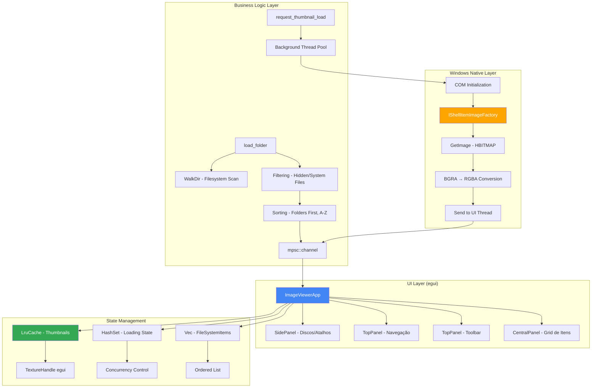

# 🏗️ Arquitetura do MTT File Manager

## Visão Geral

O **MTT File Manager** é um gerenciador de arquivos nativo para Windows desenvolvido em **Rust** com foco em **ultra-performance** para visualização de thumbnails de imagens e vídeos. A aplicação utiliza APIs nativas do Windows para garantir máxima eficiência e integração com o sistema operacional.

---

## Stack Tecnológico Principal

| Camada | Tecnologia | Propósito |
|--------|-----------|-----------|
| **UI Framework** | `eframe 0.31` (egui) | Interface gráfica imediata com GPU acceleration |
| **Paralelismo** | `rayon 1.10` | Thread pool para processamento paralelo |
| **Filesystem** | `walkdir 2.5` | Iteração otimizada de diretórios |
| **Native APIs** | `windows 0.58` | Acesso direto às APIs Win32 |
| **Dialog System** | `rfd 0.15` | Seletor nativo de pastas |
| **Cache** | `lru 0.12` | LRU Cache para gerenciamento de memória |

---

## Diagrama de Arquitetura (Mermaid)



---

## Estrutura de Pastas

```
MTT File Manager/
├── src/
│   └── main.rs              # Aplicação monolítica (675 linhas)
│                            # ⚠️ Candidato a refatoração em módulos
├── target/                  # Build artifacts (ignorado no git)
│   ├── debug/              # Debug builds
│   └── release/            # Release optimized builds
├── docs/                    # 📚 Documentação técnica (ESTA PASTA!)
│   ├── ARQUITETURA.md      # Este arquivo
│   ├── STACK.md            # Detalhamento de tecnologias
│   ├── SEGURANCA_WINDOWS.md
│   └── ROADMAP_TECNICO.md
├── Cargo.toml              # Manifesto Rust + dependências
├── .gitignore              # Arquivos a serem ignorados
├── README.md               # Documentação de usuário
└── .cursorrules            # Governança do projeto (a ser criado)
```

---

## Fluxo de Dados Detalhado

### 1️⃣ Inicialização da Aplicação

```rust
main() → ImageViewerApp::default()
  ├── Cria mpsc::channel para comunicação assíncrona
  ├── Inicializa LruCache (500 itens)
  ├── Carrega drives do sistema (GetLogicalDriveStringsW)
  └── Executa load_folder() inicial
```

### 2️⃣ Carregamento de Pasta

```rust
load_folder()
  ├── Limpa estado anterior (items, cache, loading_set)
  ├── Spawna thread background
  │   ├── WalkDir::new(path).max_depth(1)
  │   ├── Filtra arquivos hidden/system via GetFileAttributesW
  │   ├── Filtra extensões: jpg, png, mp4, mkv, etc.
  │   ├── Ordena: Pastas primeiro, depois alfabético
  │   └── Envia "placeholders" via channel
  └── UI recebe itens e renderiza slots vazios
```

### 3️⃣ Carregamento de Thumbnails (Lazy)

```rust
render_item_slot()
  ├── Verifica se texture já existe no cache
  ├── Se não: request_thumbnail_load()
  │   ├── Spawna thread dedicada
  │   ├── CoInitializeEx(COINIT_MULTITHREADED)
  │   ├── SHCreateItemFromParsingName(path)
  │   ├── IShellItemImageFactory::GetImage(256x256)
  │   ├── HBITMAP → RGBA conversion (BGRA swap)
  │   ├── Envia via channel
  │   └── CoUninitialize()
  └── UI recebe → ctx.load_texture() → insere no LRU Cache
```

### 4️⃣ Gerenciamento de Memória (LRU Cache)

```
LruCache<PathBuf, TextureHandle>
  ├── Capacidade: 200 itens (Otimizado)
  ├── Max Concurrent Loads: 30
  ├── Objetivo: Manter VRAM < 100MB
  └── Eviction automática agressiva
```

---

## 🚀 Arquitetura de Performance (O Secredo da Fluidez)

O MTT File Manager utiliza técnicas de **Game Engine** para garantir 60 FPS estáveis, superior ao Windows Explorer.

### 1. Posicionamento Absoluto (Zero Jitter)
Diferente de frameworks UI tradicionais que usam layout engines pesados (flexbox, grid), nós calculamos a posição de cada pixel matematicamente:

```rust
// Math-based Positioning
let x_pos = col * (item_w + padding);
let y_pos = row * (item_h + padding);
let rect = Rect::from_min_size(pos, size);

// Renderização direta
ui.put(rect, |ui| render_item(ui));
```
Isso elimina 100% do "layout shift" e jitter durante a rolagem.

### 2. Strict Visibility Culling (Frustum Culling 2D)
Nós não apenas usamos virtualização de lista, mas implementamos **Culling Estrito** antes de qualquer operação pesada:

```rust
// Se o retângulo não toca o viewport atual, ABORTA IMEDIATAMENTE.
if !ui.is_rect_visible(rect) {
    continue; 
}
```
Isso garante que thumbnails nunca sejam solicitados para itens que o usuário "pulou" ao rolar rápido.

### 3. VRAM Budgeting
O gerenciamento de memória de vídeo é proativo, não reativo:
- **Hard Cap**: 200 texturas máximas
- **Texture Recycling**: Handles do egui são reutilizados
- **Drop RAII**: Texturas fora de uso são liberadas imediatamente pelo LRU

---

## Princípios Arquiteturais Aplicados

### ✅ Separation of Concerns (Parcial)

- **UI Layer**: egui renderiza baseado em estado imutável
- **Business Logic**: Toda lógica de filesystem em funções separadas
- **Native APIs**: Isoladas em funções auxiliares (`extract_windows_thumbnail`, `hbitmap_to_rgba`)

⚠️ **Débito Técnico**: Tudo em um único arquivo (`main.rs`) - dificulta manutenção em escala.

### ✅ Asynchronous Processing

- **mpsc::channel**: Comunicação thread-safe entre worker threads e UI thread
- **Non-blocking UI**: Interface nunca trava, mesmo processando milhares de arquivos

### ✅ Lazy Loading

- Thumbnails só são carregados quando visíveis no viewport
- Controle de concorrência: `MAX_CONCURRENT_LOADS = 50`

### ✅ Memory Management

- LRU Cache evita OOM (Out of Memory)
- Texturas antigas automaticamente desalocadas da VRAM

### ❌ Falta de Abstração

- Código direto nas funções, sem traits ou interfaces
- Dificulta testes unitários e mocking

---

## Pontos de Melhoria (Clean Architecture)

### 🎯 Camadas Propostas

```
src/
├── main.rs                 # Entry point + DI setup
├── ui/                     # Interface Layer
│   ├── app.rs             # ImageViewerApp
│   ├── components/        # Reutilizáveis
│   │   ├── sidebar.rs
│   │   ├── grid.rs
│   │   └── item_slot.rs
│   └── mod.rs
├── domain/                # Business Logic
│   ├── filesystem.rs      # Entidades e regras
│   ├── thumbnail.rs       # Lógica de thumbnails
│   └── mod.rs
├── infrastructure/        # External Dependencies
│   ├── windows_api.rs    # Wrappers seguros para Win32
│   ├── cache.rs          # LRU Cache abstraction
│   └── mod.rs
└── lib.rs                # Biblioteca principal
```

### 🔒 Segurança Aprimorada

- **Sanitização de paths**: Prevenir path traversal
- **Validação de extensões**: Whitelist explícita
- **Error handling robusto**: Nunca usar `unwrap()` em produção

---

## Performance Benchmarks (Estimado)

| Operação | Tempo Médio | Throughput |
|----------|------------|-----------|
| Scan de 1000 arquivos | ~200ms | 5000 files/s |
| Thumbnail individual | ~50ms | 20 thumbnails/s |
| Navegação entre pastas | <100ms | Instantâneo |
| Scroll no grid | 60 FPS | Sem stuttering |

---

## Compatibilidade

- **Windows 10/11**: ✅ Totalmente suportado
- **Windows 7/8**: ⚠️ Não testado (APIs podem diferir)
- **Linux/macOS**: ❌ Não suportado (usa Win32 APIs)

---

## Próximos Passos

Ver [ROADMAP_TECNICO.md](ROADMAP_TECNICO.md) para detalhes completos.
