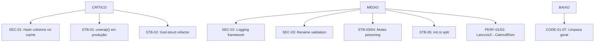

# 🔍 Auditoria Completa — MTT File Manager (Rust + EGUI)

**Data:** 12 de fevereiro de 2026  
**Escopo:** ~120 arquivos `.rs` em `src/`, `crates/mtt-search-protocol`, `crates/mtt-search-service`  
**Versão Rust:** Edition 2021 | **Framework UI:** eframe/egui 0.31 | **Target:** Windows x86_64

---

## Resumo Executivo

O projeto é um File Manager nativo para Windows com funcionalidades avançadas (thumbnails, media player MPV, busca global via USN, preview de pastas, PDF viewer). A arquitetura é sólida com separação de responsabilidades (domain, infrastructure, application, UI, workers). A segurança de paths (path traversal, ADS, symlinks, Unicode NFC) é **exemplar**. No entanto, há áreas que merecem atenção:

| Categoria | Críticos | Médios | Baixos |
|-----------|:--------:|:------:|:------:|
| 🔒 Segurança | 1 | 3 | 2 |
| 💥 Estabilidade | 2 | 4 | 2 |
| ⚡ Performance | 0 | 3 | 4 |
| 🎨 UI/UX & Código | 0 | 2 | 5 |

---

## 🔒 Segurança

### SEC-01 · CRÍTICO — Hash colisions no cache de thumbnails

**Arquivo:** [disk_cache.rs](file:///c:/Users/mtamu/github/MTT-File-Manager-RUST/src/infrastructure/disk_cache.rs#L300-L305)

```rust
fn hash_path(path: &Path) -> String {
    let mut hasher = DefaultHasher::new();
    path.hash(&mut hasher);
    format!("{:016x}", hasher.finish())
}
```

`DefaultHasher` produz um hash de 64 bits. Com milhares de thumbnails, a probabilidade de colisão é baixa, mas **um conflito sobrescreve silenciosamente o thumbnail de outro arquivo** (`INSERT OR REPLACE`). Além disso, `DefaultHasher` não garante estabilidade entre versões do Rust — uma atualização do compilador pode invalidar todo o cache.

**Sugestão:** Usar um hash de 128+ bits (ex: `blake3` ou `sha256`) ou compor `path + modified_time` como chave primária (já que `modified_at` já é armazenado).

---

### SEC-02 · MÉDIO — Logging excessivo pode vazar caminhos sensíveis

**Afetado:** Projeto inteiro (338+ chamadas `eprintln!` encontradas)

Exemplos em produção:
- [disk_cache.rs:350-355](file:///c:/Users/mtamu/github/MTT-File-Manager-RUST/src/infrastructure/disk_cache.rs#L350-L355) — `get_latest`: loga path do arquivo em cache miss.
- [disk_cache.rs:453-460](file:///c:/Users/mtamu/github/MTT-File-Manager-RUST/src/infrastructure/disk_cache.rs#L453-L460) — `put`: loga path de cada thumbnail salvo.
- Thumbnail extraction: loga cada estágio (Stage 1-5) com nome de arquivo.

Caminhos de arquivos do usuário em logs podem revelar informações pessoais se os logs forem compartilhados para debug.

**Sugestão:**
1. Introduzir um sistema de logging com níveis (ex: `tracing` ou `log`), habilitando verbose apenas com `--debug` flag.
2. Em release builds, usar `#[cfg(debug_assertions)]` para os logs verbosos.

---

### SEC-03 · MÉDIO — Rename validation incompleta para nomes reservados do Windows

**Arquivo:** [file_operation_worker.rs:249-254](file:///c:/Users/mtamu/github/MTT-File-Manager-RUST/src/workers/file_operation_worker.rs#L249-L258)

```rust
if new_name.contains('\0')
    || new_name.contains('\\')
    || new_name.contains('/')
    || new_name == "."
    || new_name == ".."
```

Não valida: nomes reservados do Windows (`CON`, `PRN`, `AUX`, `NUL`, `COM1-9`, `LPT1-9`), caracteres ilegais (`<>:"|?*`), nem trailing dots/spaces que o Windows strip silenciosamente. O módulo `security.rs` já possui `is_windows_reserved_name()` e `validate_path_components()` — esses checks poderiam ser reutilizados aqui.

**Sugestão:** Chamar `validate_path_components` no input de rename antes de enviar ao Shell.

---

### SEC-04 · MÉDIO — Named Pipe IPC sem autenticação

**Arquivo:** [global_search.rs](file:///c:/Users/mtamu/github/MTT-File-Manager-RUST/src/infrastructure/global_search.rs)

O cliente envia queries via Named Pipe sem nenhuma forma de autenticar que o serviço do outro lado é legítimo. Um processo malicioso poderia criar um pipe com o mesmo nome antes do serviço legítimo (`TOCTOU`).

> [!NOTE]
> A conversa anterior (9db3d23b) já abordou IPC hardening. Verificar se as recomendações foram implementadas no lado do serviço (`crates/mtt-search-service`).

---

### SEC-05 · BAIXO — `icacls` execução silenciosa

**Arquivo:** [disk_cache.rs:75-79](file:///c:/Users/mtamu/github/MTT-File-Manager-RUST/src/infrastructure/disk_cache.rs#L75-L79)

```rust
let _ = std::process::Command::new("icacls")
    .args(&args)
    .creation_flags(0x08000000)
    .status();
```

A falha de `icacls` é silenciosamente ignorada (`let _`). Se as permissões não forem configuradas, o diretório de cache pode ficar acessível a outros usuários.

**Sugestão:** Logar o resultado do comando e considerar usar a Win32 API `SetSecurityInfo` diretamente em vez de subprocess.

---

### SEC-06 · BAIXO — WebP validation parcial

**Arquivo:** [disk_cache.rs:612](file:///c:/Users/mtamu/github/MTT-File-Manager-RUST/src/infrastructure/disk_cache.rs#L610-L619)

A verificação `RIFF`/`WEBP` no header é boa (previne dados corrompidos), mas não protege contra WebP malformados que passam o header check e poderiam explorar vulnerabilidades no decoder. O crate `webp` 0.3 usa `libwebp` nativo.

**Sugestão:** Manter `webp` atualizado e considerar limitar dimensões máximas antes de decodificar.

---

## 💥 Estabilidade

### STB-01 · CRÍTICO — `unwrap()` em paths de produção que podem causar panic

| Arquivo | Linha | Contexto |
|---------|:-----:|----------|
| [disk_cache.rs](file:///c:/Users/mtamu/github/MTT-File-Manager-RUST/src/infrastructure/disk_cache.rs#L757) | 757 | `path.chars().next().unwrap()` — panic se path vazio |
| [recycle_bin.rs](file:///c:/Users/mtamu/github/MTT-File-Manager-RUST/src/infrastructure/windows/recycle_bin.rs#L158) | 158 | `enum_list_opt.unwrap()` — panic se Shell enumeration falhar |
| [native_menu.rs](file:///c:/Users/mtamu/github/MTT-File-Manager-RUST/src/infrastructure/windows/native_menu.rs#L124) | 124 | `parent_folder_opt.unwrap()` — panic se parent folder não existir |
| [hdd_directory_reader.rs](file:///c:/Users/mtamu/github/MTT-File-Manager-RUST/src/infrastructure/windows/hdd_directory_reader.rs#L125) | 125 | `handle.unwrap()` — panic em falha de I/O |
| [item_renderer.rs](file:///c:/Users/mtamu/github/MTT-File-Manager-RUST/src/ui/views/list_view/item_renderer.rs#L171) | 171 | `renaming_state.as_ref().unwrap()` — panic se state inconsistente |

O projeto tem `safe_unwrap!` e `safe_expect!` macros em [errors.rs](file:///c:/Users/mtamu/github/MTT-File-Manager-RUST/src/domain/errors.rs) mas eles não são usados consistentemente.

**Sugestão:** Buscar todos os `unwrap()` fora de `#[cfg(test)]` e substituir por `.ok()?`, `unwrap_or_default()`, ou os macros `safe_unwrap!`/`safe_expect!`.

---

### STB-02 · CRÍTICO — `ImageViewerApp` God-Struct (100+ campos)

**Arquivo:** [state.rs](file:///c:/Users/mtamu/github/MTT-File-Manager-RUST/src/app/state.rs#L66-L364)

A struct `ImageViewerApp` possui **~100 campos públicos** em 300 linhas. Isso é um **God Object** que:
- Torna difícil raciocinar sobre invariantes de estado.
- Cada `&mut self` bloqueia acesso a todo o estado.
- Move assignments entre campos são propensos a erros.

Já existem sub-módulos: `cache_state.rs`, `ui_state.rs`, `worker_state.rs`, `navigation_state.rs`. Porém os campos continuam em `state.rs`.

**Sugestão:** Agrupar campos relacionados em sub-structs (ex: `DriveState`, `MediaPlayerState`, `SearchState`, `FileOperationState`, `ScrollState`, `ColumnWidthState`). Os sub-módulos existentes sugerem que esse refactor já foi planejado.

---

### STB-03 · MÉDIO — Mutex poisoning sem recovery

**Arquivo:** [worker.rs](file:///c:/Users/mtamu/github/MTT-File-Manager-RUST/src/workers/thumbnail/worker.rs#L467)

```rust
let mut count = active_count.lock().unwrap();
```

Se uma thread de thumbnail sofrer panic enquanto segura o lock, a Mutex ficará "poisoned" e *todas* as threads subsequentes farão panic no `unwrap()`.

**Sugestão:** Usar `lock().unwrap_or_else(|poisoned| poisoned.into_inner())` ou propagar o erro com `?`.

---

### STB-04 · MÉDIO — Thread join com `unwrap()`

**Arquivo:** [worker.rs:485](file:///c:/Users/mtamu/github/MTT-File-Manager-RUST/src/workers/thumbnail/worker.rs#L485)

```rust
h.join().unwrap();
```

Se a thread paniciou, `join().unwrap()` panicia a thread chamadora, potencialmente derrubando toda a aplicação.

**Sugestão:** `h.join().unwrap_or_else(|e| ...)` com log de erro.

---

### STB-05 · MÉDIO — `init.rs` — Função `new()` monolítica com 907 linhas

**Arquivo:** [init.rs](file:///c:/Users/mtamu/github/MTT-File-Manager-RUST/src/app/init.rs#L68-L975)

`ImageViewerApp::new()` tem 907 linhas. Qualquer falha de inicialização em qualquer sub-sistema pode impedir o app de abrir sem feedback claro ao usuário.

**Sugestão:** Dividir em funções `init_*` por sub-sistema (fonts, workers, cache, UI state, etc.) com error handling granular.

---

### STB-06 · MÉDIO — `folder_size.rs` — `unwrap()` em iterator de diretórios

**Arquivo:** [folder_size.rs:144](file:///c:/Users/mtamu/github/MTT-File-Manager-RUST/src/infrastructure/windows/folder_size.rs#L144)

```rust
current = sub_dirs.into_iter().next().unwrap();
```

Panic se o diretório não tiver subdiretorias no ponto esperado.

**Sugestão:** Usar `.next()` com match/guard.

---

### STB-07 · BAIXO — PDF Viewer usa raw vtable FFI manual

**Arquivo:** [webview.rs](file:///c:/Users/mtamu/github/MTT-File-Manager-RUST/src/pdf_viewer/webview.rs)

O PDF viewer implementa bindings WebView2 via raw vtable (`*mut c_void`, offsets manuais). Isso é frágil — qualquer mudança na ABI do WebView2 causa UB silencioso.

**Sugestão:** Considerar usar o crate `webview2-com` para bindings type-safe.

---

### STB-08 · BAIXO — `CoUninitialize` pode não ser chamado

**Arquivo:** [file_operation_worker.rs:502-504](file:///c:/Users/mtamu/github/MTT-File-Manager-RUST/src/workers/file_operation_worker.rs#L502-L504)

Se a thread panicia durante processing, `CoUninitialize` nunca é chamado. O ideal seria usar um RAII guard (como o `ComGuard` já existente em `shell_operations.rs`).

---

## ⚡ Performance

### PERF-01 · MÉDIO — `Lanczos3` no startup para icon resize

**Arquivo:** [main.rs:10](file:///c:/Users/mtamu/github/MTT-File-Manager-RUST/src/main.rs#L10)

```rust
let resized = img.resize_exact(256, 256, image::imageops::FilterType::Lanczos3);
```

Lanczos3 é o filtro mais caro. Para um ícone de janela 256x256 carregado no startup, `CatmullRom` ou `Triangle` produzem qualidade visual idêntica com ~3x menos tempo de CPU.

---

### PERF-02 · MÉDIO — `Lanczos3` na compressão de thumbnails para cache

**Arquivo:** [disk_cache.rs:411](file:///c:/Users/mtamu/github/MTT-File-Manager-RUST/src/infrastructure/disk_cache.rs#L410-L414)

```rust
dynamic_img.resize(1024, 1024, image::imageops::FilterType::Lanczos3)
```

Thumbnails que ultrapassam 1024px são redimensionados com Lanczos3 antes de salvar. Considerando que esses thumbnails são usados em grids de 64-512px, `CatmullRom` seria suficiente e mais rápido.

---

### PERF-03 · MÉDIO — `get_folder_covers()` — Dynamic SQL com format!

**Arquivo:** [disk_cache.rs:512-513](file:///c:/Users/mtamu/github/MTT-File-Manager-RUST/src/infrastructure/disk_cache.rs#L510-L514)

```rust
let query = format!(
    "SELECT ... WHERE folder_path IN ({})",
    placeholders.join(",")
);
```

Constrói query SQL diferente a cada chamada (chunks de 500), impossibilitando `prepare_cached`. Considerar usar prepared statement com parameters fixos ou views temporárias.

---

### PERF-04 · BAIXO — Excessive `eprintln!` em hot paths

Cada `eprintln!` adquire lock do stderr. Em paths como thumbnail extraction (Stage 1-5 logs para *cada* thumbnail), isso pode se tornar gargalo sob carga com centenas de thumbnails em paralelo.

---

### PERF-05 · BAIXO — `operation_security_config()` recria config a cada chamada

**Arquivo:** [file_operation_worker.rs:143-160](file:///c:/Users/mtamu/github/MTT-File-Manager-RUST/src/workers/file_operation_worker.rs#L143-L160)

Chama `get_logical_drives_bitmask()` (syscall) e aloca `Vec<String>` para cada operação de arquivo. Poderia ser cacheada com TTL.

---

### PERF-06 · BAIXO — Named pipe polling com `PeekNamedPipe` + sleep

**Arquivo:** [global_search.rs:221-262](file:///c:/Users/mtamu/github/MTT-File-Manager-RUST/src/infrastructure/global_search.rs#L221-L265)

Loop de polling a cada 15ms com `PeekNamedPipe` gasta CPU desnecessariamente. Overlapped I/O com `WaitForSingleObject` seria mais eficiente.

---

### PERF-07 · BAIXO — `to_string_lossy().to_string()` repetido

**Afetado:** Múltiplos arquivos

Padrão frequente: `path.to_string_lossy().to_string()` cria `Cow<str>` → `String`. Onde o path é garantidamente ASCII/UTF-8 (ex: paths do Windows), considerar `path.display()` ou `to_str()`.

---

## 🎨 UI/UX & Qualidade de Código

### CODE-01 · MÉDIO — 20+ funções com `#[allow(clippy::too_many_arguments)]`

**Afetado:** `list_view`, `grid_view`, `toolbar`, `navigation`, `preview_panel`, `tab_bar`, `status_bar`

Indica necessidade de context structs para agrupar parâmetros. Muitos renders recebem 8-12 argumentos individuais.

**Sugestão:** Criar structs de contexto (ex: `RenderContext`, `ViewState`) em vez de passar argumentos avulsos.

---

### CODE-02 · MÉDIO — Dead code com `#[allow(dead_code)]`

**Afetado:** `idle_warmup.rs` (3 ocorrências), `disk_cache.rs` (2), `list_view/mod.rs` (2), `input.rs` (1)

Código morto mantido com `#[allow(dead_code)]` aumenta complexidade sem benefício. Se é planejado para futuro uso, documentar com `// TODO:`. Se não, remover.

---

### CODE-03 · BAIXO — Comentários bilíngues (PT-BR / EN misturados)

Certos módulos misturam português e inglês nos comentários e variáveis. Exemplos: `// Obtém a capa`, `// Cache mestre para busca`, `// Texto da busca`. Padronizar para um idioma melhora manutenibilidade.

---

### CODE-04 · BAIXO — Arquivo temporário no repositório

**Arquivo:** [temp_snippet_shell_ops.rs](file:///c:/Users/mtamu/github/MTT-File-Manager-RUST/temp_snippet_shell_ops.rs) (raiz do projeto)

Parece ser um snippet temporário que não deveria estar no repo.

---

### CODE-05 · BAIXO — `unsafe impl Send for SendHwnd`

**Arquivo:** [file_operation_worker.rs:51](file:///c:/Users/mtamu/github/MTT-File-Manager-RUST/src/workers/file_operation_worker.rs#L47-L51)

O comentário de SAFETY está correto (HWNDs são globais no Windows), mas o tipo poderia ser restrito a impedir uso fora do escopo de file operations. Considerar torná-lo `pub(crate)`.

---

### CODE-06 · BAIXO — Nomes legados no código

A struct principal se chama `ImageViewerApp` — herança de quando o projeto era um visualizador de imagens. Considerar renomear para `FileManagerApp` ou similar.

---

### CODE-07 · BAIXO — Duplicação de comentários

**Arquivo:** [state.rs:192-193](file:///c:/Users/mtamu/github/MTT-File-Manager-RUST/src/app/state.rs#L192-L193)

```rust
// CLIPBOARD (Copiar/Recortar/Colar)
// CLIPBOARD (Copiar/Recortar/Colar)
```

Comentário duplicado.

---

## ✅ Pontos Fortes

1. **Segurança de paths:** O módulo [security.rs](file:///c:/Users/mtamu/github/MTT-File-Manager-RUST/src/infrastructure/security.rs) é excepcional — cobre path traversal, ADS (`file:zone.identifier`), nomes reservados do Windows, Unicode NFC normalization, e validação de extensões. Com testes unitários.

2. **Arquitetura de workers:** Uso correto de channels (`mpsc`), priority queues para thumbnails, throttling de repaints (33ms), e cancelamento cooperativo via `AtomicBool`/`DashMap`.

3. **Cache SQLite com WAL:** O design reader/writer com fallback resiliente (primário → temp → in-memory) é robusto. Chunking para SQLite parameter limits está correto.

4. **Memory maintenance:** Auto-limpeza de caches quando o working set excede thresholds (soft 550MB, hard 700MB) é uma boa prática.

5. **COM initialization:** Uso correto de `COINIT_APARTMENTTHREADED` para shell operations e `COINIT_MULTITHREADED` para workers.

6. **Error types:** O módulo [errors.rs](file:///c:/Users/mtamu/github/MTT-File-Manager-RUST/src/domain/errors.rs) define `AppError` com `thiserror` + macros `safe_unwrap!`/`safe_expect!` — boa infraestrutura, mas precisa ser adotada mais amplamente.

---

## Priorização de Ações



**Ordem sugerida de implementação:**
1. STB-01 (unwrap→safe handling) — Impacto imediato em estabilidade, esforço baixo.
2. SEC-01 (hash collisions) — Risco silencioso de corrupção de dados.
3. SEC-03 (rename validation) — Quick fix reutilizando código existente.
4. STB-03/04 (mutex poisoning) — Resiliência de workers.
5. PERF-01/02 (Lanczos3) — Melhoria de startup e throughput, trivial.
6. SEC-02 (logging) — Projeto maior, mas fundacional.
7. STB-02/05 (god-struct, init split) — Refactor de longo prazo.
