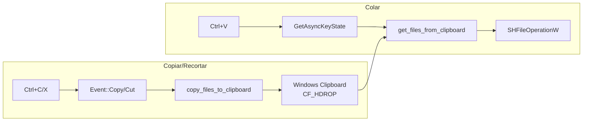

# 📋 Integração com Clipboard do Windows

> **Adicionado em**: 2026-01-04  
> **Módulo**: `src/infrastructure/windows_clipboard.rs`

## Visão Geral

O MTT File Manager integra-se com o clipboard do Windows usando o formato **CF_HDROP**, permitindo:

- **Ctrl+C/X** para copiar/recortar arquivos
- **Ctrl+V** para colar arquivos
- Interoperabilidade com Windows Explorer e outros apps
- Menu de contexto nativo mostra "Colar" automaticamente

---

## Arquitetura



---

## Dependência

```toml
clipboard-win = "5.4"  # Windows clipboard (CF_HDROP)
```

---

## APIs Utilizadas

| API | Propósito |
|-----|-----------|
| `clipboard_win::formats::FileList` | Ler/escrever lista de arquivos (CF_HDROP) |
| `RegisterClipboardFormatW` | Registrar "Preferred DropEffect" |
| `SetClipboardData` | Definir efeito Copy vs Move |
| `GetAsyncKeyState` | Detectar Ctrl+V no nível de hardware |

---

## Por que GetAsyncKeyState?

O Windows **consome** o evento Ctrl+V quando o clipboard contém arquivos (CF_HDROP). Os eventos de teclado normais (`key_pressed`, `Event::Paste`) não chegam ao aplicativo.

A solução é usar `GetAsyncKeyState` que consulta o estado físico do teclado, bypassing o sistema de eventos.

```rust
// VK_CONTROL = 0x11, VK_V = 0x56
let ctrl_down = unsafe { GetAsyncKeyState(0x11) < 0 };
let v_down = unsafe { GetAsyncKeyState(0x56) < 0 };

if ctrl_down && v_down && !self.paste_key_debounce {
    do_paste = true;
    self.paste_key_debounce = true;
}
```

---

## Arquivos Relacionados

| Arquivo | Responsabilidade |
|---------|------------------|
| `src/infrastructure/windows_clipboard.rs` | API wrapper para clipboard |
| `src/main.rs` | Detecção de Ctrl+C/X/V e chamada das funções |
| `docs/STACK.md` | Documentação da dependência |
| `docs/SEGURANCA_WINDOWS.md` | Auditoria de código unsafe |

---

## Referências

- [Microsoft CF_HDROP Documentation](https://learn.microsoft.com/en-us/windows/win32/shell/clipboard#cf_hdrop)
- [clipboard-win crate](https://docs.rs/clipboard-win/latest/clipboard_win/)

---

*Última atualização: 2026-01-04*
