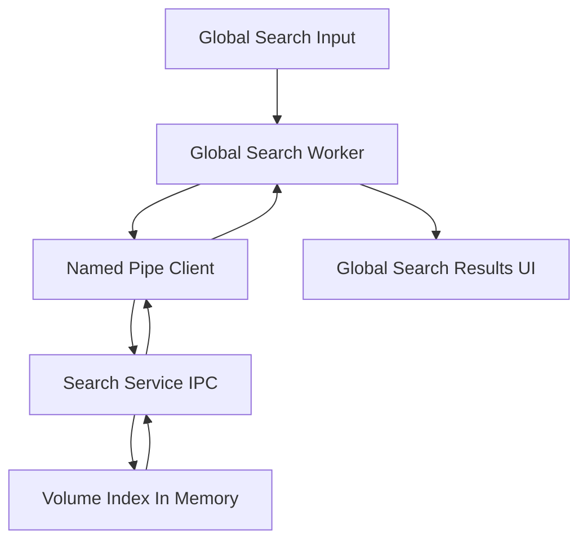

# MTT File Manager Rust - Priority Code Review Report

Date: 2026-02-18  
Scope: priority-first review in `src` and `crates`, then targeted expansion where risks were detected.

---

## 1. Executive Summary

This review found **11 actionable issues** across security, stability, UI responsiveness, and performance:

- **Critical:** 1
- **High:** 4
- **Medium:** 5
- **Low:** 1

Top risks:

1. **Security policy bypass path** in context-menu open flow.
2. **Unsafe IPC write assumptions** around `WriteFile` partial writes.
3. **UI scrollbar numeric edge cases** that can produce invalid math.
4. **Search request pressure and full-scan query complexity** affecting responsiveness.

### Implementation Status (Code Phase - 2026-02-18)

- **F-01**: ✅ Implemented
  - Context-menu open path now uses centralized sanitized open flow.
- **F-02**: ⚠️ Partially implemented (intentionally scoped)
  - Blocked-extension validation enforced for open flow boundary.
  - Generic enforcement on all file operations was intentionally deferred to avoid behavioral regressions.
- **F-03**: ✅ Implemented
  - Added denominator/travel guards and handle clamp in list/grid custom scrollbars.
- **F-04**: ✅ Implemented
  - Added looped write-all handling for named pipe writes in client and service.
- **F-05**: ✅ Implemented
  - Added real UI-side debounce before dispatching global search requests.

---

## 2. Methodology

- Static, read-only audit with file-level evidence.
- Priority modules reviewed first:
  - Search client/service IPC and indexer loops.
  - UI virtualization and scroll pipelines.
  - File operation security boundaries.
  - Worker/thread lifecycle and shutdown behavior.
- Expansion into adjacent modules when risk propagation was identified.

---

## 3. Architecture Risk Map

Main pressure points observed:

- UI event rate feeding IPC.
- IPC framing robustness under partial I/O conditions.
- Index search complexity under large record sets.
- UI custom scroll math under boundary geometry.

---

## 4. Detailed Findings

## F-01 - Unsanitized open path in context menu

- Severity: **Critical**
- Category: Security, Stability

### Evidence

- Direct shell spawn without centralized sanitization in [`fn open_with_shell()`](../src/ui/app/menu_handler.rs:161).
- Hardened path flow exists in [`pub fn open_with_shell()`](../src/application/file_operations.rs:116).
- Safe bridge helper already routes correctly in [`fn open_with_shell()`](../src/app/operations/ui_rendering/list_bridge.rs:16).

### Impact

- A context-menu execution path bypasses the central path security checks.
- Creates inconsistent behavior between UI entry points.

### Recommendation

- Replace the direct explorer spawn in menu handler with the centralized [`file_operations::open_with_shell()`](../src/application/file_operations.rs:116).
- Keep one authoritative open path policy.

### Verification

- Use only one call chain for open operations.
- Add a regression test around context-menu open for blocked/invalid paths.

---

## F-02 - Blocked extension policy appears non-enforced in operational flow

- Severity: **High**
- Category: Security

### Evidence

- Blocklist exists in [`SecurityConfig`](../src/infrastructure/security.rs:33) with values at [`impl Default for SecurityConfig`](../src/infrastructure/security.rs:47).
- Validator exists in [`pub fn validate_file_extension()`](../src/infrastructure/security.rs:170).
- Usage search found references only within the same file and tests.

### Impact

- Security policy can become a false sense of protection if not wired into real operation paths.

### Recommendation

- Integrate extension validation into operation sanitization entry points:
  - [`sanitize_operation_path()`](../src/application/file_operations.rs:87)
  - [`sanitize_operation_path()`](../src/workers/file_operation_worker.rs:171)
- Apply selectively based on operation type, preserving allowed workflows where needed.

### Verification

- Add integration tests for blocked extensions across open/rename/create/shortcut flows.

---

## F-03 - Scrollbar denominator can reach invalid range in custom list/grid scrollbars

- Severity: **High**
- Category: UI Responsiveness, Stability

### Evidence

- List view scrollbar math in [`fn render_scrollbar()`](../src/ui/views/list_view/virtualization.rs:330).
- Grid view scrollbar math in [`pub(super) fn render_custom_scrollbar()`](../src/ui/views/grid_view/scroll.rs:60).
- Both use divisions by `viewport_h - handle_h` without explicit epsilon guard.

### Impact

- Potential NaN/Inf values during extreme geometry cases.
- Scroll jumps, stuck dragging, or unstable UX.

### Recommendation

- Clamp handle height and denominator:
  - `handle_h = handle_h.min(viewport_h - 1.0)` where feasible.
  - Guard denominator with epsilon before division.
- Keep behavior deterministic when content barely exceeds viewport.

### Verification

- Add UI tests for near-equal `total_content_height` and `viewport_h`.

---

## F-04 - IPC `WriteFile` partial write not validated

- Severity: **High**
- Category: Stability

### Evidence

- Client write path in [`fn write_message()`](../src/infrastructure/global_search.rs:207).
- Service write path in [`fn send_response()`](../crates/mtt-search-service/src/ipc_server.rs:541).
- Neither verifies `bytes_written == encoded.len()`.

### Impact

- Framing corruption risk under edge I/O conditions.
- Potential decode failures and intermittent protocol errors.

### Recommendation

- Treat partial writes as error or perform looped writes until all bytes are sent.
- Mirror strictness with existing read-side framing checks.

### Verification

- Add pipe I/O stress tests with forced short-write simulation.

---

## F-05 - Global search input sends request on each change despite debounce comment

- Severity: **High**
- Category: Performance, UI Responsiveness

### Evidence

- Per-change send in [`render_global_search_overlay()`](../src/ui/global_search_overlay.rs:156).
- Worker coalesces bursts in [`start_global_search_worker()`](../src/workers/global_search_worker.rs:190), but request pressure still reaches queue.

### Impact

- Extra IPC churn, queue traffic, and avoidable CPU load.
- UI responsiveness may degrade during fast typing on slower systems.

### Recommendation

- Add real UI-side debounce window before enqueue.
- Preserve immediate send for explicit user actions like Enter.

### Verification

- Confirm request rate reduction under fast typing scenarios.

---

## F-06 - Service search path is O records per query page

- Severity: **Medium**
- Category: Performance

### Evidence

- Full iteration in [`pub fn search_page()`](../crates/mtt-search-service/src/file_index.rs:189).
- Match check done per record via [`contains_case_insensitive()`](../crates/mtt-search-service/src/file_index.rs:156).

### Impact

- Query latency grows with index size.
- Increased CPU usage under frequent search activity.

### Recommendation

- Introduce searchable auxiliary index for candidate narrowing.
- Keep existing full scan as fallback path.

### Verification

- Benchmark p50/p95 query latency against large synthetic datasets.

---

## F-07 - MPV event-loop shutdown timeout intent is weakened by unconditional join

- Severity: **Medium**
- Category: Stability

### Evidence

- Timeout wait loop then unconditional `join` in [`pub fn stop_event_loop()`](../src/ui/components/mpv/event_loop.rs:90).

### Impact

- Shutdown can still block beyond intended timeout.

### Recommendation

- If timeout expires and thread is still alive, skip blocking join and log degraded shutdown path.

### Verification

- Exercise shutdown under synthetic stuck-thread conditions.

---

## F-08 - USN incremental updates can lag under sustained lock contention

- Severity: **Medium**
- Category: Stability, Performance

### Evidence

- Non-blocking lock attempt in [`pub(crate) fn index_volume()`](../crates/mtt-search-service/src/volume_indexers.rs:145) at try-write section around incremental apply.

### Impact

- Deltas may be postponed repeatedly during heavy read contention.
- Visible index freshness drift.

### Recommendation

- Add bounded retry window per cycle or short timed lock strategy.
- Emit metrics for skipped apply cycles to detect sustained lag.

### Verification

- Stress with concurrent query load and ensure bounded staleness.

---

## F-09 - Mixed path redaction discipline in service logs

- Severity: **Medium**
- Category: Security, Operability

### Evidence

- Redactor exists in [`redact_paths()`](../crates/mtt-search-service/src/main.rs:18).
- Some logs redact errors, others log raw error strings in [`volume_indexers.rs`](../crates/mtt-search-service/src/volume_indexers.rs:96).

### Impact

- Potential leakage of sensitive filesystem structure in logs.

### Recommendation

- Standardize logging wrappers that always apply redaction for external-facing error text.

### Verification

- Log snapshot tests with path-bearing errors.

---

## F-10 - Search result metadata lookup may induce UI I/O spikes

- Severity: **Medium**
- Category: UI Responsiveness, Performance

### Evidence

- Inline `metadata` fetch in [`resolve_result_size()`](../src/ui/global_search_overlay/results_panel.rs:371).

### Impact

- Rendering path can incur filesystem calls across many rows.

### Recommendation

- Move size resolution to async worker or lazy-fetch on selection/hover.

### Verification

- Compare frame-time variance before and after async migration.

---

## F-11 - Potential header-body width divergence in list view rendering snapshot

- Severity: **Low**
- Category: UI Correctness

### Evidence

- Width snapshot taken before scaling in [`render_list_view()`](../src/ui/views/list_view/mod.rs:307), while scaled values mutate context for header.

### Impact

- Minor visual mismatch risk under constrained width.

### Recommendation

- Compute and use a single post-scale width model for both header and rows.

### Verification

- Snapshot tests on narrow widths and high DPI.

---

## 5. Positive Observations

- Security hardening has strong foundations in [`sanitize_path_with_local_drive_fallback()`](../src/infrastructure/security.rs:123).
- Thumbnail pipeline has defense-in-depth non-media guard in [`generate_thumbnail_hybrid()`](../src/workers/thumbnail/extraction/mod.rs:31).
- Search worker has resilience patterns and queue coalescing in [`start_global_search_worker()`](../src/workers/global_search_worker.rs:190).
- USN/fallback split is well-structured with persistence checkpoints in [`index_volume()`](../crates/mtt-search-service/src/volume_indexers.rs:145).

---

## 6. Prioritized Action Plan for Implementation Mode

1. **Unify secure open path**
   - Remove direct explorer spawn path and route all UI opens through centralized sanitized operations.

2. **Enforce blocked-extension policy at operation boundaries**
   - Wire validator into effective execution paths.

3. **Harden IPC write framing**
   - Validate byte counts and handle partial writes explicitly.

4. **Fix custom scrollbar edge math**
   - Add denominator guards and handle clamps in both list and grid.

5. **Implement real UI debounce for global search input**
   - Reduce queue pressure and IPC churn while preserving perceived responsiveness.

6. **Improve search scalability path**
   - Add candidate narrowing index and benchmarks.

7. **Correct MPV shutdown timeout behavior**
   - Avoid indefinite blocking when timeout expires.

8. **Add contention telemetry and bounded retries in USN apply loop**
   - Keep incremental freshness predictable under load.

9. **Standardize redacted logging for all path-bearing errors**
   - Eliminate accidental path disclosure.

10. **Move size metadata collection out of render-critical path**
    - Keep global search overlay smooth under large result sets.

---

## 7. Suggested Validation Matrix

- Security regression suite for path and extension handling.
- IPC stress tests with forced short-write/timeout conditions.
- UI interaction tests for custom scrollbars on boundary geometries.
- Search load tests with large index volumes and typed input bursts.
- Shutdown tests for media preview lifecycle under abnormal thread behavior.

---

## 8. Deliverable Path

This report is saved at:

- [`plans/code-review-priority-src-crates.md`](../plans/code-review-priority-src-crates.md)

